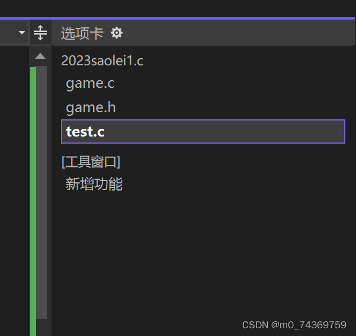
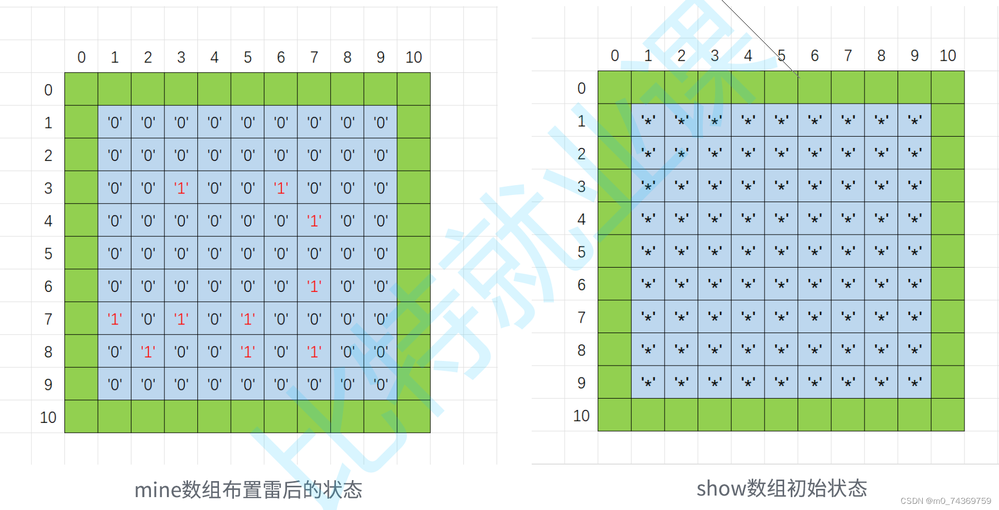

#### C语言之扫雷游戏


- [1.扫雷游戏的准备工作](#1_3)

- [2.扫雷游戏的基本逻辑](#2_6)


- [一.扫雷的基本框架](#_7)

- [二. 扫雷游戏的基本逻辑](#__11)

- [三.扫雷需要的所有函数](#_18)


- [1.定义初始化函数](#1_20)

- [2.定义打印棋盘函数](#2_37)

- [3.定义布置雷的函数](#3_63)

- [4.定义寻找雷的函数](#4_87)


- [三.头文件得声明](#_138)


- [3.扫雷游戏的具体实现](#3_162)

- [写到最后](#_333)


## 1.扫雷游戏的准备工作


>


>


在进行扫雷工作时，我们需要做的是需要一个编译环境，在市面上有众多的编译器，在这里作为使用过VS的我来说，它简直太适合我们这样的初学者了，里面支持自动换行对于初学者非常友好，同时，最为关键的是，在这款编译器当中，我们使用调试功能，是极其的容易，并且它的调试功能也是极其强大的。
 写到最后，我推荐大家观看B站鹏哥的视频，在那里鹏哥会给我们最为直观的讲解，会非常详细的指导大家的。


## 2.扫雷游戏的基本逻辑


### 一.扫雷的基本框架


**在扫雷游戏中时，首先需要我们在VS编译器当中准备三个文件，二个C文件一个头文件：**
 在这里大家可以参考一下我准备的文件
 


### 二. 扫雷游戏的基本逻辑


>


>


1.在C语言扫雷游戏之中，需要注意的是扫雷游戏时在选定的区域的附近八个点位统计雷的个数并输出在选定的区域之上，但是若果选定的区域是边上亦或是角上，那么就会导致无法遍历，超出应有的范围，这个问题我们可以假设棋盘的大小是9x9然而总共数组的大小可以设定11x11那么，就不是解决了问题吗？
 `2.扫雷的基本思路是首先需要准备2个字符数组，一个数组存放排查出的雷的数量信息记录存储，并打印出来，而另一个数组则存放布置好雷的信息，这样就互不干扰了`
 3.同时为了保持神秘，show数组开始时初始化为字符 ‘*’，为了保持两个数组的类型一致，可以使用同一
 套函数处理，mine数组最开始也初始化为字符’0’，布置雷改成’1’。如下如：
 


### 三.扫雷需要的所有函数


对于扫雷的实现需要用到，大量的函数，在这里我将为大家呈现出应当使用的具体函数：


#### 1.定义初始化函数


>


首先我们需要一个初始化棋盘的函数，而对于二个棋盘,一个接受‘0’的初始化，而另一个则接受‘*’的初始化，像这样的函数：


```
void InitBoard(char board[ROWS][COLS], int rows, int cols, char set)
{
	int i = 0;
	for (i = 0; i < rows; i++)
	{
		int j = 0;
		for (j = 0; j < cols; j++)
		{
			board[i][j] = set;
		}
	}
}

```


#### 2.定义打印棋盘函数


>


1.在使用中，我们需要看到棋盘显示在电脑上，那么显而易见的是我们可以使用打印棋盘这个函数。


>


>


2.在这个函数之中我就不为大家介绍了，因为这个函数比较的容易，需要3个循环结束，如下是我对于其的定义：


```
void DisplayBoard(char board[ROWS][COLS], int row, int col)
{
int i = 0;
printf("--------扫雷游戏-------\n");
for (i = 0; i <= col; i++)
{
printf("%d ", i);
}
printf("\n");
for (i = 1; i <= row; i++)
{
printf("%d ", i);
int j = 0;
for (j = 1; j <= col; j++)
{
printf("%c ", board[i][j]);
}
printf("\n");
}
}

```


#### 3.定义布置雷的函数


>


1.*``当然最为重要的是，布置地雷，那么对于这个函数我们使用到了随机数函数，这个函数在我的上一讲中都有提到，我们需要用随机函数在棋盘上生成雷。```*


>


2.但是需这注意的是，我们不可以在同一个地方重复生成。因此我们可以对于生成的雷的地方，我们可以使它的值都为1，那么对于后面的来说，只要我们检查是否是1，若果是0，那么说明是这个地方没有放置地雷，而是若果，这个地方是1的话，则说明这个地方已经放置了地雷，自然不再放雷，如此来说我们定义布置雷的函数就可以说结束了。我们定义的雷的个数


>


3.**下面就位大家介绍一番：**


```
void SetMine(char board[ROWS][COLS], int row, int col)
{
	//布置10个雷
	//生成随机的坐标，布置雷
	int count = EASY_COUNT;
	while (count)
	{
		int x = rand() % row + 1;
		int y = rand() % col + 1;
		if (board[x][y] == '0')
		{
			board[x][y] = '1';
			count--;
		}
	}
}

```


#### 4.定义寻找雷的函数


>


1.我们当然需要一个寻找地雷的函数，那么在这个函数当中首先需要一个统计地雷个数的函数，定义如下：


```
int GetMineCount(char mine[ROWS][COLS], int x, int y)
{
return (mine[x-1][y]+mine[x-1][y-1]+mine[x][y - 1]+mine[x+1][y-1]+mine[x+1][y]+mine[x+1][y+1]+mine[x][y+1]+mine[x-1][y+1] - 8 * '0');
}

```


>


2.最后呢我们需要定义寻找雷的函数。在这里面我们首先需要一个循环，条件是只要输入的点位与棋盘边数的平方-雷的个数相等。
 3.每次输入的坐标判断是否是合法的坐标，若果合法就判断它的位置是1说明是雷，则退出循环，游戏结束；
 若果不合法就业退出循环
 4.若果满足条件则执行，最后判断是否输入的次数是边数的平方-雷的个数是则游戏成功，否则游戏失败。并打印在棋盘上。
 5.如下是我的代码实现:


```
void FindMine(char mine[ROWS][COLS], char show[ROWS][COLS], int row, int col)
{
	int x = 0;
	int y = 0;
	int win = 0;
	while (win < row * col - EASY_COUNT)
	{
		printf("请输入要排查的坐标:>");
		scanf("%d %d", &x, &y);
		if (x >= 1 && x <= row && y >= 1 && y <= col)
		{
			if (mine[x][y] == '1')
			{
				printf("很遗憾，你被炸死了\n");
				DisplayBoard(mine, ROW, COL);
				break;
			}
			else
			{
				//该位置不是雷，就统计这个坐标周围有几个雷
				int count = GetMineCount(mine, x, y);
				show[x][y] = count + '0';
				DisplayBoard(show, ROW, COL);
				win++;
			}
		}
		else
		{
			printf("坐标非法，重新输入\n");
		}
	}
	if (win == row * col - EASY_COUNT)
{
		printf("恭喜你，排雷成功\n");
		DisplayBoard(mine, ROW, COL);
	}

```


### 三.头文件得声明


1.在扫雷游戏中如下是我对于头文件的声明：


```
#pragma once
#pragma once
#include <stdio.h>
#include <stdlib.h>
#include <time.h>
#define EASY_COUNT 10
#define ROW 9
#define COL 9
#define ROWS ROW+2
#define COLS COL+2
//初始化棋盘
void InitBoard(char board[ROWS][COLS], int rows, int cols, char set);
//打印棋盘
void DisplayBoard(char board[ROWS][COLS], int row, int col);
//布置雷
void SetMine(char board[ROWS][COLS], int row, int col);
//排查雷
void FindMine(char mine[ROWS][COLS], char show[ROWS][COLS], int row, int col);

```


2.用到了初始化棋盘，打印棋盘，布置雷，排查雷，以及对于随机函数的头文件得声明。


## 3.扫雷游戏的具体实现


一下是对于扫雷游戏用C代码的具体实现：
 `game.c`


```
#define _CRT_SECURE_NO_WARNINGS 1
#include "game.h"
void InitBoard(char board[ROWS][COLS], int rows, int cols, char set)
{
	int i = 0;
	for (i = 0; i < rows; i++)
	{
		int j = 0;
		for (j = 0; j < cols; j++)
		{
			board[i][j] = set;
		}
	}
}
void DisplayBoard(char board[ROWS][COLS], int row, int col)
{
	int i = 0;
	printf("--------扫雷游戏-------\n");
	for (i = 0; i <= col; i++)
	{
		printf("%d ", i);
	}
	printf("\n");
	for (i = 1; i <= row; i++)
	{
		printf("%d ", i);
		int j = 0;
		for (j = 1; j <= col; j++)
		{
			printf("%c ", board[i][j]);
		}
		printf("\n");
	}
}
void SetMine(char board[ROWS][COLS], int row, int col)
{
	//布置10个雷
	//生成随机的坐标，布置雷
	int count = EASY_COUNT;
	while (count)
	{
		int x = rand() % row + 1;
		int y = rand() % col + 1;
		if (board[x][y] == '0')
		{
			board[x][y] = '1';
			count--;
		}
	}
}
int GetMineCount(char mine[ROWS][COLS], int x, int y)
{
	return (mine[x - 1][y] + mine[x - 1][y - 1] + mine[x][y - 1] + mine[x + 1][y - 1] + mine[x+1][y]+mine[x + 1][y + 1] + mine[x][y + 1] + mine[x - 1][y + 1] - 8 * '0');
}
void FindMine(char mine[ROWS][COLS], char show[ROWS][COLS], int row, int col)
{
	int x = 0;
	int y = 0;
	int win = 0;
	while (win < row * col - EASY_COUNT)
	{
		printf("请输入要排查的坐标:>");
		scanf("%d %d", &x, &y);
		if (x >= 1 && x <= row && y >= 1 && y <= col)
		{
			if (mine[x][y] == '1')
			{
				printf("很遗憾，你被炸死了\n");
				DisplayBoard(mine, ROW, COL);
				break;
			}
			else
			{
				//该位置不是雷，就统计这个坐标周围有几个雷
				int count = GetMineCount(mine, x, y);
				show[x][y] = count + '0';
				DisplayBoard(show, ROW, COL);
				win++;
			}
		}
		else
		{
			printf("坐标非法，重新输入\n");
		}
	}
	if (win == row * col - EASY_COUNT)
	{
		printf("恭喜你，排雷成功\n");
		DisplayBoard(mine, ROW, COL);
	}
}

```


`game.h`


```
#pragma once
#pragma once
#include <stdio.h>
#include <stdlib.h>
#include <time.h>
#define EASY_COUNT 10
#define ROW 9
#define COL 9
#define ROWS ROW+2
#define COLS COL+2
//初始化棋盘
void InitBoard(char board[ROWS][COLS], int rows, int cols, char set);
//打印棋盘
void DisplayBoard(char board[ROWS][COLS], int row, int col);
//布置雷
void SetMine(char board[ROWS][COLS], int row, int col);
//排查雷
void FindMine(char mine[ROWS][COLS], char show[ROWS][COLS], int row, int col);

```


`test.c`


```
#define _CRT_SECURE_NO_WARNINGS 1
#include "game.h"
void menu()
{
	printf("***********************\n");
	printf("***** 1. play *****\n");
	printf("***** 0. exit *****\n");
	printf("***********************\n");
}
void game()
{
	char mine[ROWS][COLS];//存放布置好的雷
	char show[ROWS][COLS];//存放排查出的雷的信息
	//初始化棋盘
	//1. mine数组最开始是全'0'
	//2. show数组最开始是全'*'
	InitBoard(mine, ROWS, COLS, '0');
	InitBoard(show, ROWS, COLS, '*');
	//打印棋盘
	//DisplayBoard(mine, ROW, COL);
	DisplayBoard(show, ROW, COL);
	//1. 布置雷
	SetMine(mine, ROW, COL);
	//DisplayBoard(mine, ROW, COL);
	//2. 排查雷
	FindMine(mine, show, ROW, COL);
}
int main()
{
	int input = 0;
	srand((unsigned int)time(NULL));
	do
	{
		menu();
		printf("请选择:>");
		scanf("%d", &input);
		switch (input)
		{
		case 1:
			game();
			break;
		case 0:
			printf("退出游戏\n");
			break;
		default:
			printf("选择错误，重新选择\n");
			break;
		}
	} while (input);
	return 0;
}

```


## 写到最后


大家可以对这个游戏功能进行丰富，如可以成片的显示，积分，难易程度等等。
