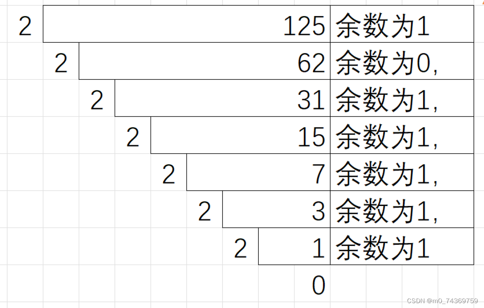

#### C语言之操作符（上）


- [一.二进制，八进制，十六进制](#_3)


- [`1.二进制`](#1_5)

- [`2.八进制与十六进制`](#2_27)


- [二.原码，反码，补码](#_35)


- [`1.原码`](#1_37)

- [`2.反码`](#2_45)

- [`3.补码`](#3_53)


- [三.移位操作符](#_60)


- [`1.左移操作符`](#1_64)

- [`2.右移操作符`](#2_69)


- [1.逻辑右移](#1_71)

- [2.算术右移](#2_73)


- [四.位操作符](#_75)


- [`1.按位与`](#1_78)

- [`2.按位或`](#2_82)

- [`3.按位异或`](#3_84)

- [4.运用](#4_89)


- [五.逗号表达式](#_92)


 在C语言之中，操作符也是极其重要的，不不仅仅C语言会用到，同时最为关键的是学会操作符，会对于我们学习单片机起到奠基石的作用，对于单片机的学习起到引领的作用，会非常有助于我们学习单片机的，会让我们对于单片机的一些基础操作可以看的懂。


## 一.二进制，八进制，十六进制


在计算机当中信息是以二进制的形式存储的，而我们在日常生活当中使用的最为多的，其实就是十进制，然而我们对于十进制的转化可以说是手到擒来。但是对于二进制相信一些伙伴，连听都没有听过，更不要说二进制之间的转化，不同进制之间的转化。由于二进制表达的数字太过于庞大了，我们不习惯使用二进制，因此我们需要学习八进制，十六进制，在接下来的讲解中我将为大家娓娓道来，并力求做到，看过我写的便学会，懂得了。


### `1.二进制`


>


1.首先，需要注意的是，二进制是什么。二进制是是计算机在存储信息之中时以1，0对信息加以存储和表达，满2进1对的。
 2.其次我们需要注意的是，二进制的转化：
 `1.二进制同十进制之间的转化：`首先需要明确一下的是权重，求值，以十进制数字：123为例。
| 10进制的位 | 1 | 2 | 3 |  |
|---|---|---|---|---|
| 权重 | 10^2 | 10^1 | 10^0 |  |
| 权重值 | 100 | 10 | 1 |  |
| 求值 | 1*100 | 2*10 | 3*1 = | 123 |


>


1.由此可以看出，权重，权重值,的关系，对这个概念可以运用到二进制·之上，对于二进制数如：110.
| 二进制的位 | 1 | 1 | 0 |  |
|---|---|---|---|---|
| 权重 | 2^2 | 2^1 | 2^0 |  |
| 权重值 | 4 | 2 | 1 |  |
| 求值 | 4*1 | 2*1 | 0*1= | 6 |


>


2.这样我们就完成了对二进制与十进制数相互进行转化。而对于十进制数转化为二进制数字，比如说一个十进制数字125将他转化成二进制数字，可以采用短除法，具体操作如下：





>


3.因此可以知道，十进制数125转化为二进制数是0111 1101。虽然我们可以采用短除法求值，但是在一般情况下不需要调用短除法，我们可以用一种估值的方法计算,比如说十进制数字125,可以用64+32+16+8+4+1=12 4 ,而2的64,32,16,8,8,4,1分别是2的,6,5,4,3,2,0 次方，这样估计值似乎比使用短除法更加迅速，遇到稍微大一些的数字可以采用电脑上的计算器。


### `2.八进制与十六进制`


>


通过以上叙述，我们对二进制的数字有了新的认识，更加深刻的明白了，二进制数字该如何转化十进制，十进制数字该如何转化为成为二进制数字，同时通过我的叙述想必各位一定知道了，为何在日常之中短除法不能成为主要的方法，下面我就为大家详尽的介绍八进制，十六进制同二进制之间的巧妙的关系。
 `2.二进制与八进制，十六进制的关系:`
 1.由于十进制8是2的3三次方，16是2的4次方，因此可以这样说，每一位八进制数字可以拆分为3个二进制位，而每一位的十六进制可以1拆分为4个二进制位。
 2.举一个例子，如下：十六进制数字3f,可以看作是3 f 而3的二进制位是11，f的二进制位是1111，因此他们的十进制数字是111111。
 2.再举一个例子：又如二进制数字0111111，转化为十六进制如下，011 1111,011转化为十进制的数字则是6,1111转为十进制的数字是15，十六进制则是f,因此答案就是6f.
 3.八进制的转化类似，在此不再做叙述了，有需要的小伙伴，可以观看B站鹏哥视频，那里会有讲解。
 4.写到最后，我们通常把前置如0X写作十六进制。


## 二.原码，反码，补码


在初学计算机时，我们必须明白计算机存储的实质，其实是用二进制数字的补码加以存储的，下面我就为大家介绍一下三者之间的各种关系。


### `1.原码`


首先呢，原码是二进制数原来的存储方式，但是需要注意一点的是，正数的原码最高位，其实就是符号位是0；而负数的原码的最高位则是1
 如：`int c=1;`它的原码是32个比特位，也就是说：0000 0000 0000 0000 0000 0000 0000 0001；
 而：


```
int a=-1;

```


它的原码则是，1000 0000 0000 0000 0000 0000 0000 0001


### `2.反码`


>


1.正数的反码，补码依旧是其本身，不做任何变化，因此在关于后面讨论反码，补码时不再做讨论。然而，负数的反码则是，符号位不变而，其他的位取反.，后面的讨论会详尽的讨论关于负数的，如：


```
int a=-1;

```


它的反码则是，32个比特位：1111 1111 1111 1111 1111 1111 1111 1110


### `3.补码`


在负数中，它的补码是其反码+1；就可以了。
 如:


```
int a=-1

```


这个数的补码是32个比特位：1111 1111 1111 1111 1111 1111 1111 1111，因此-1的补码是全为1。


## 三.移位操作符


移位操作符分为，左移操作和右移操作。
 左移操作符记作：<<
 右移操作符记作：>>


### `1.左移操作符`


它是最为容易的，指的是二进制的数字整体向左移动，空缺的位用0补齐，下面以第8个位记作符号位。
 如下：3<<1 记作 ：0000 0011<< 1 **0000 0110**
 而0000 0110=6，左移操作就是这样操做的。


### `2.右移操作符`


右移操作就显得稍微麻烦一些，具体的话分为，逻辑右移和算术右移。


#### 1.逻辑右移


这种右移操作，大部分编译器是不支持的。其实逻辑右移就有一些简单粗暴了，是整体右移，最高位也就是说是符号位，用0补齐，最低位则自动舍弃。这样肯定会造成一些误差的。比如说：5>>1 按照逻辑右移，那么整体右移：0000 0101>>1 =**0000 0010**


#### 2.算术右移


他其实同逻辑右移差不多，只不过是做高位按照符号位进行补齐，其他就都一样，比如说-1>>11111 1111 >>1=1111 1111,也就是说同原来是一样的还是-1.，基本原理还是同逻辑右移的实现是一样的。


## 四.位操作符


位操作符有& ，^, |.


### `1.按位与`


他的意思是说，有0就0，都是1则为1那么对于像如下：
 3&2=011&010=2


### `2.按位或`


他的意思是说，有1就为1，都是0则为0，像以下如：3|2=011|010=011=3


### `3.按位异或`


按位异或的意思是，相同则为0，不同则为1.
 像如下，如：3^2=11 ^ 10=11=3


### 4.运用


在不创建临时变量时对于数字进行交换
 比如说，数字1 2进行交换可以这样操作，1=1^2,2=1 ^2, 1=1 ^ 2,也就是说异或可以进行交换像a ^ b ^ a= a ^ a ^ b=0 ^ b =b,但是这样的运算有着局限性，不可以对数组，等进行交换。


## 五.逗号表达式


他可以起到，简化代码的作用，我们通常以逗号表达式的最后一个作为他的值，如下：


```
int c = (a>b, a=b+10, a, b=a+1);

```


c的值就是取最后一个逗号表达式的值，是b之值。


```
a = get_val();
count_val(a);

如果使用逗号表达式，改写：
while (a>0)
{
a = get_val();
count_val(a);
}

```


可以看出，这样写比较冗余，但是写成逗号表达式的话就比较简洁一些。记作：


```
while (a = get_val(), count_val(a),a>0)
{
a = get_val();
count_val(a);
}

```


结束。
