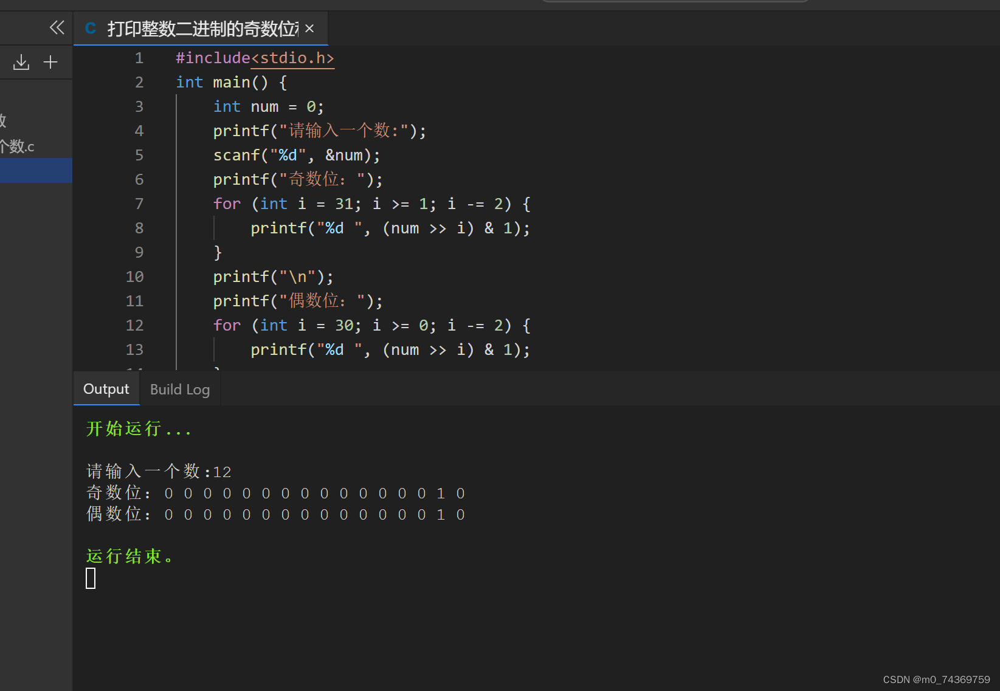

例题：获取一个整数二进制序列中所有的偶数位和奇数位，分别打印出二进制序列。

对于这个题我想的是，由于1&二进制的数字，他的意思是判断最低位是否为1，是的话那么就是1，否则就不是1而是0，这样如果我在进行一番右移操做，那么的话，就可以把这个二进制打印出来。

若是需要奇偶位打印的话，那么可能是在每次右移奇数个位或者是偶数个位，就可以求出二进制的奇数位，以及偶数位，下面我就为大家展示一番。


```
#include<stdio.h>

int main() {

    int num = 0;

    printf("请输入一个数:");

    scanf("%d", &num);

    printf("奇数位：");

    for (int i = 31; i >= 1; i -= 2) {

        printf("%d ", (num >> i) & 1);

    }

    printf("\n");

    printf("偶数位：");

    for (int i = 30; i >= 0; i -= 2) {

        printf("%d ", (num >> i) & 1);

    }

    printf("\n");

    return 0;

}


```


这个是运行结果：



因此这就是本题的代码。
