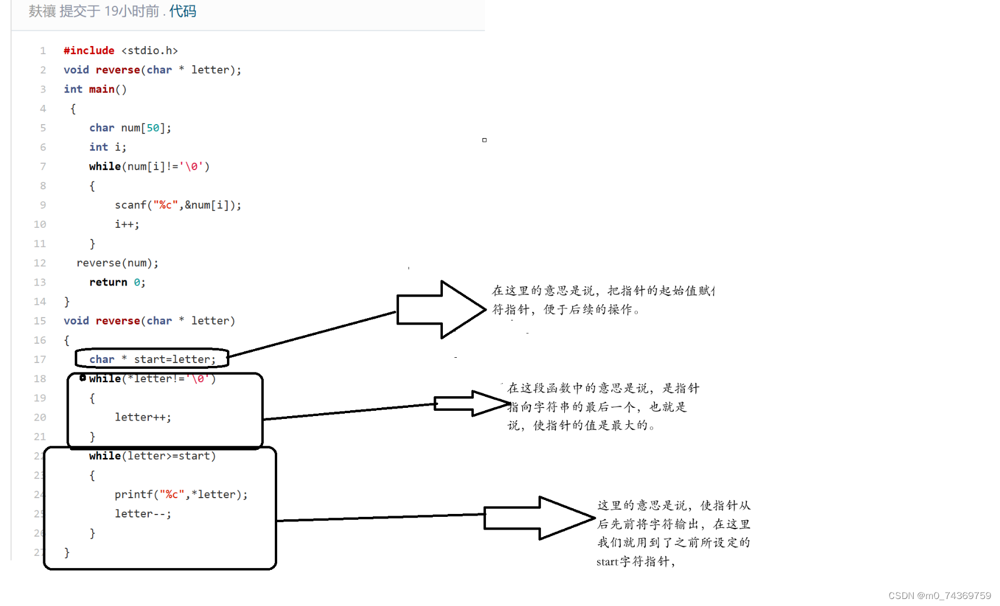
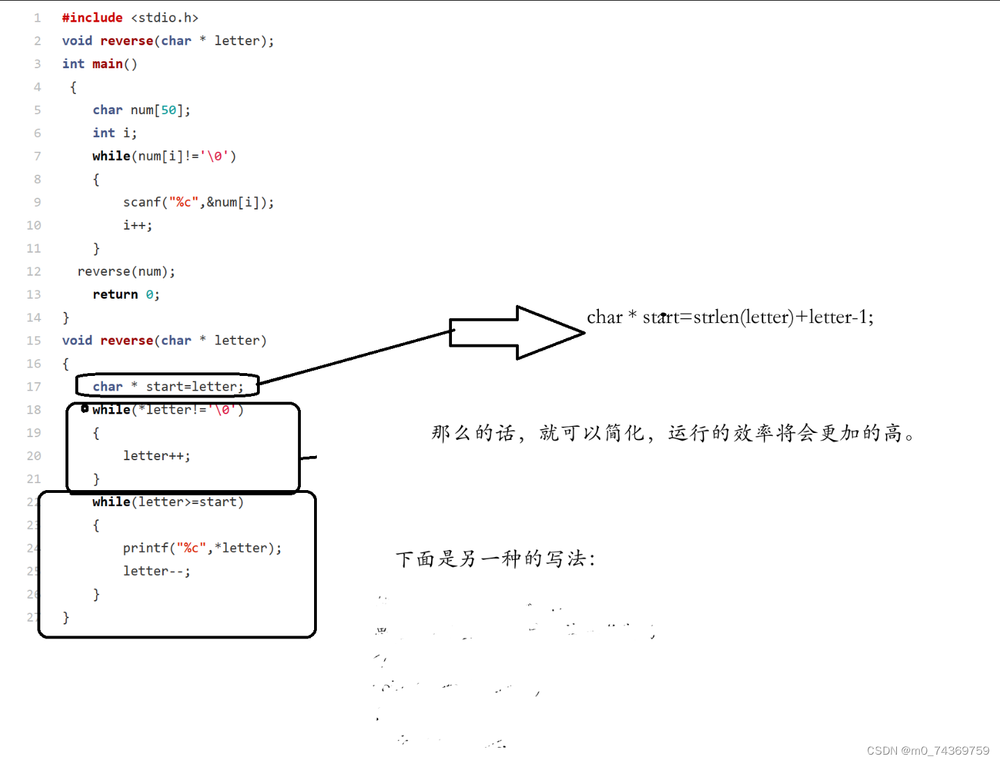



例题：写一个函数，可以逆序一个字符串的内容。


```
#include <stdio.h>
void reverse(char * letter);
int main()
 {
    char num[50];
    int i;
    while(num[i]!='\0')
    {
        scanf("%c",&num[i]);
        i++;
    }
  reverse(num);
    return 0;
}
void reverse(char * letter)
{
    char * start=letter;
    while(*letter!='\0')
    {
        letter++;
    }
    while(letter>=start)
    {
        printf("%c",*letter);
        letter--;
    }
}

```




在这里我们看到用循环设定指针的最大者似乎效率不是很高，那么我们可以使用这个语句：strlen()用他求出字符串的最大值，最后再赋值给指针似乎就完美了：




```
/*
思路：该题比较简单，请参考代码
*/
#include<stdio.h>
void Reverse(char* str)
{
    char* left = str;
    char* right = str + strlen(str)-1;
    while(left < right)
    {
        char temp = *left;
        *left = *right;
        *right = temp;
        ++left;
        --right;
    }
}


int main()
{
    char str[] = "hello bit";
    //在这里完成下面函数，参数自己设计，要求：使用指针
    Reverse(str);
    return 0;
}


// 注意：如果是在线OJ时，必须要考虑循环输入，因为每个算法可能有多组测试用例进行验证，参考以下main函数写法，
int main()
{
    char str[101] = {0};
    while(gets(str))
    {
        Reverse(str);
        printf("%s\n", str);
        memset(str, 0, sizeof(str)/sizeof(str[0]));
    }
    return 0;
}

```


接下来本题就宣告结束了。
