- [1. 引言](#1__8)


- [1.1 自动化 Git 的介绍](#11__Git__10)

- [1.2 传统手动推送痛点](#12__33)

- [1.3 我为何需要自动同步](#13__44)


- [2. 如何想到这个方案](#2__70)


- [2.1 背景：Linux 学习带来的启发](#21_Linux__72)

- [2.2 一段经历：用 OpenClaw 部署 NSSM 服务](#22__OpenClaw__NSSM__80)


- [2.2.1 原因](#221__82)

- [2.2.2 解决问题](#222__95)

- [2.2.3 开始执行步骤](#223__116)


- [步骤 1：实施步骤流程](#_1_118)

- [步骤 2：注册服务](#_2_134)

- [步骤 3：配置服务账户（第一次踩坑）](#_3_145)

- [步骤 4：关键一步：给 LocalSystem“指路”](#_4_LocalSystem_177)

- [步骤 5：启动与验证](#_5_190)

- [步骤 6：总结](#_6_204)


- [3. 思路与方案定型](#3__220)

- [4. 需求分析](#4__230)

- [5. 验证方案可行性](#5__244)

- [6. 列出可行的方案](#6__252)

- [7. 项目实施的大纲](#7__269)

- [8. 详细步骤](#8__290)


- [8.1 一次性准备](#81__292)


- [8.1.1 在本地建一个仓库](#811__294)

- [8.1.2 安装 Git](#812__Git_298)

- [8.1.3 SSH 准备](#813_SSH__304)


- [生成无口令密钥](#_306)

- [公钥添加到平台](#_312)

- [GitHub 走 443 端口](#GitHub__443__323)


- [8.2 底层一步一步是怎么实现的](#82__331)


- [8.2.1 监听文件变化](#821__333)

- [8.2.2 事件泵 + 防抖](#822____342)

- [8.2.3 自动提交推送](#823__354)

- [8.2.4 服务化（NSSM）](#824_NSSM_363)

- [8.2.5 定时拉取](#825__373)


- [9. 核心脚本设计（PowerShell）](#9_PowerShell_383)


- [9.1 脚本文件构成](#91__390)

- [9.2 推送守护脚本设计（git_sync_realtime_xxx.ps1）](#92_git_sync_realtime_xxxps1_401)

- [9.3 定时拉取脚本设计（change_fetcher_generic.ps1）](#93_change_fetcher_genericps1_499)

- [9.4 设计上的几个关键决定](#94__552)


- [10. 遇到的问题与解决方法（最重要的关键部分）](#10__563)


- [10.1 bat 中文乱码](#101_bat__578)

- [10.2 SSH 私钥带口令，自动化服务无法使用](#102_SSH__586)

- [10.3 git 的 "dubious ownership" 安全保护](#103_git__dubious_ownership__592)

- [10.4 GitHub 端口 22 被拦截](#104_GitHub__22__598)

- [10.5 服务“已标记为删除”（错误 1072）](#105__1072_604)

- [10.6 定时拉取间隔写死](#106__610)

- [10.7 FileSystemWatcher 实时监听不触发](#107_FileSystemWatcher__615)

- [10.8 服务 PAUSED（启动失败循环）](#108__PAUSED_621)


- [11. 安全设计：主仓库只推送 + 镜像区](#11____629)


- [11.1 为什么这样设计](#111__631)

- [11.2 两条线分别怎么做](#112__642)

- [11.3 安全边界（一定要分清）](#113__669)

- [11.4 配套安全措施](#114__683)

- [11.5 结论](#115__690)


- [12. 验证结果](#12__696)

- [13. 下载与体验](#13__715)

- [14. 总结与展望](#14__750)


>


**摘要**：本文记录我从“AI 机器人老挂机”的痛点出发，到用 NSSM 把 OpenClaw 网关变成 Windows 服务，再到把“Git 自动同步”做成一个完整工具包并打包发布的完整过程。全文包含：方案对比、详细步骤、核心脚本设计、8 个真实踩坑记录、安全设计、验证结果。全程由我提出需求、检查验证、确定改进方向，代码与排错由 AI 辅助完成。


>


**核心结论（TL;DR）**：用 NSSM 把“监听推送 + 定时拉取”脚本注册成 Windows 服务，实现本地改动自动推 Gitee/GitHub、云端变化定时拉回本地、开机自启、崩溃自愈。全程零代码基础：作者提需求、AI 辅助实现、作者逐项验证。全文较长，建议先看第 10 章问题速查和第 12 章验证清单。


## 1. 引言


### 1.1 自动化 Git 的介绍


**自动化 Git**，简单说就是：让 Git 的“提交（commit）+ 推送（push）”不再需要人手动输入命令，而是由程序自动完成。


传统 Git 工作流是**人驱动的**：


```
改文件 → 手动 git add → git commit → git push → 完成

```


自动化 Git 是**事件/定时驱动的**：


```
改文件 → 程序监听到变化 → 自动 add → 自动 commit → 自动 push → 完成

```


自动化 Git 的核心组件一般包括：
| 组件 | 作用 |
|---|---|
| 监听器 | 实时检测目录里文件的增、删、改 |
| 执行器 | 自动执行 add/commit/push，省去手动输入 |
| 调度/服务 | 让整个过程开机自启、崩溃自愈（如 NSSM 服务） |
| 认证 | 免密 SSH 密钥，让自动化可以无人值守 |


它特别适合：笔记仓库、配置文件、文档、个人项目，以及任何“改完就该同步”的场景。配合 Gitee/GitHub，等于给文件加了一层“自动上传备份”。


### 1.2 传统手动推送痛点


在动手之前，我已经被手动推送折磨了很久，痛点非常具体：


1. **总是忘记提交**：改完文件经常忘了 `git add && git commit && git push`，等想起来已经是几天后，甚至直接没保存到云端。

2. **两个平台重复劳动**：Gitee 和 GitHub 都要维护，每次手动推两遍，容易漏一个。

3. **云端和本地经常分叉**：电脑关了、忙忘了，云端和本地就对不上，下次同步还要面对一堆冲突。

4. **没有历史安全感**：本地文件一旦误删、磁盘坏了，云端根本不会有最新版本。


这些痛点反复出现，我逐渐意识到：**手动推送这件事，本质上是“可以被程序替代的重复劳动”**。既然能交给程序，为什么还要自己记着做？


### 1.3 我为何需要自动同步


每天就修改或添加几个文件，却要单独用小乌龟（TortoiseGit）推到远端，麻烦又臃肿。而且文件写入本地仓库后，经常因为各种事情忘记推送。


其实**大学的时候我就在想**：如果这些东西都能自己搞定就好了——自动提交、自动把远端变化拉取到本地指定目录，多好呀。这在当时是一个遥远的梦想。但大学这几年，老师不教 Git 知识，也不讲 Windows 脚本、NSSM 系统级服务……很多东西都没讲。大学四年，我甚至听都没听说过这些技术名词，这个想法只能一直藏在心里。


而且，我们大学有些同学是**不会用 Git 这个工具**的，对他们来说使用难度很高，这也是一个痛点。要是本地仓库能自动同步，就不需要他们自己折腾了。


但更关键的是，大学时我用小乌龟手动推送，**经常报错**：


- 一会说“不能在本地仓库里添加目录，只能加入文件”这类莫名其妙的提示。

- 有时候小乌龟里设置的用户名和邮箱与 Gitee 不匹配，怎么都推送不上去。

- 好几个大文件不能一次推送，需要单独推送——都是痛点与麻烦的地方。


我大学时的几个同学使用 GitHub 客户端推送，这本身没有问题，但我**无法忍受每次要推送本地仓库时，都强制打开这个客户端**——多加一步操作流程。我本身就极其不愿意专门腾出时间做这种操作：一来麻烦不说，忙起来还容易忘记；二来我本身就是个极其懒的人，每天做重复的动作心情极差，很不舒服，影响一天的状态——这也是此次项目实施的背景之一。


当时自己没有手段可以简化这些流程，让它标准化、自动化、自发进行，把流程固定下来，抽象成一套具有普适性的自动化经验。所以我只能每天定一个时间，在时间范围内推送——这样的操作一直持续到大学毕业。


**转机就出现在大学毕业这段时间**：我终于有能力也有手段（包括 AI 辅助、NSSM 实践经验的积累）把这些曾经的“梦想”变成现实。于是，这套“Git 自动同步系统”正式立项。最终效果：


- 本地文件夹**一有改动 → 自动提交并推送到云端**。

- 云端变化 → **自动拉取到本地镜像目录**（不碰主仓库，安全）。

- **开机自启**、崩溃自动重启，全程无需干预。


## 2. 如何想到这个方案


### 2.1 背景：Linux 学习带来的启发


当时我在学习 Linux，先学到了 SSH 免密登录：生成私钥和公钥，把公钥发给 node2，这样两台主机可以互相免密登录。后面学到 rsync 的时候，通过写 rsync 服务的配置文件、安装监控用的安装包、写一个脚本自动同步，最后把脚本加入服务项并设置开机自启。我看到了：一旦宿主机的指定目录有变化，就会自动把相应的变化同步到服务器 node2。


学完之后我就在想：Linux 都可以自动监控目录的变化，这不就是我梦寐以求的 Git 流程化思考路径吗？但当时我也有顾虑：老师是在 Linux 机器上演示的，而且用的不是 Gitee 或 GitHub，只是单纯的同步。我在想，如果把这个思路用在 Git 流程化上，而且用的是 Windows 机器，不知道是否可行。当时也不知道我的想法是否天真、是否正确，我就去咨询 AI，问它这个问题。最后 AI 说：这个方案对我来说是可以实施的，具有成功可能，但过程可能不顺利。


当时我就把这个想法种下了。这是如今我能做出这套系统的启发点。直到后来我把 OpenClaw 加入 NSSM 服务项，才把这个想法具体化，知道了具体该如何实施、该如何操作，大致框架也有了。


### 2.2 一段经历：用 OpenClaw 部署 NSSM 服务


#### 2.2.1 原因


我之前在电脑上安装了 OpenClaw，这本身没有什么问题。后来我给 OpenClaw 配置好了 QQ、飞书这些国内机器人，远程、异地访问都能做到。但问题就出在这里：


- 有时候我让机器人自发执行任务，它会重启网关，然后**再也启动不成了**，需要我手动启动网关。

- 有时候执行某个任务，OpenClaw 突然任务失败，然后就没有反应，像是突然死掉了一样，这时候也需要我手动重启网关，机器人才会有反应。


这些问题放在本地其实不算什么，甚至连写博客都没有必要。但如果我在异地、在远处、在其它省份呢？机器人突然任务失败，难道我要从很远的地方跑过来，专门给它重启一下网关吗？显然不能，这也不现实。


其实这就是我在使用 OpenClaw 时的一个痛点，一个非常致命的地方：一旦它挂机，就会耽误很多事情。所以每次在异地遇到挂机，我都只能忍着。


后来我咨询 OpenClaw，问它为什么老是挂机、有没有解决方式。它告诉我一个新东西——**NSSM**。这就是本次 Git 自动化以及 OpenClaw 用到的核心技术：它解决了 OpenClaw 挂机的痛点，也帮助我把想法一步步具体化、落地。


#### 2.2.2 解决问题


当时 OpenClaw 告诉我的方案有好几种，下面我为大家介绍一下：
| 方式 | 开机自启 | 崩溃自动重启 | 需要登录 | 稳定性 | 备注 |
|---|---|---|---|---|---|
| 启动文件夹 .bat | ✅（登录后） | ❌ | ✅ | 一般 | 简单粗暴，适合临时脚本 |
| 注册表 Run 键 | ✅（登录后） | ❌ | ✅ | 一般 | 常用但易被安全软件拦截 |
| 任务计划程序 | ✅ | 可配置 | 可配置 | 好 | 灵活，支持触发器、条件等 |
| NSSM 服务 | ✅（登录前） | ✅ 默认 | ❌ | 最好 | Non-Sucking Service Manager，将任意程序包装为 Windows 服务 |


**NSSM**（Non-Sucking Service Manager）是一个将普通应用程序包装为 Windows 服务的工具，它具备：


- **开机自启**：系统启动后即运行，无需用户登录。

- **崩溃自愈**：服务异常退出后自动重启。

- **后台静默**：无窗口、无界面，适合长期运行的守护进程。


通过观察这个表格，我知道，在 OpenClaw 给定的方案当中，最出色的就是 NSSM 服务：服务崩溃会自动重启，稳定性也是最好的，和我的需求贴合得最为紧密。它完全满足了我对 OpenClaw“服务崩溃、重启之后启动不成、自发启动、自我修复进程”的全部要求。


这里也想说明一下：今天这篇以 **Git 自动化** 为主，对 OpenClaw 的介绍是为了诠释 Git 自动化，让整个部署过程更加自然，读起来不那么唐突，有一个思考过程。什么东西都是一点点来的，不是一蹴而就的。**这个过程其实要比项目本身重要很多**，因为这是一个思考路径，一种递进。以后我有其他项目，也是一步一个脚印地走，因为如此，才会逐渐把想法落地。


#### 2.2.3 开始执行步骤


##### 步骤 1：实施步骤流程


整体的思路只有一条：**让 OpenClaw 网关以 Windows 服务的方式常驻运行，由 NSSM 负责开机拉起、崩溃重启。** 至于 Git 自动化，是另一条独立的线：由另一个 agent 完成的工具包负责，同样由 NSSM 托管（后面会详细讲）。


```
开机 → Windows 启动 OpenClawService → NSSM 拉起 openclaw gateway
     → 网关连上 QQ/飞书/Telegram → 机器人常驻、异地可用

```


具体流程如下：


1. 确认 OpenClaw 网关可以手动运行：`openclaw gateway run`。

2. 用 NSSM 将网关注册为 Windows 服务。

3. 配置服务：工作目录、服务账户、开机自启、崩溃自动重启。

4. 设置关键环境变量，让服务能找到用户配置。

5. 启动服务并验证。

6. 重启电脑，做最终验收。


##### 步骤 2：注册服务


以下命令需要**以管理员身份**打开 cmd 或 PowerShell 执行。


我的 NSSM 程序位于 `C:\Users\62901\.openclaw\nssm.exe`，网关入口是 `C:\Users\62901\AppData\Roaming\npm\openclaw.cmd`：


```
C:\Users\62901\.openclaw\nssm.exe install OpenClawService "C:\Users\62901\AppData\Roaming\npm\openclaw.cmd" gateway run
C:\Users\62901\.openclaw\nssm.exe set OpenClawService AppDirectory C:\Users\62901\.openclaw

```


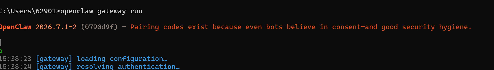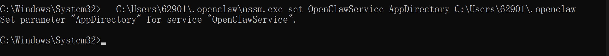*图：NSSM 安装与 AppDirectory 配置成功*


##### 步骤 3：配置服务账户（第一次踩坑）


一开始我试图用**当前用户账户**运行服务：


```
C:\Users\62901\.openclaw\nssm.exe set OpenClawService ObjectName WIN-C0SV93I7DP8\62901 <真实Windows登录密码>

```


结果一直报：


```
OpenClawService: START: 由于登录失败而无法启动服务。

```


原因很简单：NSSM 要求的“密码”是**真实的 Windows 登录密码（开机密码）**，不是用户名，也不是随便猜的数字。如果电脑是用 Microsoft 账户登录的，这条路基本走不通。


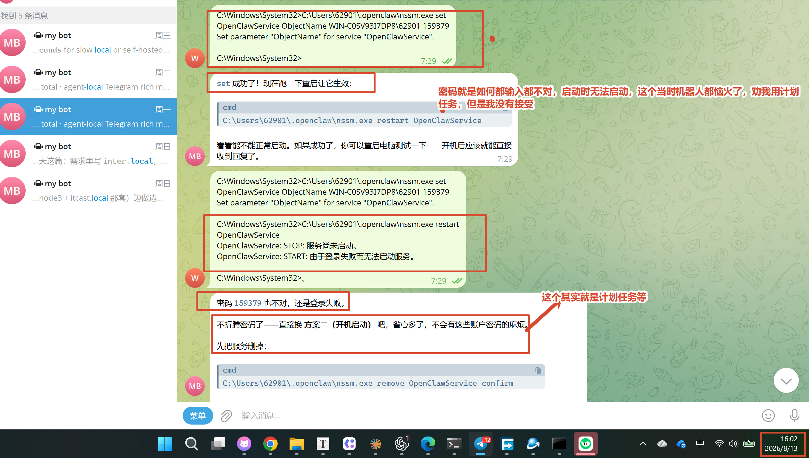*图：使用用户账户运行时提示“由于登录失败而无法启动服务”*


当时 OpenClaw 有点“恼火”了，建议我用启动文件夹方案，把脚本放到启动目录里。但我没有按它说的来，因为我觉得这个操作手段不够稳定：服务一崩溃，就再也起不来了，想要自发重启根本不可能。我当时对 OpenClaw 说：不是有一个 LocalSystem 吗，为什么不能用呢？我也问它：开机自启动到底有哪些方式？下面就是它告诉我的。


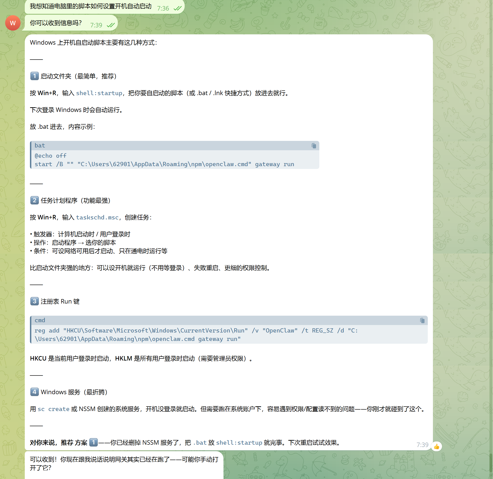


当时我又问它：启动文件夹的方案，崩溃后会自发启动吗？它说没有办法。


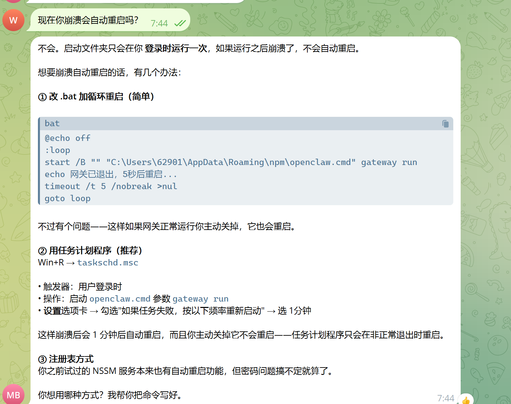


**因此，我当时就决定还是使用 NSSM 服务项，而且直接使用 LocalSystem**。虽然它提醒我说 LocalSystem 权限极高、需要在系统账号下运行，但我还是如此决定。


于是我换成了 **LocalSystem**（Windows 内置账户，不需要密码，权限极高）：


```
C:\Users\62901\.openclaw\nssm.exe set OpenClawService ObjectName LocalSystem
C:\Users\62901\.openclaw\nssm.exe set OpenClawService Start SERVICE_AUTO_START
C:\Users\62901\.openclaw\nssm.exe set OpenClawService AppExit Default Restart

```


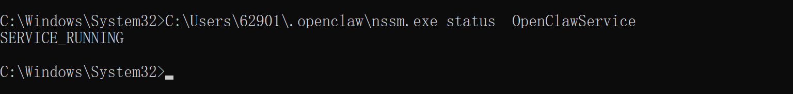*图：切换到 LocalSystem 并配置开机自启与崩溃重启*


##### 步骤 4：关键一步：给 LocalSystem“指路”


服务确实 RUNNING 了，但重启电脑后还是没反应。排查后发现，这不是权限问题，而是**路径问题**：


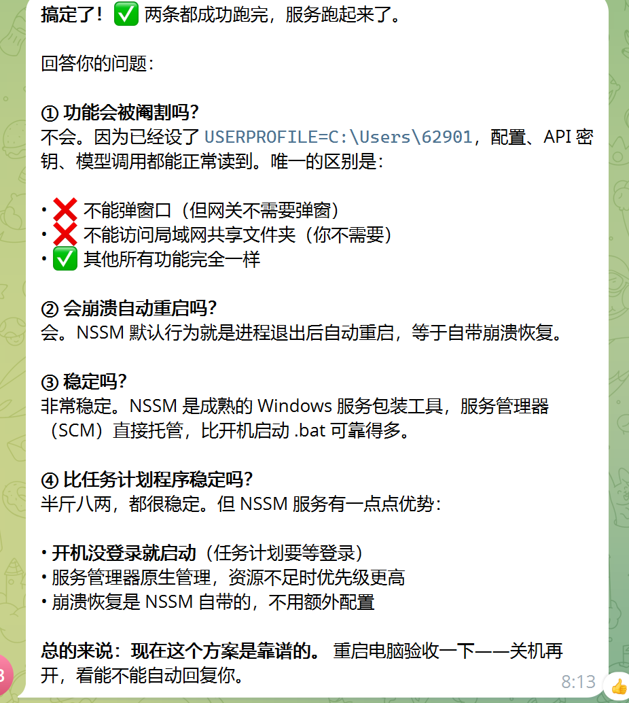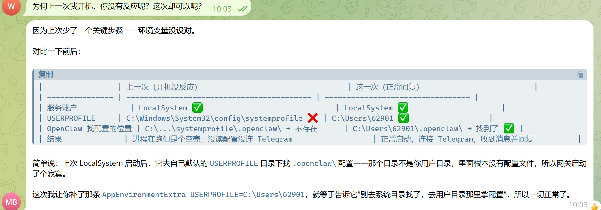


OpenClaw 启动时会去 `%USERPROFILE%\.openclaw\` 找配置和 API 密钥，而 **LocalSystem 的 `%USERPROFILE%` 指向的是 `C:\Windows\System32\config\systemprofile`**，不是我的用户目录 `C:\Users\62901`。于是网关去系统目录找配置 → 找不到 → 进程在跑，却是个“空壳”，连不上任何机器人。


解决办法是用 NSSM 的 `AppEnvironmentExtra` 强制注入环境变量：


```
C:\Users\62901\.openclaw\nssm.exe set OpenClawService AppEnvironmentExtra USERPROFILE=C:\Users\62901
C:\Users\62901\.openclaw\nssm.exe restart OpenClawService

```


##### 步骤 5：启动与验证


```
C:\Users\62901\.openclaw\nssm.exe start OpenClawService
C:\Users\62901\.openclaw\nssm.exe status OpenClawService
sc query OpenClawService

```


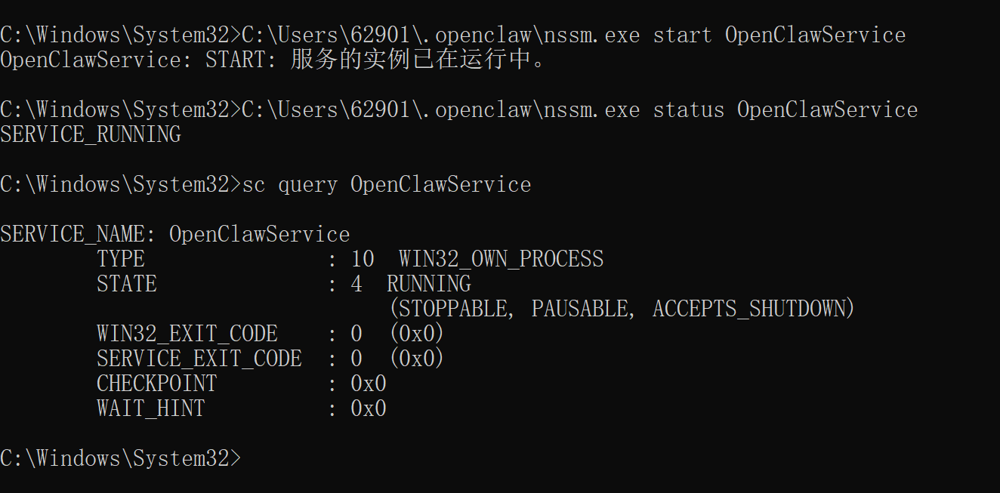*图：服务启动成功，状态 RUNNING*


写到这里我发现，OpenClaw 可以正常连接 NSSM 服务，可以完美执行。


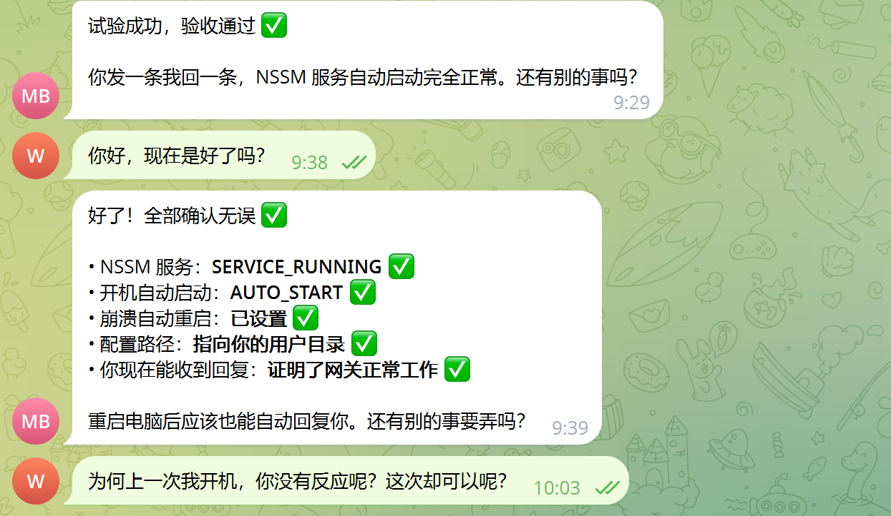*图：OpenClaw 网关正常连接，机器人可正常回复*


**这个 OpenClaw 配置的实验是完美收官**：服务运行状态相当之好，稳定性异常优秀，崩溃后可以自发启动。对于异地使用 OpenClaw 来说也很完美——运行程序崩掉，不需要提心吊胆害怕了。以后可以稳定地使用这个 OpenClaw 机器人，在飞书、QQ 上完美运行。


##### 步骤 6：总结


最终配置一览：
| 配置项 | 值 | 作用 |
|---|---|---|
| 服务名 | OpenClawService | 服务标识 |
| ObjectName | LocalSystem | 免密码、权限高 |
| Start | SERVICE_AUTO_START | 开机自启 |
| AppExit | Default Restart | 崩溃自动重启 |
| AppEnvironmentExtra | USERPROFILE=C:\Users\62901 | 让服务找到用户配置（关键） |


最后再回到思考路径：之所以先写 OpenClaw 与 NSSM，是为了解释 Git 自动化为什么能成立。**先让执行者稳定活着（NSSM 服务），再把流程固定给自动化工具（另一个 agent 完成的工具包）**。一个想法接一个想法，一个脚印接一个脚印，这就是我理解的技术落地过程。这个项目的实施，促进了我对 Git 自动化配置的想法构思：既然 OpenClaw 能这样稳定运行，我完全也可以把 Git 同步脚本注册成 NSSM 服务，让它同样健壮、同样优秀。下面就开始此次的正题：Git + NSSM 落地的自动化。


## 3. 思路与方案定型


通过以上的分析，我对 Git 自动化的理解进一步深入。最初的构思是采用类似 Linux 的技术：监听 + 脚本控制 + 免密登录 + 注册服务项。但需要注意，**当时的构思非常笼统、不具体**，只给了一个“像 Linux 那样的技术方向”，是不可直接实施的。


经过把 OpenClaw 网关注册到 NSSM 服务项，我进一步具体化了构思：为什么不采用类似 OpenClaw 的 NSSM 系统级服务控制呢？把监听、推送、拉取脚本都注册到 NSSM 里面，那么就是可以实施、可以尝试的。


因此我的最终方案就是：**用脚本化控制手段监听本地仓库动态，把变化推送到远端，或者把远端的变化拉取到本地，再把脚本注册为服务项。这样就可以实现实时监听，加上动态自我修复。**


## 4. 需求分析


动手前，先把需求列清楚：
| 需求 | 说明 |
|---|---|
| 实时监听 | 目录里增、删、改都要能检测到 |
| 自动提交推送 | 检测到变化后自动 commit + push 到 Gitee/GitHub |
| 开机自启 | 服务随系统启动，登录前后都能跑 |
| 多平台 | 同一套方案支持 Gitee 和 GitHub |
| 数据安全 | 云端变化不应直接覆盖本地主仓库 |


## 5. 验证方案可行性


为了验证我的想法是否可行，我当时直接问的是腾讯元宝：Git 自动化是否可以实施？它给出了肯定的答复，同时提醒我过程中可能会遇到权限、编码、服务配置等问题。我当时就知道，这个想法不是空中楼阁，是可以试一下的。


（这一部分的对话截图当时没有保存，这里用文字记录结论。）


## 6. 列出可行的方案


Windows 上实现“开机自启后台任务”有两种主流方式：
| 对比项 | 计划任务 (schtasks) | NSSM 服务 |
|---|---|---|
| 触发时机 | 登录之后才启动 | 开机即启动（登录前） |
| 崩溃恢复 | 不自动重启 | 自动重启 |
| 后台稳定性 | 一般 | 更稳（系统服务管理） |
| 配置自由度 | 一般 | 高（日志轮转、环境变量等） |


这几个自启动方式在第 2 节其实已经分析过，这里再列一次对比，是为了让读者在进入实现之前更清楚为什么选它。


最终选择 **NSSM**（The Non-Sucking Service Manager）——把 PowerShell 脚本包装成 Windows 服务，稳、能自愈、能开机自启。


## 7. 项目实施的大纲


整套系统有两条线：


```
【自动推送线】本地 → 云端
本地文件夹 → FileSystemWatcher 监听变化
           → 自动 git add → commit → push
           → 推送到 Gitee / GitHub

【定时拉取线】云端 → 本地
Gitee / GitHub 云端仓库
           → GitMirrorFetcher 每隔 N 分钟 fetch
           → reset --hard 同步到本地镜像目录

```


两条线都由 **NSSM 服务**托管：开机自启、崩溃自动重启、后台静默运行。


- 推送服务名：`GitAutoSync_xxx`（每个仓库一个）。

- 拉取服务名：`GitMirrorFetcher`（全局一个，管理所有镜像）。


## 8. 详细步骤


### 8.1 一次性准备


#### 8.1.1 在本地建一个仓库


这一步就是在本地建一个目录，目录的名字可以任意取，这一步是为了后面与远端仓库关联起来。


#### 8.1.2 安装 Git


因为我之前在大学的时候已经下载过 Git，这里就略过了。给大家一个下载链接：


[Git 下载地址](https://git-scm.com/install/windows)


#### 8.1.3 SSH 准备


##### 生成无口令密钥


```
ssh-keygen -t ed25519 -f %USERPROFILE%\.ssh\gitee_sync -N ""

```


>


注意两点：`-N ""` 表示无口令，自动化服务是非交互环境，带口令的密钥会无法使用（这是我遇到的问题）；另外 Windows 的 cmd 不识别 `~`，要用 `%USERPROFILE%` 或完整路径。


##### 公钥添加到平台


把 `.pub` 文件内容分别添加到：


- Gitee：设置 → SSH公钥。

- GitHub：Settings → SSH and GPG keys。


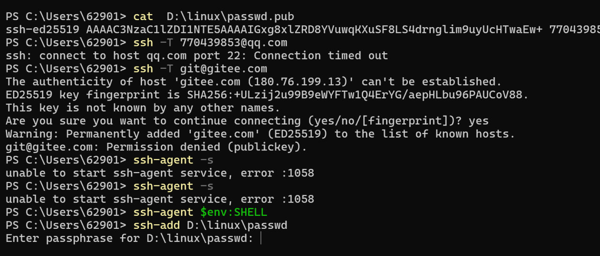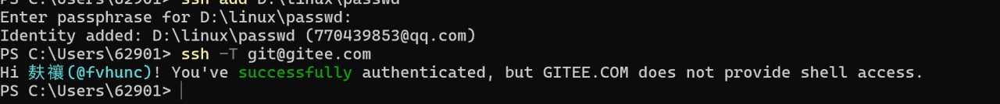*图：Gitee 添加 SSH 公钥*


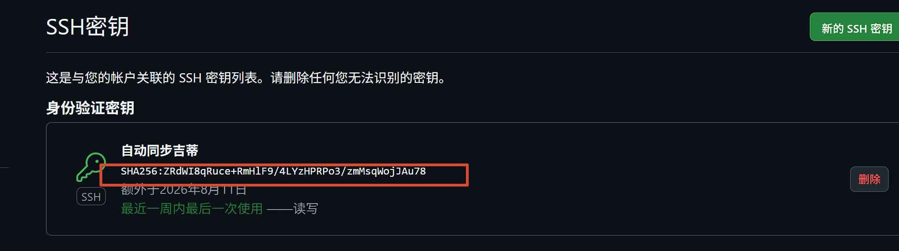*图：GitHub 添加 SSH 公钥*


##### GitHub 走 443 端口


```
git remote set-url origin ssh://git@ssh.github.com:443/用户名/仓库.git

```


>


端口 22 被本机网络环境拦截（详见问题 4），GitHub 官方支持 SSH over 443。


这条命令就是把本地仓库和远端仓库关联起来，指定“以后推送到哪、从哪里拉取”。执行后可以用 `git remote -v` 确认。


### 8.2 底层一步一步是怎么实现的


#### 8.2.1 监听文件变化


用 .NET 的 `FileSystemWatcher` 监听仓库目录（含子目录），注册 新建/修改/重命名/删除 四类事件：


```
$watcher = New-Object System.IO.FileSystemWatcher
$watcher.Path = $RepoPath
$watcher.IncludeSubdirectories = $true
$watcher.EnableRaisingEvents = $true

```


#### 8.2.2 事件泵 + 防抖


事件动作不能靠 `Register-ObjectEvent -Action` 自动触发（主线程阻塞时不会执行），所以主循环用 `Wait-Event` 泵取事件：


```
while ($true) {
    $e = Wait-Event -Timeout 1
    if ($null -eq $e) { continue }
    Remove-Event -EventIdentifier $e.EventIdentifier
    Start-Sleep -Milliseconds 3000   # 防抖：合并连续写入
    Sync-Now
}

```


#### 8.2.3 自动提交推送


```
git add -A
git status --porcelain          # 没变化就跳过，避免空提交
git commit -m "auto-sync: 时间戳"
git push origin <分支>           # 失败重试 3 次，间隔 5 秒

```


关键细节：必须检查 `commit/push` 的退出码，否则失败会被静默吞掉。


#### 8.2.4 服务化（NSSM）


核心配置：


```
ObjectName        = LocalSystem        # 免密码、权限高
Start             = SERVICE_AUTO_START # 开机自启
AppExit           = Default Restart    # 崩溃自动重启
AppRestartDelay   = 5000               # 5 秒后重试
AppEnvironmentExtra = GIT_CONFIG_VALUE_0=*   # 允许 SYSTEM 访问任意仓库（safe.directory）

```


#### 8.2.5 定时拉取


```
git fetch origin <分支>
git reset --hard origin/<分支>    # 强制同步到云端最新
git clean -fd                     # 清理未跟踪文件

```


启动时立即执行一轮，之后按 `git_mirror_settings.txt` 里的 `interval=N` 循环，默认 60 分钟。


## 9. 核心脚本设计（PowerShell）


这套工具的核心逻辑全部用 PowerShell 写成，是作者用电脑上的 Codex 运行出来的，这里把关键部分写清楚：


- **一次性生成脚本**：新建仓库时运行，负责初始化、配置、生成同步脚本。

- **常驻守护脚本**：被 NSSM 包装成服务，负责监听、推送、定时拉取。


### 9.1 脚本文件构成
| 文件 | 角色 |
|---|---|
| new_sync_repo_generic.ps1 | 新建自动推送仓库：初始化 + 生成同步脚本和安装 bat |
| git_sync_realtime_xxx.ps1 | 自动生成的推送守护脚本，被 NSSM 托管 |
| new_pull_mirror_generic.ps1 | 登记云端镜像：选择密钥 + 立即克隆 + 写入配置 |
| change_fetcher_generic.ps1 | 定时拉取守护脚本，被 NSSM 托管 |
| service_manager.ps1 | 服务管理菜单（中文界面主体） |
| ssh_key_generator.ps1 | 一键生成无口令 SSH 密钥 |


### 9.2 推送守护脚本设计（git_sync_realtime_xxx.ps1）


**1）配置区**


```
$RepoPath      = 'D:\我的项目'        # 被监听仓库
$Branch        = 'master'             # 推送分支
$Remote        = 'origin'
$LogFile       = Join-Path $RepoPath 'git_sync.log'
$DebounceMs    = 3000                 # 防抖时间
$RetryTimes    = 3                    # 推送重试次数
$RetryWaitSec  = 5

```


**2）日志函数**


```
function Write-Log {
    param([string]$Msg)
    $line = "[{0}] {1}" -f (Get-Date -Format 'yyyy-MM-dd HH:mm:ss'), $Msg
    $line | Out-File -FilePath $LogFile -Append -Encoding utf8
    Write-Host $line
}

```


日志文件放在仓库内，同时被 `.gitignore` 忽略，避免日志污染提交。


**3）启动自检**


脚本启动先做四件事，缺一直接退出，避免“空转”：


```
if (-not (Test-Path $RepoPath)) { Write-Log '目录不存在'; exit 1 }
if (-not (Get-Command git -ErrorAction SilentlyContinue)) { Write-Log '未找到 git'; exit 1 }
if (-not (Test-Path (Join-Path $RepoPath '.git'))) { Write-Log '不是 git 仓库'; exit 1 }
$hasRemote = (git -C $RepoPath remote) -match '^origin$'
if (-not $hasRemote) { Write-Log '未配置远端'; exit 1 }

```


**4）文件过滤**


`.git` 目录和同步脚本自身的日志必须过滤，否则会自己触发自己：


```
function Should-Ignore {
    param([string]$FullPath)
    if ($FullPath -like "$RepoPath\.git*") { return $true }
    if ($FullPath -like "$RepoPath\git_sync*") { return $true }
    return $false
}

```


**5）同步函数（核心）**


```
function Sync-Now {
    git -C $RepoPath add -A
    if ($LASTEXITCODE -ne 0) { Write-Log 'git add 失败'; return }

    $status = git -C $RepoPath status --porcelain
    if ([string]::IsNullOrWhiteSpace($status)) { Write-Log '无实际变化，跳过'; return }

    $msg = "auto-sync: {0}" -f (Get-Date -Format 'yyyy-MM-dd HH:mm:ss')
    git -C $RepoPath commit -m $msg
    if ($LASTEXITCODE -ne 0) { Write-Log 'commit 失败'; return }

    for ($i = 1; $i -le $RetryTimes; $i++) {
        git -C $RepoPath push $Remote $Branch
        if ($LASTEXITCODE -eq 0) { Write-Log '推送成功'; return }
        Start-Sleep -Seconds $RetryWaitSec
    }
    Write-Log '推送失败，将在下次文件变化时重试'
}

```


设计要点：先 `add`，再用 `status --porcelain` 判断有没有真实变化，避免产生空提交；`commit/push` 都检查退出码，失败不静默。


**6）监听器 + 事件泵**


```
$watcher = New-Object System.IO.FileSystemWatcher
$watcher.Path                  = $RepoPath
$watcher.IncludeSubdirectories = $true
$watcher.NotifyFilter          = [System.IO.NotifyFilters]::LastWrite -bor `
                                 [System.IO.NotifyFilters]::FileName -bor `
                                 [System.IO.NotifyFilters]::DirectoryName -bor `
                                 [System.IO.NotifyFilters]::Size
$watcher.EnableRaisingEvents   = $true

$null = Register-ObjectEvent $watcher Created -SourceIdentifier Sync.Created
$null = Register-ObjectEvent $watcher Changed -SourceIdentifier Sync.Changed
$null = Register-ObjectEvent $watcher Renamed -SourceIdentifier Sync.Renamed
$null = Register-ObjectEvent $watcher Deleted -SourceIdentifier Sync.Deleted

```


主循环用 `Wait-Event` 泵取事件，而不是靠 `-Action` 自动执行（主线程阻塞时事件动作不会触发）：


```
while ($true) {
    $e = Wait-Event -Timeout 1
    if ($null -eq $e) { continue }
    if ($null -ne $e.SourceEventArgs -and (Should-Ignore $e.SourceEventArgs.FullPath)) {
        Remove-Event -EventIdentifier $e.EventIdentifier
        continue
    }
    Remove-Event -EventIdentifier $e.EventIdentifier
    Start-Sleep -Milliseconds $DebounceMs     # 防抖，合并连续写入
    while ($null -ne (Wait-Event -Timeout 0)) { Remove-Event -EventIdentifier (Get-Event).EventIdentifier }
    Sync-Now
}

```


### 9.3 定时拉取脚本设计（change_fetcher_generic.ps1）


**1）间隔读取**


```
$SettingsFile = Join-Path $env:USERPROFILE 'git_mirror_settings.txt'
$IntervalMinutes = 60
if (Test-Path $SettingsFile) {
    Get-Content $SettingsFile | ForEach-Object {
        if ($_ -match '^interval\s*=\s*(\d+)$') { $IntervalMinutes = [int]$Matches[1] }
    }
}

```


**2）配置解析**


每一行是一条镜像记录，格式：`目标目录|远端地址|分支|密钥路径`：


```
function Get-Mirrors {
    Get-Content $ConfigFile -Encoding UTF8 | ForEach-Object {
        $line = $_.Trim()
        if ($line -eq '' -or $line.StartsWith('#')) { return }
        $parts = $line -split '\|'
        if ($parts.Count -ge 3) {
            $item = @{ Dir = $parts[0]; Url = $parts[1]; Branch = $parts[2]; Key = $null }
            if ($parts.Count -ge 4 -and $parts[3]) { $item.Key = $parts[3] }
            $item
        }
    }
}

```


**3）单条更新**


每条记录先选密钥（记录里指定，没有就用默认），再克隆或更新：


```
function Update-Mirror {
    param($m)
    $key = if ($m.Key) { $m.Key } else { $DefaultKey }
    $env:GIT_SSH_COMMAND = "ssh -i `"$($key -replace '\\','/')`" -o IdentitiesOnly=yes -o StrictHostKeyChecking=accept-new"
    if (-not (Test-Path (Join-Path $m.Dir '.git'))) {
        git clone $m.Url $m.Dir
    } else {
        git -C $m.Dir fetch origin $m.Branch
        git -C $m.Dir reset --hard "origin/$($m.Branch)"
        git -C $m.Dir clean -fd
    }
}

```


**4）主循环**


```
while ($true) {
    Start-Sleep -Seconds ($IntervalMinutes * 60)
    foreach ($m in Get-Mirrors) { Update-Mirror $m }
}

```


### 9.4 设计上的几个关键决定


1. **退出码检查优先**：所有 git 操作都检查 `$LASTEXITCODE`，失败必须写日志，绝不静默吞掉。

2. **防抖合并**：一次保存可能触发十几个事件，等 3 秒合并成一次同步，避免重复提交。

3. **密钥可配置**：多账号、多平台时，每条镜像记录可以指定自己的密钥。

4. **无口令密钥**：服务在后台无人值守运行，带口令的密钥无法自动使用。

5. **safe.directory**：LocalSystem 身份访问用户仓库必须配置，否则 git 直接拒绝。

6. **日志轮转**：NSSM 配置 `AppRotateBytes`，日志超过 1MB 自动轮转，不会无限膨胀。


## 10. 遇到的问题与解决方法（最重要的关键部分）


先给一张速查表，后面每一节再展开详细过程：
| 问题 | 一句话解决 |
|---|---|
| bat 中文乱码 | bat 用 ASCII + CRLF + chcp 65001，中文交给带 BOM 的 PowerShell |
| SSH 私钥带口令 | 自动化必须使用无口令专用密钥 |
| dubious ownership | 服务环境变量加 safe.directory |
| GitHub 端口 22 被拦 | 改用 SSH over 443 |
| 服务“已标记删除”（1072） | 先停服务，再重装或彻底重建 |
| 定时拉取间隔写死 | 菜单 [F] 设置间隔，保存后自动重启服务 |
| FileSystemWatcher 不触发 | 用 Wait-Event 循环泵取事件 |
| 服务 PAUSED | 用正确配置重装服务 |


### 10.1 bat 中文乱码


- **现象**：双击 bat 报 `'姟' 不是内部或外部命令`。

- **原因**：bat 是 UTF-8，cmd 默认按 GBK 解析；且换行不是 CRLF 会解析错位。

- **解决**：bat 内容保持纯 ASCII + CRLF 换行 + 顶部 `chcp 65001`；中文界面放进带 UTF-8 BOM 的 PowerShell 脚本。


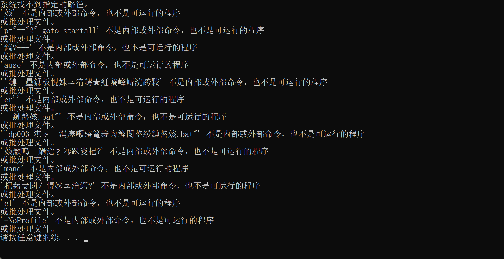*图：bat 中文乱码的实际报错*


### 10.2 SSH 私钥带口令，自动化服务无法使用


- **现象**：手动 SSH 能连（交互输入口令），但服务里一直 `Permission denied (publickey)`，`ssh -v` 显示 `Server accepts key` 却仍失败。

- **原因**：私钥加了 passphrase，服务在非交互环境无法输入口令。

- **解决**：生成**无口令**的专用密钥给服务用。


### 10.3 git 的 “dubious ownership” 安全保护


- **现象**：服务以 LocalSystem 运行，git 报 `fatal: detected dubious ownership in repository`。

- **原因**：git 的 CVE-2022-24765 缓解机制——不同用户身份操作他人拥有的仓库时拒绝执行。

- **解决**：把仓库加入 `safe.directory` 白名单（本地配置 + 服务环境变量）。最终统一用 `safe.directory=*`（单用户本机可接受）。


### 10.4 GitHub 端口 22 被拦截


- **现象**：`ssh -T git@github.com` 报 `Connection closed by 198.18.0.15`。

- **原因**：代理/过滤工具拦截了 GitHub 的 22 端口。

- **解决**：改用 **SSH over 443**（`ssh.github.com:443`）。


### 10.5 服务“已标记为删除”（错误 1072）


- **现象**：服务能运行但改不了配置。

- **原因**：对运行中的服务执行卸载，Windows 标记为删除待定。

- **解决**：先停服务完成删除，再重新安装；工具包里的“彻底重建”就是干这个的。


### 10.6 定时拉取间隔写死


- **现象**：想改拉取频率要改脚本。

- **解决**：菜单加 `[F] 设置定时拉取间隔`，保存到设置文件，自动重启服务生效。


### 10.7 FileSystemWatcher 实时监听不触发


- **现象**：`Register-ObjectEvent -Action` 的事件动作不执行。

- **原因**：PowerShell 事件动作需要事件引擎泵处理，主线程阻塞（Sleep/WaitOne）时不触发。

- **解决**：改用 `Wait-Event` 在循环中泵取事件。


### 10.8 服务 PAUSED（启动失败循环）


- **现象**：服务状态 PAUSED，脚本一启动就报“未配置远程仓库”。

- **原因**：服务配置错误（AppDirectory 错、缺 safe.directory）→ 脚本以 SYSTEM 运行读不到仓库 → 启动即退出 → NSSM 反复重启。

- **解决**：用正确配置重装。


## 11. 安全设计：主仓库只推送 + 镜像区


### 11.1 为什么这样设计


自动同步最容易出的事故是：**云端被改坏，反过来把本地也覆盖了**。比如云端仓库被误删、误提交、被恶意改动，如果本地一直跟着 `pull`，坏内容会直接冲进你的工作目录。


这套系统用“双向分离”来解决：


```
主仓库（本地工作区）      →  只推送（push）     → 云端永远不覆盖本地
镜像区（独立目录）        →  只拉取（pull）     → 云端当前状态的可读副本

```


一句话：**主仓库是“源头”，镜像区是“影子”。**


### 11.2 两条线分别怎么做


**1）主仓库：只推送，不做 pull**


自动推送脚本里只有：


```
git add -A
git commit -m "auto-sync: 时间戳"
git push origin <分支>

```


脚本中刻意不放 `pull` / `fetch` / `merge`，从代码上保证云端永远进不了主仓库。云端被改坏、误删、甚至整个仓库被清空，本地主仓库都安然无恙。


**2）镜像区：只拉取，云端是唯一权威**


镜像区用独立目录承载，不在主仓库目录内部：


```
主仓库        D:\我的项目
镜像区        D:\云端镜像\我的项目（或 change / change_github 等独立目录）

```


定时拉取时执行：


```
git fetch origin <分支>
git reset --hard origin/<分支>   # 强制等于云端
git clean -fd                    # 清理未跟踪文件

```


镜像区可以随时删除重建，它只反映云端当前状态，本身不承担“备份”职责。


### 11.3 安全边界（一定要分清）
| 区域 | 行为 | 谁覆盖谁 | 丢了怎么办 |
|---|---|---|---|
| 主仓库 | 只 push | 本地 → 云端 | 云端有历史可找回 |
| 镜像区 | 只 pull | 云端 → 本地 | 删除后下次自动重建 |
| 云端仓库 | 双向收 | 两端 | 依靠 Git 历史恢复 |


三个容易误会的点：


1. **镜像区不是备份**：它会被 `reset --hard` 覆盖，里面的本地改动会被清掉，不能当保险箱用。

2. **主仓库的“保险”在云端**：只要推送成功过，云端 Git 历史就保留了每一版提交，本地误删也能从云端找回。

3. **真备份建议**：重要项目额外定期做一次完整克隆，或启用平台的仓库备份功能。


### 11.4 配套安全措施


- **密钥隔离**：自动同步使用专用无口令密钥，与手动登录钥匙分开；镜像记录可逐条指定密钥。

- **safe.directory**：服务以 LocalSystem 运行时，用环境变量放行仓库目录，避免 git 安全保护误拦。

- **日志不污染仓库**：同步日志写入仓库但被 `.gitignore` 忽略；NSSM 服务日志开启轮转。

- **可关闭清理**：`GIT_MIRROR_CLEAN=0` 可关闭镜像区的 `git clean -fd`，防止误删你放在镜像里的文件。


### 11.5 结论


“主仓库只推送 + 镜像区只拉取”这个设计，用很小的代价换来了最大的安全感：**本地不会被云端带坏，云端坏了对本地也无从下手。** 所有“看云端最新”的需求都走镜像区，所有“保存本地成果”的需求都走主仓库推送，职责清清楚楚。


## 12. 验证结果


下面我把测试结果发给大家看一下：


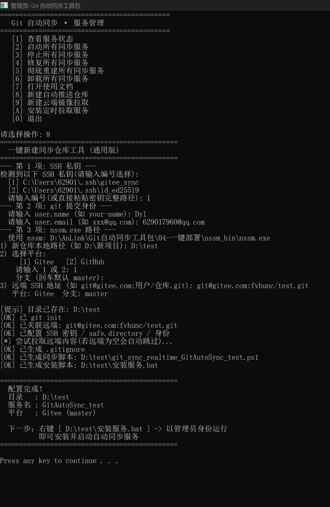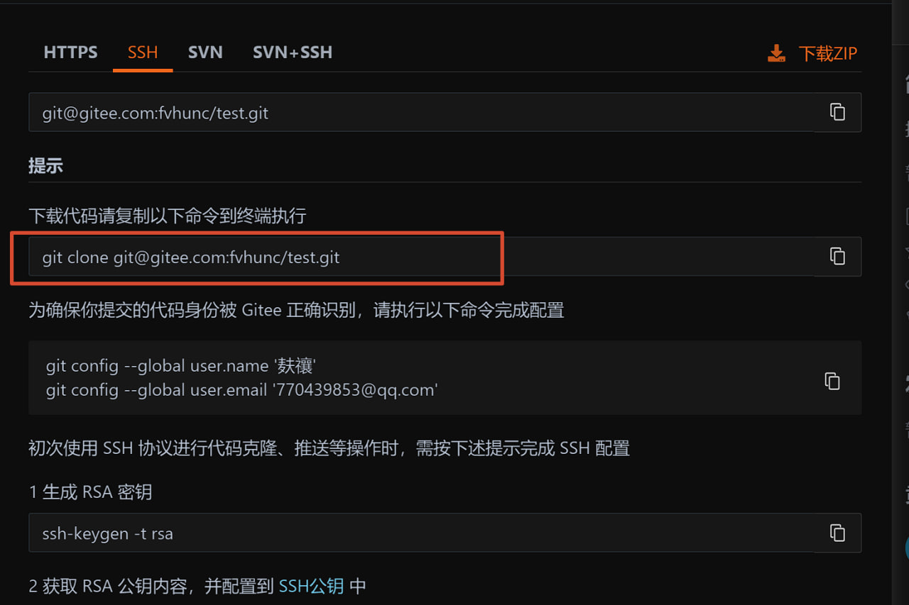*图：自动推送成功，云端出现 auto-sync 提交*


实测清单：


- 自动推送 ✅：本地测试目录写入文件 → 云端仓库自动出现 `auto-sync` 提交。

- 定时拉取 ✅：云端改动 → 本地镜像目录按设置间隔同步。

- 开机自启 ✅：重启电脑后服务自动运行，无需手动启动。

- 崩溃自动重启 ✅：进程异常退出后由 NSSM 自动拉起。


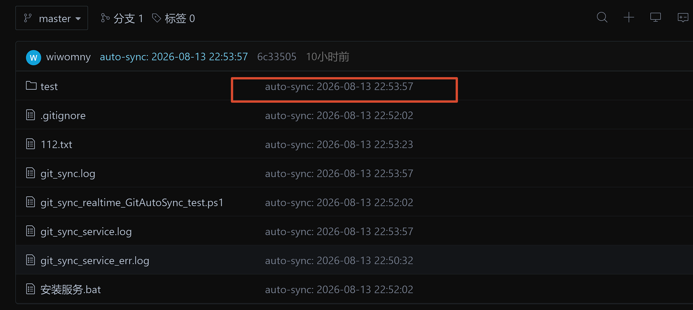*图：定时拉取验证成功*


我发现测试目录自动上传成功。现在这个本地仓库正式具有了：自动同步 + 自我修复 + 开机自启 + 远端定时把变化拉取到本地。它对任务的执行效率和处理稳定性都达到了预期。我梦寐以求的工具，在 agent 的辅助之下直接搞定了。我当时看到这个结果还是异常兴奋的，因为它意味着我的想法从空想变为实际。中间虽然有些曲折，虽然经过了 OpenClaw 的 NSSM 服务部署才把想法彻底定性，但结果是一步一个脚印走出来的，是好的。


## 13. 下载与体验


这套工具已经打包成 **zip 版** 和 **安装版 exe**，源码与发布文件在：


- GitHub Releases（最新版下载）：[Git 自动同步工具包 · Releases](https://github.com/dsduyopg/linux_heima/releases)

- GitHub 源码目录：[linux_heima/my_data/发布](https://github.com/dsduyopg/linux_heima/tree/main/my_data/%E5%8F%91%E5%B8%83)

- Gitee（可选）：[Gitee 仓库](https://gitee.com/fvhunc/linus_heima)


工具包目录结构：


```
Git自动同步工具包/
├── 环境自检.bat            检查 Git / SSH / nssm
├── 生成SSH密钥.bat          一键生成密钥并复制公钥
├── 新建自动推送仓库.bat      本地 → Gitee/GitHub 自动推送
├── 新建云端镜像拉取.bat      云端 → 本地立即克隆/更新
├── 安装定时拉取服务.bat      定时拉取服务一键安装
├── 服务管理.bat             日常管理菜单
├── 修复服务.bat / 彻底重建服务.bat
├── README.md / 使用说明.txt / docs 教程
└── LICENSE

```


**环境要求**：Windows 10 / 11，安装 Git，SSH 密钥已添加到 Gitee/GitHub。


**使用顺序**：


1. 双击 `环境自检.bat` 检查 Git / SSH / nssm。

2. 双击 `生成SSH密钥.bat` 生成密钥并复制公钥。

3. 双击 `新建自动推送仓库.bat` 或 `新建云端镜像拉取.bat` 建立同步任务。

4. 双击 `安装定时拉取服务.bat` 开启定时拉取。

5. 之后所有日常操作都通过 `服务管理.bat` 完成。


>


提示：安装版 exe 未做商业签名，Windows 智能应用控制可能拦截，优先使用 zip 版（解压即用）。


## 14. 总结与展望


写到最后，我想先说一句真实感受：这个工具包从最初“一堆脚本手动控制”，到如今“一个安装包 + 一个管理菜单”就能完成所有操作，整个过程确实给了我很大的成就感。


经过我在自己电脑上的完整测试，自动推送、定时拉取、崩溃自动重启、开机自启这些核心功能都验证通过，功能也算比较完善了。虽然整个过程中我没有写过核心代码，主要是由 agent（AI）辅助实现，但需求是我提的、方向是我定的、每一步结果都是我亲自验证的。所以当它真正自己跑起来的那一刻，那种“原来我也可以做出来”的兴奋感，是真实存在的。


这段经历让我最大的体会是：**技术不是目的，把想法变成能用的东西才是。**


如果你心里也有什么想法，哪怕只是“文件不想手动推送”“机器人挂了要自动重启”这样的小事，都可以借助 agent 把它变成一个落地的项目。一次完整的“想法 → 实现 → 验证 → 发布”，对未来的自己是一种实打实的积累，也会慢慢建立起“我能把事情做成”的信心。


也想对还不了解 agent 的朋友说一句：不用等“学会编程”再开始。CSDN 的 Inscode、Codex 这类 AI 工具都可以尝试；有些工具可以通过配置模型供应商（例如搭配模型切换工具接入 DeepSeek 等 API）来使用，具体按工具说明操作即可。重要的是先迈出第一步，让 AI 帮你把想法跑起来，再一步步验证和打磨。


如果越来越多的人愿意把想法变成实际的东西，整个社会的创新氛围会越来越好，国家也会因此更加强大。哪怕只是一个个人小工具，也值得认真做、认真写下来、认真分享出去。


最后，把这几天的收获浓缩成一句话与大家共勉：


>


**想法是起点，行动是过程，坚持验证才是真正的落地。**


**项目仓库**：源码与发布文件见 [Git 自动同步工具包（GitHub）](https://github.com/dsduyopg/linux_heima/tree/main/my_data/%E5%8F%91%E5%B8%83)


**说明**：本文由作者提出需求、检查验证并确定改进方向，文字由 AI 辅助整理完成。
