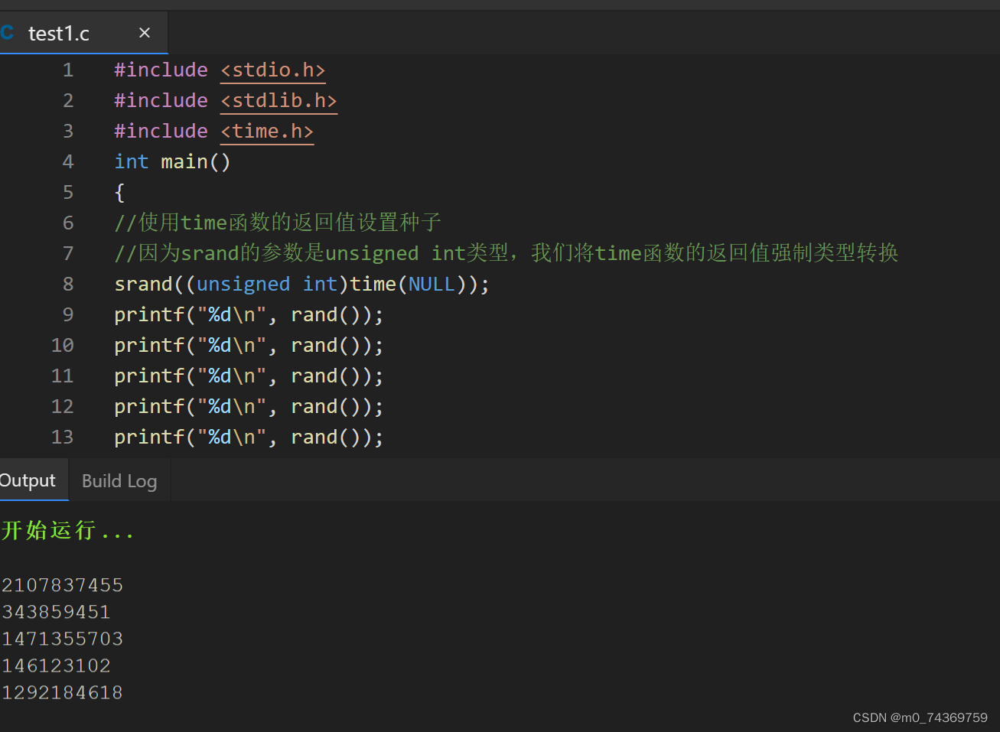
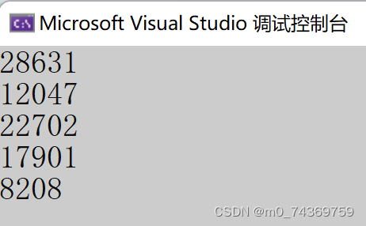
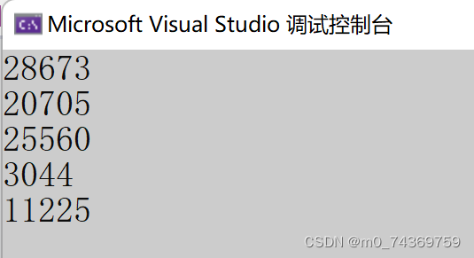
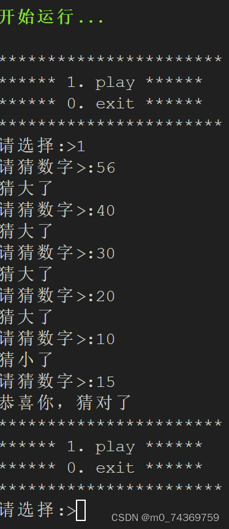



## 1.分支和循环（下)


### 一.随机数生成


#### (1).rand


#### (2).srand


#### (3)time


#### (4)设置随机数的范围


### 二.猜数字游戏实现


## **分支和循环（下)**


****在本节内容当中，主要讨论了关于随机函数相关的知识点并做一些应用，也就是说讨论关于猜数字的游戏****。


### ` 一.随机数生成`


*随机函数主要有rand,srand,函数，我们将会讨论什么是随机数种子，为何说rand函数不是我们的随机函数，以及用time函数实现srand的随机种子，进而实现了对于随机数的求解*。


#### (1).rand


**`C语言提供了求解随机数的方法：`**


```
int rand(void);

```


但是呢，由于rand函数是为随机函数是通过某种算法生成的随机数，不是真正的随机数，下面就为大家试一下:


```
#include <stdio.h>
#include <stdlib.h>
int main()
{
printf("%d\n", rand());
printf("%d\n", rand());
printf("%d\n", rand());
printf("%d\n", rand());
printf("%d\n", rand());
return 0;

```


)


 由此可以知道的，是rand两次所生成的结果是一样的，那么可以说，`rand`不是一个正常的生成随机数的函数，因为他默认的随机种子数是1，如果要生成不同的随机数，就要让种子是变化的。


#### (2).srand


**下面我就介绍关于`srand`函数**，只要在使用`rand`之前，使用`srand`函数，通过 `srand`函数的参数`seed`来设置`rand`函数生成随机数的时候的种子，只要种子在变化，每次生成的随机数序列也就变化起来了,
 那也就是说给`srand`的种子是如果是随机的，`rand`就能生成随机数；在生成随机数的时候又需要一个随
 机数，这就矛盾了.


#### (3)time


因为时间是经常变化的，在`c`当中有一个函数是`time`,因此我们可以使用它时间作为随机数种子。在`C`当中的定义如下：


```
time_t time (time_t* timer);

```


**如果 timer 是NULL，就只返回这个时间的差值。time函数返回的这个时间差也被叫做：时间戳。
 使用time函数的时候，需要包含头文件：time.h**
 书写生成随机函数的代码如下：


```
#include <stdio.h>
#include <stdlib.h>
#include <time.h>
int main()
{
//使用time函数的返回值设置种子
//因为srand的参数是unsigned int类型，我们将time函数的返回值强制类型转换
srand((unsigned int)time(NULL));
printf("%d\n", rand());
printf("%d\n", rand());
printf("%d\n", rand());
printf("%d\n", rand());
printf("%d\n", rand());
return 0;
}

```


得到的结果是：
 
 
 可以知道的是，两次得到的随机数并不像第一次那样—二次得到的，是一样的，这个函数可以成功的实现对于随机数的求解，这就是我们需要的函数。


#### (4)设置随机数的范围


**`在这里我为大家介绍关于如何精确调整随机数的取值范围：`**


>


比如说：从0到99之间的随机值就是:


```
rand()%100;

```


那么显而易见的是，从1到100之间的随机数取值就是这个：


```
rand()%100+1;

```


显而易见的是，我们可以得到这样一个规律，从100到200随机数就是100+rand（）%200-100。
 那么我们可以用一个公式表达:
 `假如从a到b之间的随机值范围那么可以用以上经验做出解答，是a+rand()%b-a,这个公式.`


我们可以用这个公式，对猜数字进行解答，下面就是详细的解答。


### `二.猜数字游戏实现`


**我们，写出了这些代码，可以实现猜数字的功能：**


```
#include <stdio.h>
#include <stdlib.h>
#include <time.h>
void game()
{
int r = rand()%100+1;
int guess= 0;
while(1)
{
printf("请猜数字>:");
scanf("%d", &guess);
if(guess < r)
{
printf("猜小了\n");
}
else if(guess > r)
{
printf("猜大了\n");
}
else
{
printf("恭喜你，猜对了\n");
break;
}
}
}
void menu()
{
printf("***********************\n");
printf("****** 1. play ******\n");
printf("****** 0. exit ******\n");
printf("***********************\n");
}
int main()
{
int input = 0;
srand((unsigned int)time(NULL));
do
{
menu();
printf("请选择:>");
scanf("%d", &input);
switch(input)
{
case 1:
game();
break;
case 0:
printf("游戏结束\n");
break;
default:
printf("选择错误，重新选择\n");
break;
}
}while(input);
return 0;
}

```


我们的到了运行结果如下：
 
 我们对这段代码进行优化，可以假设玩游戏时，只允许5次机会，那么可以书写如下：


```
#include <stdio.h>
#include <stdlib.h>
#include <time.h>
void game()
{
int r = rand() % 100 + 1;
int guess = 0;
int count = 5;
while (count)
{
printf("\n你还有%d次机会\n", count);
count--;
printf("请猜数字>:");
scanf("%d", &guess);
if (guess < r)
{
printf("猜小了\n");
}
else if (guess > r)
{
    printf("猜大了\n");
}
else
{
printf("恭喜你，猜对了\n");
break;
}
}
if (count == 0)
{
printf("你失败了，正确值是:%d\n", r);
}
}
void menu()
{
printf("***********************\n");
printf("****** 1. play ******\n");
printf("****** 0. exit ******\n");
printf("***********************\n");
}
int main()
{
int input = 0;
srand((unsigned int)time(NULL));
do
{
menu();
printf("请选择:>");
scanf("%d", &input);
switch (input)
{
case 1:
game();
break;
case 0:
printf("游戏结束\n");
break;
default:
printf("选择错误，重新选择\n");
break;
}
} while (input);
return 0;
}

```


[同时呢，大家可用这个网上的编译器，它挺好用的：](https://6a192191.lightly.teamcode.com/),大家可以点击一下。
