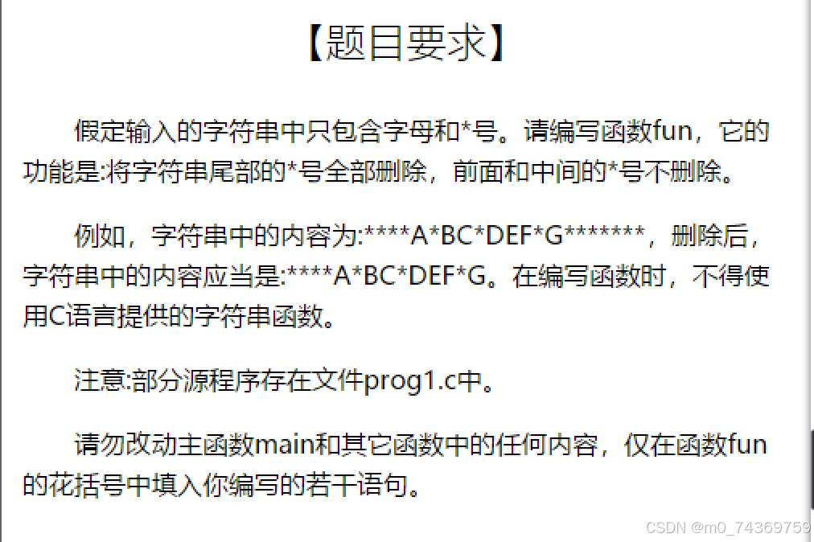
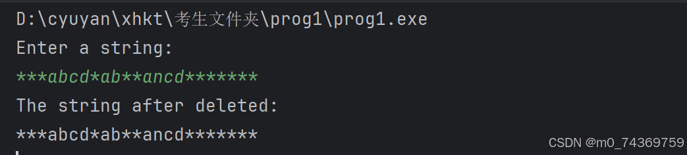
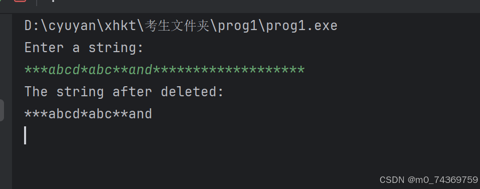

#### 字符串中删除后导星号的问题


- [一.题目分析](#_1)

- [二.我所犯的错误](#_4)


- [2.1我的代码](#21_5)

- [2.1我的错误的代码运行的结果](#21_54)


- [2.1.1我的结果分析](#211_56)


- [三.错误分析](#_58)


- [3.1 我总结的错误缘由](#31__59)


- [主要问题总结：](#_71)


- [3.2 修改的意见](#32__77)


- [改进点解释：](#_79)

- [举个例子：](#_91)

- [测试：](#_99)


- [3.3 修正好后的代码运行结果如下：](#33__117)

- [3.4 我的修正后的代码如下：](#34__119)


- [四.总结](#_171)


## 一.题目分析





## 二.我所犯的错误


### 2.1我的代码


```
#include <stdio.h>
void  fun( char *a )
{
	int count=0,count_a=0,i,j=0;
	while(*a!='\0')
	{
		a++;
		count++;
	}
	a=a-1;
	while(*a=='*')
	{
		a--;
		count_a++;
	}
	for(i=0;i<count-count_a;i++)
	{
		a[j++]=a[i];
	}
	a[j]='\0';
}
main()
{  char  s[81];void NONO ();
   printf("Enter a string:\n");gets(s);
   fun( s );
   printf("The string after deleted:\n");puts(s);
   NONO();
  getchar();
}
void NONO ()
{/* 本函数用于打开文件，输入数据，调用函数，输出数据，关闭文件。 */
  FILE *in, *out ;
  int i ; char s[81] ;
  in = fopen("in.dat","r") ;
  out = fopen("out.dat","w") ;
  for(i = 0 ; i < 10 ; i++) {
    fscanf(in, "%s", s) ;
    fun(s) ;
    fprintf(out, "%s\n", s) ;
  }
  fclose(in) ;
  fclose(out) ;
}


```


### 2.1我的错误的代码运行的结果





#### 2.1.1我的结果分析


通过我的运行结果可以知道，我并没有完成删除后导星号的任务，这个函数的功能一点都没有执行。但是我觉得的写的代码是正确的，我一遍一遍分析我的代码，发现是我的代码思路可行的，就是不知道为何运行出来的是错误的，我一遍一遍分析，就是不知道，在哪里出错了，这种感觉是异常痛苦的，百思不得其解的痛苦感，我想我就这样搞不定了吗？后来，我我问了一位老师，人家给我讲了一下。


## 三.错误分析


### 3.1 我总结的错误缘由


我的问题出在指针操作和逻辑处理上，主要有以下几点：


1.

**指针的回退与字符覆盖冲突**：


- 在第一次遍历时，`a` 被移动到字符串末尾，并且在移除末尾的星号时没有保存起始位置。当我想再次使用 `a` 去操作字符串时，我已经丢失了它的原始位置，所以会导致逻辑错误。


2.

**字符的移动逻辑有问题**：


- 我试图在移除星号后通过 `a[j++]=a[i];` 这种方式将有效字符重新赋值，但 `a` 指针已经被移动过，并且我没有合适的边界检查，可能会导致覆盖和数组越界。


3.

**没有保存指针的初始位置**：


- 一旦我用 `a++` 移动指针，你就失去了对字符串起始位置的引用，所以后续的字符操作都可能出错。


#### 主要问题总结：


- **指针丢失原始位置**：`a` 指针在遍历时被不断递增，导致我无法恢复到字符串的开始位置。

- **字符覆盖错误**：在进行字符移位时，`a[j++] = a[i];` 中的 `a[i]` 实际上是错误的，因为 `a` 已经被修改，无法正确访问原字符。

- **边界处理不正确**：最后没有处理字符串末尾的 `'\0'`，使得最终的字符串可能没有正确终止。


### 3.2 修改的意见


#### 改进点解释：


1.

**`start` 和 `end` 指针：**


- 保留了原字符串的起始位置 `start`，并使用 `end` 指向字符串的最后一个字符。这样可以避免对原始字符串指针 `a` 进行过多修改，从而使代码更清晰。


2.

**指针回退和字符移动：**


- 在计算完字符串长度后，`end` 指针回退以跳过末尾的星号，同时计算星号的数量。

- 使用 `for` 循环将有效的字符（不包括星号）复制到前面的位置。


3.

**末尾终止符 `'\0'`：**


- 复制完有效字符后，在新的字符串末尾添加终止符 `'\0'`，确保字符串的结束标志正确。


#### 举个例子：


假设输入字符串是 `"hello***"`，程序会做以下事情：


1. 计算字符串总长度为 8。

2. 统计末尾的 3 个星号。

3. 将 `hello` 的字符移动到前面，并添加结束符 `'\0'`，最终结果是 `"hello"`。


#### 测试：


我可以通过如下代码来测试：


```
#include <stdio.h>

void fun(char *a);

int main() {
    char str[] = "hello***";
    fun(str);
    printf("Modified string: %s\n", str);  // 输出 "hello"
    return 0;
}

```


这段代码应该会输出修改后的字符串 `hello`。


### 3.3 修正好后的代码运行结果如下：





### 3.4 我的修正后的代码如下：


```
#include <stdio.h>
void  fun( char *a )
{
	int count=0,count_a=0,i,j=0;
	char *end,*start;
	start=a;
	while(*a!='\0')
	{
		a++;
		count++;
	}
	end=a-1;
	while(*end=='*')
	{
		end--;
		count_a++;
	}
	for(i=0;i<count-count_a;i++)
	{
		start[j++]=start[i];
	}
	start[j]='\0';
}

main()
{  char  s[81];void NONO ();
   printf("Enter a string:\n");gets(s);
   fun( s );
   printf("The string after deleted:\n");puts(s);
   NONO();
  getchar();
}
void NONO ()
{/* 本函数用于打开文件，输入数据，调用函数，输出数据，关闭文件。 */
  FILE *in, *out ;
  int i ; char s[81] ;
  in = fopen("in.dat","r") ;
  out = fopen("out.dat","w") ;
  for(i = 0 ; i < 10 ; i++) {
    fscanf(in, "%s", s) ;
    fun(s) ;
    fprintf(out, "%s\n", s) ;
  }
  fclose(in) ;
  fclose(out) ;
}


```


## 四.总结


```
在以上的代码当中我错误的使用一个指针，这样在后续操作的时候，会出现挺
多的异常，这样就运行不出我们想要的结果了，总的来看，我写的代码的大概
框架是正确的，但是呢对于指针的处理不太熟练，以后在操作指针的时候，要
用不同变量进行处理，希望同学们，汲取我的错误的教训，吸收经验，从而更
好的成长，

```


**再见！！！**
