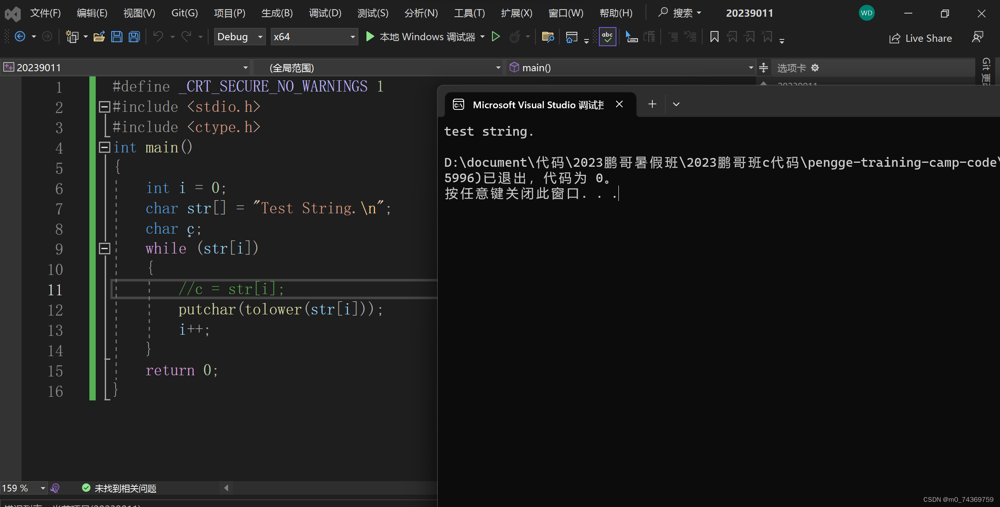
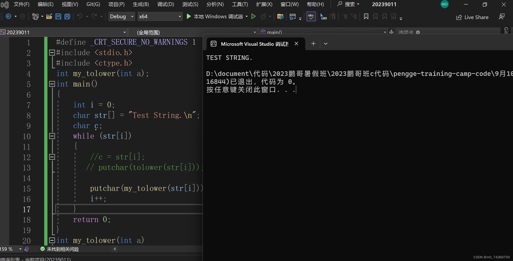
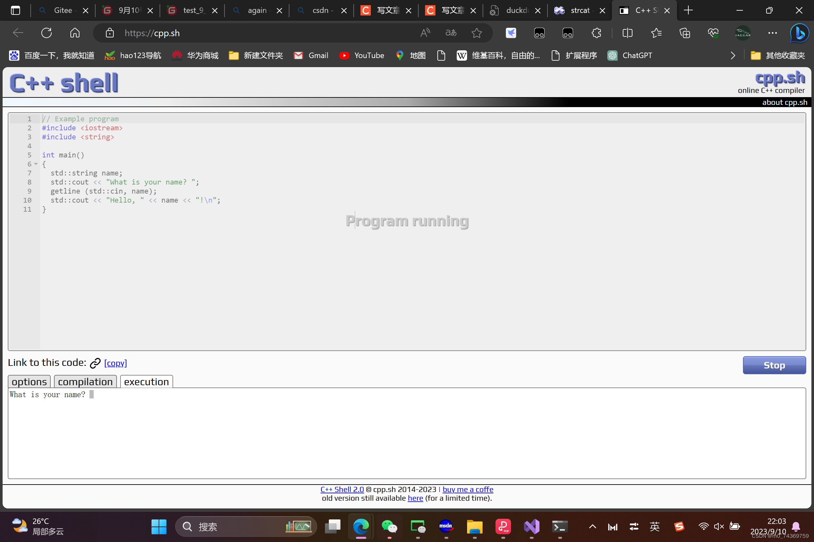
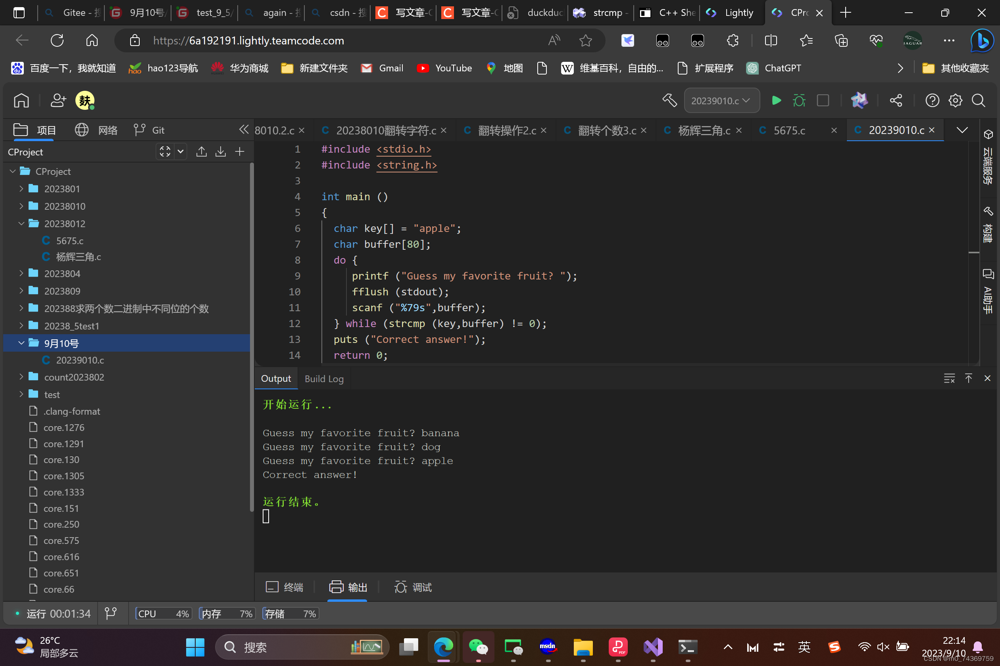



在本节中我将为大家介绍一些关于字符函数以及字符串函数，在本节中我将为大家详细介绍某些重要函数的模拟实现，使大家更好的了解这些函数的具体逻辑，下面就开启了本次的学习之旅，希望大家都有所收获。


#### 字符函数和字符串函数


- [一.字符函数](#_2)


- [1.字符分类函数](#1_4)


- [1.字符分类函种类及作用](#1_5)


- [2.字符转换函数](#2_19)


- [1.字符转换函数包括哪些](#1_21)


- [1.大写字符转化为小写字符](#1_22)


- [1.大写字符转化为小写字符函数的具体诠释](#1_23)


- [2.大写字符转化为小写字符函数的模拟实现](#2_67)


- [2.小写字符转化为大写字符的函数](#2_79)


- [1.小写字符转化为大写字符函数的具体诠释](#1_80)

- [2.小写字符转化为大写字符函数的模拟实现](#2_124)


- [二.字符串函数](#_135)


- [1.字符串函数包括哪些](#1_137)


- [1.strlen函数](#1strlen_139)

- [2.strcpy函数](#2strcpy_165)

- [3.strcat函数](#3strcat_194)

- [4.strcmp函数](#4strcmp_226)


## 一.字符函数


字符是组成字符串的根本，那么学好字符函数对我们今后的学习起到了重要的作用，而在众多的字符函数当中有两种类型一个是判断的那种函数也就是字符分类函数，另一种则是转化大小写的那种，下面就为大家具体的诠释其中的奥妙。


### 1.字符分类函数


#### 1.字符分类函种类及作用
| iscntrl | 判断是否输入控制字符 |
|---|---|
| isspace | 输入空白字符返回真 |
| isdigit | 输入数字字符返回真 |
| isxdigit | 输入16进制数字字符返回真 |
| islower | 输入小写字符返回真 |
| isupper | 输入大写字符返回真 |
| isalpha | 输入字母字符返回真 |
| isalnum | 输入数字或者字母字符返回真 |
| ispunct | 输入标点字符返回真 |
| isgraph | 输入图形字符返回真 |
| isprint | 输入可打印字符返回真 |


### 2.字符转换函数


字符转化函数具体有，大写字符转化成小写字符，另有小写字符转化为大写字符，当然这些都是针对的是输入的是字母字符时方可使用的，但是若果使用的是非字母字符那么的话可能会导致错误，从而程序无法运行。


#### 1.字符转换函数包括哪些


##### 1.大写字符转化为小写字符


###### 1.大写字符转化为小写字符函数的具体诠释


形如以下形式：


```
int tolower ( int c );

```


给大家举出一下例子，我们一起看一下：


```
#include <stdio.h>
#include <ctype.h>
int main ()
{
  int i=0;
  char str[]="Test String.\n";
  char c;
  while (str[i])
  {
    c=str[i];
    putchar (tolower(c));
    i++;
  }
  return 0;
}

```


当然这样写没有什么问题，但是我们也可以这样子写如下：


```
#define _CRT_SECURE_NO_WARNINGS 1
#include <stdio.h>
#include <ctype.h>
int main()
{
    int i = 0;
    char str[] = "Test String.\n";
    char c;
    while (str[i])
    {
        //c = str[i];
        putchar(tolower(str[i]));
        i++;
    }
    return 0;
}

```


因为int 与 char 都是整型的因此两种写法是没有什么问题的，但是我们平常在书写的时候要尽量采用第二种写法，因为这样可能更快一些，下面是在VS上运行的结果，如下：
 


###### 2.大写字符转化为小写字符函数的模拟实现


```
int my_tolower(int a)
{
    if (a >= 'A' && a <= 'Z')
        a = a + 32;
    return a;

}

```


这个模拟实现出来的代码与库里面的代码是一模一样的。


##### 2.小写字符转化为大写字符的函数


###### 1.小写字符转化为大写字符函数的具体诠释


形如以下形式：


```
int toupper ( int c );

```


给大家举出一下例子，我们一起看一下：


```
#include <stdio.h>
#include <ctype.h>
int main ()
{
  int i=0;
  char str[]="Test String.\n";
  char c;
  while (str[i])
  {
    c=str[i];
    putchar (toupper(c));
    i++;
  }
  return 0;
}

```


当然这样写没有什么问题，但是我们也可以这样子写如下：


```
#define _CRT_SECURE_NO_WARNINGS 1
#include <stdio.h>
#include <ctype.h>
int main()
{
    int i = 0;
    char str[] = "Test String.\n";
    char c;
    while (str[i])
    {
        //c = str[i];
        putchar(toupper(str[i]));
        i++;
    }
    return 0;
}

```


因为int 与 char 都是整型的因此两种写法是没有什么问题的，但是我们平常在书写的时候要尽量采用第二种写法，因为这样可能更快一些，下面是在VS上运行的结果，如下：
 


###### 2.小写字符转化为大写字符函数的模拟实现


```
int my_upper(int a)
{
    if (a >= 'a' && a <= 'z')
        a = a - 32;
    return a;

}

```


这个模拟实现出来的代码与库里面的代码是一模一样的


## 二.字符串函数


在这里面我们会遇到比较多的字符串函数，但是你会发现这些函数其实都差不多，所以当我为各位介绍一下函数时，请各位不要过于惊慌，不要太害怕，我们会在今后的学习中会经常遇到这些函数，所以我会用我最大的努力为大家详细的介绍这些有用的函数，望大家喜欢，下面就开始我们的字符串函数之旅。


### 1.字符串函数包括哪些


其实字符串函数是比较多的，那么今天我就为大家介绍几种字符串函数，余下的函数，等以后再为大家介绍，我今天为大家介绍的函数是一下几种：strlen函数，strcpy函数，strcat函数，strcmp函数。


#### 1.strlen函数


这个函数主要的功能是求字符串的长度的。
 我给大家举出例子如下：


```
#include <stdio.h>
#include <string.h>

int main ()
{
  char szInput[256];
  printf ("Enter a sentence: ");
  gets (szInput);
  printf ("The sentence entered is %u characters long.\n",(unsigned)strlen(szInput));
  return 0;
}

```


对于这个函数，我模拟实现如下：


```
int  my_strlen(char* a)
{
	char* b = a;
	while (*a++);
	return a - b-1;
}

```


其余地方都是差不多的，我可以相信大家对于这个函数一定有更加深刻的认识与了解。


#### 2.strcpy函数


这个函数的主要功能是将一个字符串复制到另一个字符串当中，如下我给大家举出下面的例子：


```
#include <stdio.h>
#include <string.h>

int main ()
{
  char str1[]="Sample string";
  char str2[40];
  char str3[40];
  strcpy (str2,str1);
  strcpy (str3,"copy successful");
  printf ("str1: %s\nstr2: %s\nstr3: %s\n",str1,str2,str3);
  return 0;
}

```


对于这个函数我模拟实现如下：


```
char* my_strcpy(char* a,const char *b)
{
	char* ret = a;
	assert(a);
	assert(a);
	while (*a++ = *b++);
	return  ret;
}

```


通过我对于这个函数的模拟我有理由相信大家一定会对于这个函数会有新的认识与了解，知道其中实现的具体的逻辑，对这个函数使用会更加的熟练。


#### 3.strcat函数


这个函数是将一个字符串复制到另一个字符串的末尾，具体的例子如下：


```
#include <stdio.h>
#include <string.h>

int main ()
{
  char str[80];
  strcpy (str,"these ");
  strcat (str,"strings ");
  strcat (str,"are ");
  strcat (str,"concatenated.");
  puts (str);
  return 0;
}

```


大家好这个程序的运行结果如下所示：
 
 那么接下来，大家好我将为大家展示出我对于这个函数的模拟实现，下面就是具体的例子如下：


```
char* my_strcat(char* a, const char* b)
{
	char* ret = a;
	assert(a);
	assert(b);
	while (*a++);
	while (*a++ = *b++);
	return ret;
}

```


大家好，我的这个函数实现的基本逻辑与库函数里面的逻辑可以说是一样的，那么大家对于该函数的阅读，一定会在一定程度上增进对于库函数strcat的了解与认识，今后我们会对该函数的使用会愈加的频繁，下面我就为大家介绍今天的最后一个函数。


#### 4.strcmp函数


这个函数是比较俩个字符串是否都是一样的，下面我就为大家举出具体的例子；


```
#include <stdio.h>
#include <string.h>

int main ()
{
  char key[] = "apple";
  char buffer[80];
  do {
     printf ("Guess my favorite fruit? ");
     fflush (stdout);
     scanf ("%79s",buffer);
  } while (strcmp (key,buffer) != 0);
  puts ("Correct answer!");
  return 0;
}

```


大家好这个函数的具体运行结果如下：
 
 大家只要脊柱这个库函数就可以了，具体的实现我今天就不为大家介绍了，大家若果有兴趣的话可观看一些视频，例如鹏哥的视频，鹏哥会为大家详细的介绍这个函数的具体实现及基本逻辑的，很遗憾今天我为大家讲解的知识点结束了，若果大家感兴趣的话，可以关注的账号，我会定期的为大家讲解的。
 完（结束）
