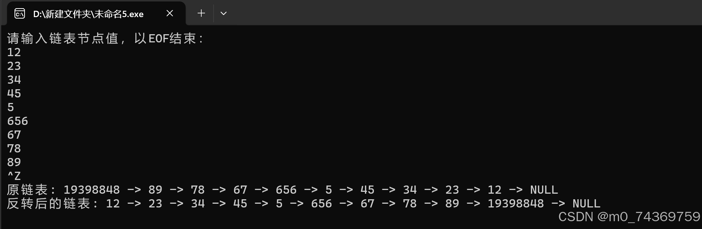



#### 数据结构链表当中的头结点问题

## 1. 示例举证


### 出现的什么例子（单链表的表头节点）


首先呢，我是在牛客网上做关于反转链表的操作，然后呢，做完之后，自己又把里面的具体的代码都写了一下，有打印，输入都有，这就是背景摘要。


### 给出自己原来写的代码及源码


下面我将给出大家我首先第一次写的代码如下：


```
#include <stdio.h>
#include <stdlib.h>

// 定义链表节点结构
struct ListNode {
    int value;
    struct ListNode* next;
};

// 反转链表函数
struct ListNode* reverseList(struct ListNode* head) {
    struct ListNode* prev = NULL;
    struct ListNode* current = head;
    struct ListNode* nextNode = NULL;

    while (current != NULL) {
        nextNode = current->next;  // 暂存下一个节点
        current->next = prev;      // 反转当前节点的指针
        prev = current;            // 前移 prev
        current = nextNode;        // 前移 current
    }

    return prev;  // 返回新的头节点
}

// 辅助函数，用于创建新节点
struct ListNode* createNode() {
    struct ListNode* head;  // 初始化头节点为空
    head=(struct ListNode*)malloc(sizeof(struct ListNode));
  head->next=NULL; // 用于记录链表的尾节点
    int x;                         // x为链表数据域中的数据
    while (scanf("%d", &x) != EOF) {
        struct ListNode* newNode = (struct ListNode*)malloc(sizeof(struct ListNode));
        newNode->value = x;
        newNode->next =head->next;  // 将新节点链接到尾节点之后
        head->next=newNode;        // 更新尾节点
    }
    return head;
}

// 辅助函数，用于打印链表
void printList(struct ListNode* head) {
    struct ListNode* current = head;
    while (current != NULL) {
        printf("%d -> ", current->value);
        current = current->next;
    }
    printf("NULL\n");
}

// 辅助函数，用于释放链表内存
void freeList(struct ListNode* head) {
    struct ListNode* current = head;
    while (current != NULL) {
        struct ListNode* next = current->next;
        free(current);
        current = next;
    }
}

// 主函数，用于测试反转链表
int main() {
    // 创建链表
    printf("请输入链表节点值，以EOF结束：\n");
    struct ListNode* head = createNode();

    printf("原链表: ");
    printList(head);

    // 反转链表
    struct ListNode* reversedHead = reverseList(head);

    printf("反转后的链表: ");
    printList(reversedHead);

    // 释放内存
    freeList(reversedHead);

    return 0;
}


```


## 2.出现的问题


**出现的问题呢就是在运行的时候，会在尾结点多出一个异常节点，当时我很懵逼，不知道，究竟错在什么地方了，然后，我以为我自己抄错了代码，然后有检验了一番，发现依旧是如此的，当时我真的很崩溃，不知道如何是好，我想到我是否可以在淘宝上面，问一下上面的大佬，花个10元，但是又觉得不值得，下面就是我的解决的经过之路**


### 出现的问题分类，代码里的哪些函数出错了。


我在ChatGPT上面经过询问得知，我不应该为头结点开辟一块内存空间即用malloc函数，上面解释说，若果强行要用malloc开辟的话，就会操作起来比较的麻烦，但是我想起来我们用到的头插法的雨具是这样子的,


```
假设新插入的空间是space那么的话，语句如下：
head->next=NULL;
space->next=head>next;
head->next=space;

```


我想既然，教材里面都给出了，head有next指针那么的话，head一定是用malloc开辟的空间，但是呢ChatGPT说不需要为头结点开辟空间，我想着若果头结点不需要开辟空间的话，那么的话，教材里为何给介绍开辟空间的那种头插法，我着教材不可能骗人吧，但是呢，经过测试，发现确实书本上的知识有一点问题，正确的头插法应该是这样子的不需要头结点的插入方法：


```
假设新插入的空间是space那么的话，语句如下：
head=NULL;
space->next=head;
head-=space;

```


这样子会更加的方便一些，不会有后续的错误，我把这个ChatGPT上给出的头插法带入到我的代码里结果非常显而易见，我成功了，结果也是非常喜人的。


下面我就为大家带来一下我的错误的运行的截图，如下所示：




并且呢，我为大家带来ChatGPT上面的截图如下：


**大家好，这就是ChatGPT给我的建！

下面我就为大家介绍如何解决该问题。**


## 3. 我的解决方案


在前文当中，我已经为大家介绍过了，我如何知道我的错误的问题，就是经过ChatGPT，询问得知，下面我就大模型，以及自己的总结俩方面给出合理的建议。


### 从网上chatgpt查找得到的解决方案


很明显他给出的解决方案就是把headbxy建议一个头结点，这样就很容易成功，他给出的源码如下：


```
#include <stdio.h>
#include <stdlib.h>

// 定义链表节点结构
typedef struct ListNode {
    int value;
    struct ListNode* next;
} ListNode;

// 反转链表函数
ListNode* reverseList(ListNode* head) {
    ListNode* prev = NULL;
    ListNode* current = head;
    ListNode* nextNode = NULL;

    while (current != NULL) {
        nextNode = current->next;  // 暂存下一个节点
        current->next = prev;      // 反转当前节点的指针
        prev = current;            // 前移 prev
        current = nextNode;        // 前移 current
    }

    return prev;  // 返回新的头节点
}

// 创建新节点函数
ListNode* createNode(int value) {
    ListNode* newNode = (ListNode*)malloc(sizeof(ListNode));
    newNode->value = value;
    newNode->next = NULL;
    return newNode;
}

// 辅助函数，用于创建链表
ListNode* createList() {
    ListNode* head = NULL;  // 初始化头节点为空
    int x;                  // x为链表数据域中的数据
    while (scanf("%d", &x) != EOF) {
        ListNode* newNode = createNode(x);
        newNode->next = head;  // 将新节点插入到链表头部
        head = newNode;        // 更新头节点
    }
    return head;
}

// 辅助函数，用于打印链表
void printList(ListNode* head) {
    ListNode* current = head;
    while (current != NULL) {
        printf("%d -> ", current->value);
        current = current->next;
    }
    printf("NULL\n");
}

// 辅助函数，用于释放链表内存
void freeList(ListNode* head) {
    ListNode* current = head;
    while (current != NULL) {
        ListNode* next = current->next;
        free(current);
        current = next;
    }
}

// 主函数，用于测试反转链表
int main() {
    // 创建链表
    printf("请输入链表节点值，以EOF结束：\n");
    ListNode* head = createList();

    printf("原链表: ");
    printList(head);

    // 反转链表
    ListNode* reversedHead = reverseList(head);

    printf("反转后的链表: ");
    printList(reversedHead);

    // 释放内存
    freeList(reversedHead);

    return 0;
}

```


但是呢，我并不满足这个解决方案，经过思考我也得出我的解决方案


### 自己研究得出的方案


我是把打印的函数的


```
 struct ListNode* current = head;

```


这个语句，修改为下面这个语句：


```
 struct ListNode* current = head->next;

```


然后再在反转单链表函数的里面修改就可以了，

如下：需要把这个语句


```
 struct ListNode* current = head;

```


修改为下面这个语句就可以了：


```
 struct ListNode* current = head;

```


然后呢，需要在末尾加上这个语句，并修改返回值为head即可


```
head->next = prev;
    return head;

```


### 给出自己修改过的代码


下面我就为大家带来我修改完之后的代码语句，如下：


```
#include <stdio.h>
#include <stdlib.h>

// 定义链表节点结构
typedef struct ListNode {
    int value;
    struct ListNode* next;
}ListNode;

// 反转链表函数
struct ListNode* reverseList(struct ListNode* head) {
    struct ListNode* prev = NULL;
    struct ListNode* current = head->next;
    struct ListNode* nextNode = NULL;

    while (current!= NULL) {
        nextNode = current->next;  // 暂存下一个节点
        current->next = prev;      // 反转当前节点的指针
        prev = current;            // 前移 prev
        current = nextNode;        // 前移 current
    }
    head->next = prev;
    return head;  // 返回新的头节点
}
 ListNode* create(int x){

	ListNode*newnode=(ListNode*)malloc(sizeof(ListNode));
	newnode->value=x;
	newnode->next=NULL;
	return newnode;

}

// 辅助函数，用于创建新节点
 ListNode* headNode() {
    struct ListNode* head=(ListNode*)malloc(sizeof(ListNode));
	head->next=NULL;
    int x;                         // x为链表数据域中的数据
    while (scanf("%d", &x) != EOF) {
        struct ListNode* newNode =create(x);
         newNode->next = head->next;
		 head->next= newNode;     // 更新尾节点
    }
    return head;
}

// 辅助函数，用于打印链表
void printList(struct ListNode* head) {
    struct ListNode* current = head->next;
    while (current != NULL) {
        printf("%d -> ", current->value);
        current = current->next;
    }
    printf("NULL\n");
}


// 主函数，用于测试反转链表
int main() {
    // 创建链表
    printf("请输入链表节点值，以EOF结束：\n");
    struct ListNode* head = headNode();

    printf("原链表: ");
    printList(head);

    // 反转链表
    struct ListNode* reversedHead = reverseList(head);

    printf("反转后的链表: ");
    printList(reversedHead);


    return 0;
}

```


## 4. 给予大家的警示


总的来说，比较俩种方法，可能第二种的方案比较麻烦，需要修改二处函数，可以想见，假设在以后工作之中，处理的函数体量庞大，那么的话，修改的函数也会有心无力的，因此呢我觉得，用第一种的不带头结点的方案是很喜人的，具体的话，自己看，但是在外面考试当中还是需要明白第二种的诀窍

最后写到，谨祝大家在数据解构课里面要善于思考，用于使用ChatGPT，会使用ChatGPT，他是一个很好的工具，同时呢，要是大家学有余力的的话，推荐大家学习咸鱼老师的数据结构，在b战里面大家可以搜索，王道的咸鱼老师讲的非常好。
