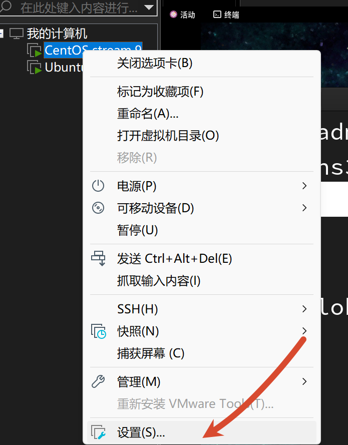
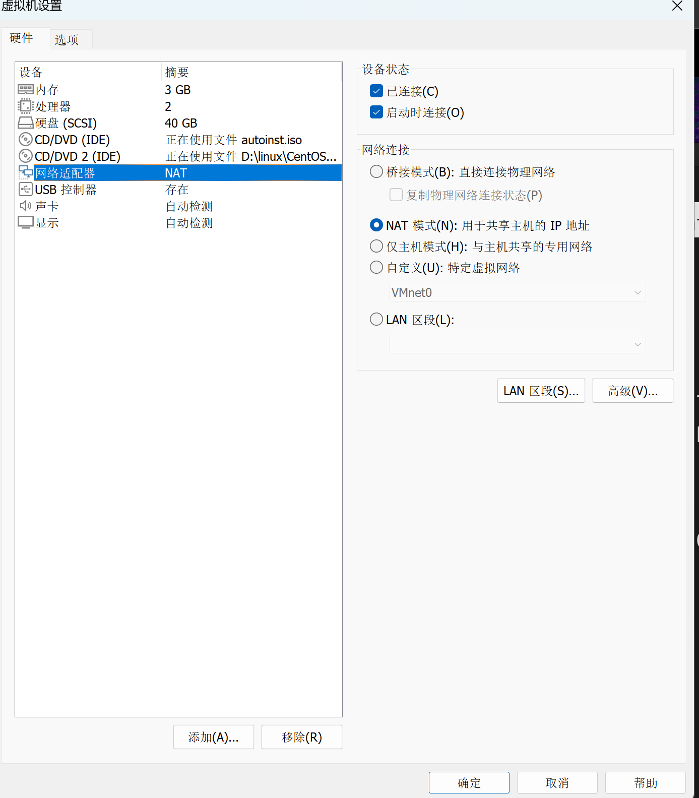
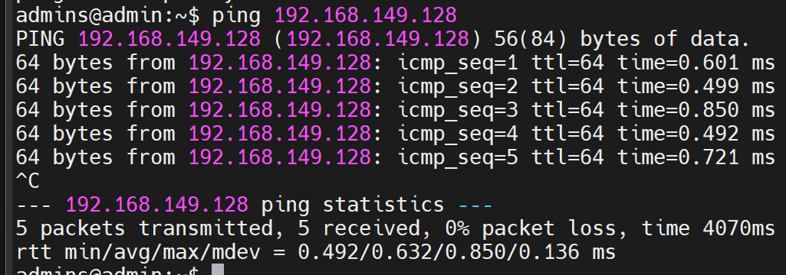
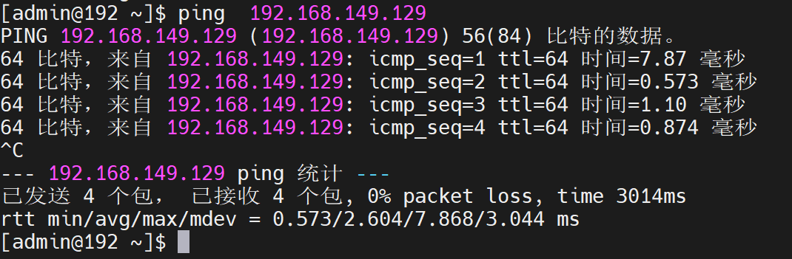
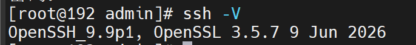
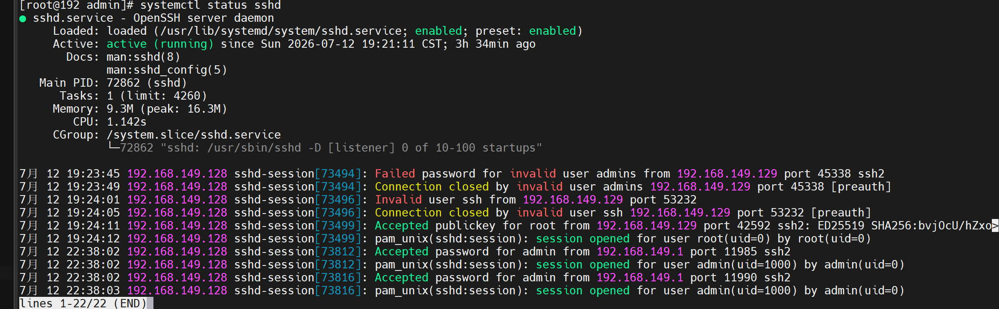
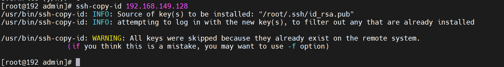
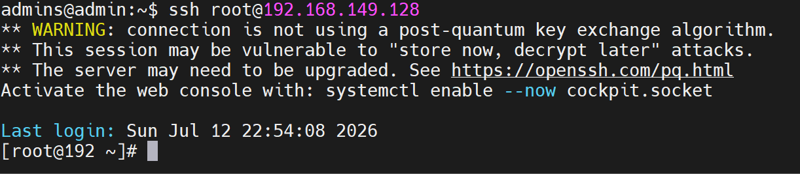
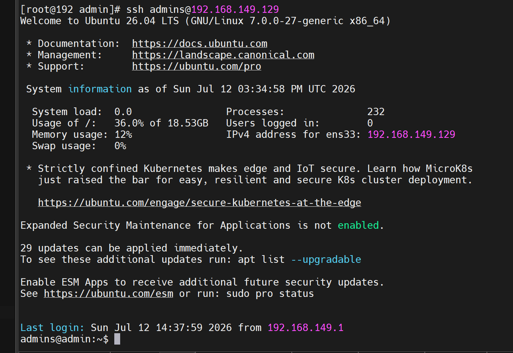



#### 这个是关于ssh的相关问题这个是关于ssh的相关问题


## 一.首先问题是：局域网内的两台主机如何可以相互登录


`在这里面的话，我们其实是分成了2步的步骤流程：`


- `首先第一步是检查是否我们局域网内的两台主机是否可以ping通`

- `第二步其实就是检查我们的这两台主机，是否安装了ssh服务`


`接下来呢，我们将在这2个方面探究第一个的问题，这里面我会将我遇到的问题都写出来，并给予解决方案`


### 一.检查网络的连通性


`其实，在这里面，大家务必要小心，不要觉得这个简单，就不好好看了，这个也是开始的时候困扰了我很久，后来才知道，了是这个问题没有解决，以下我就为大家详细的说一下吧：`


**首先呢，大家务必确定两台Linux是NAT模式，这个模式对于后续操作是有帮助的，否则的话，后面大家就会遇到各种各样的麻烦的，这里我就给大家说一下给如何进行NAT设置吧**


首先呢，大家要点击虚拟机里面的主机当中的设置按钮





接下来，在里面出现的界面我们选择网络适配器，选择NAT就可以了





然后，接下来的一台Linux的系统也是同理的，在这里我就不赘述了，操作到这里，其实两台主机就具有连通行了，我们可以ping一下的
 



 这一步，到这里就结束了，然后我们进行下一步操作的的.


### 二. 检查了是否安装了ssh服务


` 在这里呢，我们开始进入Linux里面，开始真正意义上的操作的`


- **首先就是我们查询是否安装了ssh相关服务，相比大家都知道的是，我们要安装ssh的客户端和服务端两个服务的，以下是查询的命令**


```
ssh -V   # 这个是检查SSH客⼾端版本，如果安装会显⽰版本信息

```





```
systemctl status sshd # 这个是检查SSH服务状态，如果服务正在运⾏则说明已安装SSH服务器

```





如果提⽰： command not found或类似的， 说明SSH服务未安装， 需要安装服务


![![[Pasted image 20260712225903.png]]](https://i-blog.csdnimg.cn/direct/8df8e7b8cc384d2883e169ae05d52064.png)


` 此时呢，就需要安装这几个服务了`


- 1.安装客户端


```
dnf install -y openssh-clients

```


- 2.安装服务端


```
dnf install -y openssh-service

```


- 3.启动ssh服务


```
systemctl start sshd # 启动服务
systemctl enable sshd # 将服务添加到⾃启动项，下次开机就⾃动启动了

```


**这一步，到这里，我们也就结束了**


**实是完成的，我们输入ssh 主机名@ip地址，最后输入密码就可以了，但是呢，两台主机都必须要用非root用户登录的，下面我大家探讨不需要输入密码就可以进行登陆的，同时我们也可以进行root用户的登录的。**


## 二.如何配置SSH免密登录


` 在这里面呢，我就为大家解决上面留下来的问题，一个是使用root账户也是可以登陆的；第二个是不使用密码也是可以进行登陆的。`


### 一.root用户的登录配置


` 在这里，我分了两个的步骤的，首先是修改配置文件，然后就是对所在的服务进行重启的。`


#### 1.修改配置文件


**在这里面呢，我们需要把配置文件：/etc/ssh/sshd_config给修改了，将里面的PermitRootLogin prohibit-password改成PermitRootLogin yes，然后保存就可以了。**


```
vim etc/ssh/sshd_config # 修改配置文件


```


大家在这里，如果修改完配置文件之后就需要，保存，这一步就搞定了。


#### 2.重启ssh服务


```
sudo systemctl restart sshd

```


接下来，我们就迎来了，最后的一步就可以了


### 二.免密钥登录


```
在这里，我们需要，先在一台Linux机器里面安装私钥和公钥，然后我们就把公钥发送给另一台Linux机器。

```


#### 1.安装私钥和公钥


```
ssh-keygen -f ~/.ssh/id_rsa -P '' -q

```


![[Pasted image 20260712232607.png]]
 **这样就可以了**
 ` 另一台机器同理，也是如此的安装方法。`


#### 2.发送公钥


`在这里，我们需要先给对方的机器发送公钥，其次再给我们自己的本机发送公钥。`


- 1.给对方的机器发送公钥。


```
ssh-copy-id 主机名@目标地址的IP地址

```


`大家做完之后，其实应该就是这个样子的。`





- 2.然后自己给自己发送公钥


` 同理，这里我就不叙述了。`


**这样我们就把其中的一台主机搞定了，另一台主机的操作流程其实是一样的，做出来的效果，大家可以看一下的，由于，我的另一个是Ubuntu所以呢，只可以使用普通用户登陆的。**
 
 


**写到最后，在这里呢，大家可能觉得搞一个两台主机相互ping通的操作是没有任何意义的，但是呢，我在这里诚挚的告诉大家，没有用处是在这里的，但是呢，黑马的佳乐老师，告诉了我们，在以后的脚本学习当中，脚本的配置当中是需要两台主机可以相互访问的，因为这样可以节省出大量的功夫的，我觉得在学习当中其实是可以研究一下自己有什么不明白的，然后把自己的不懂之处都写出来，虽然不可以做到极致，但是呢，我还是希望帮助到更多的人，最后说一句，希望这篇博客对于大家是有帮助的，大家如果大于计算机学习有兴趣是可以跟随黑马的课程的。**
