#### 非齐次方程当中的代入数值问题

- [一.遇到的问题](#_1)

- [0.0那个数学公式在梨米特讲义的位置](#00_4)

- [0.1那个公式在梨米特讲义上的例题](#01_8)

- [0.2那道数学公式在同济课本的地方](#02_13)

- [1.那道题目](#1_18)

- [2.我算的结果和答案给的区别](#2_20)

- [1.我算的结果](#1_21)

- [2.答案给的是这样子的](#2_23)

- [二.解决的方案](#_26)

- [1.我的错误分析](#1_28)

- [2.测试的结果分析](#2_30)

- [1.首先是在网站symbol这个网站测试的结果，如下，大家有兴趣可以试一下。](#1symbol_31)

- [2.然后答案给的看一下](#2_33)

- [3.分析结果](#3_35)

- [三.我的建议](#_37)

## 一.遇到的问题

首先我在写数学题的时候，遇到了一个问题，就是我用非齐次方程的代入数值的公式进行操作的时候，遇到了，一个问题，就是，我用公式算的竟然和答案给的不一样，当时我就有一点困惑，然后，我一点一点研究，探明这个公式的使用范围。

### 0.0那个数学公式在梨米特讲义的位置

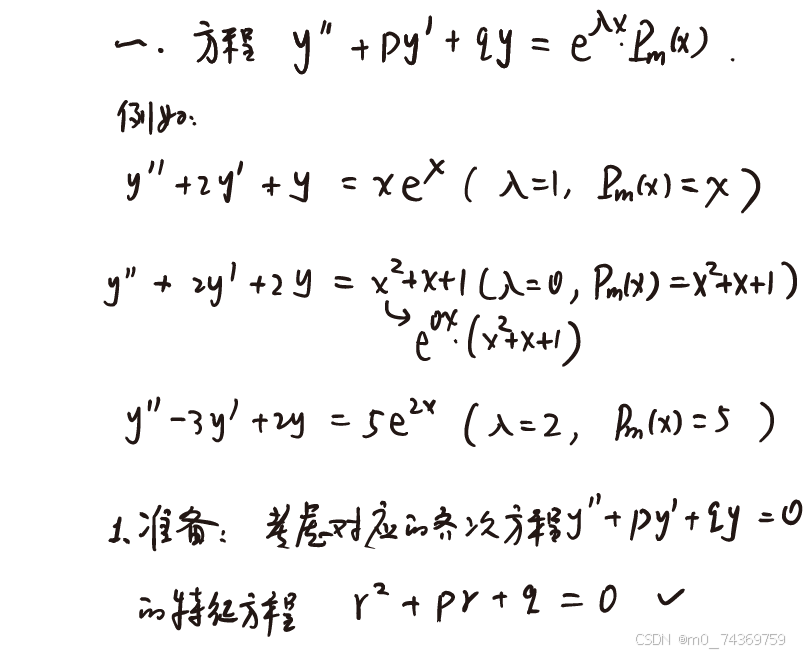
 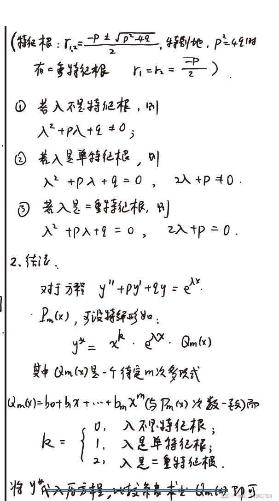

### 0.1那个公式在梨米特讲义上的例题

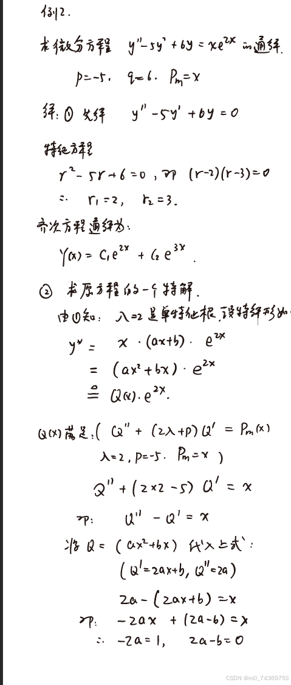
 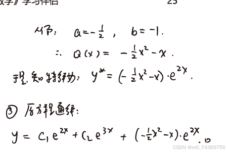

### 0.2那道数学公式在同济课本的地方

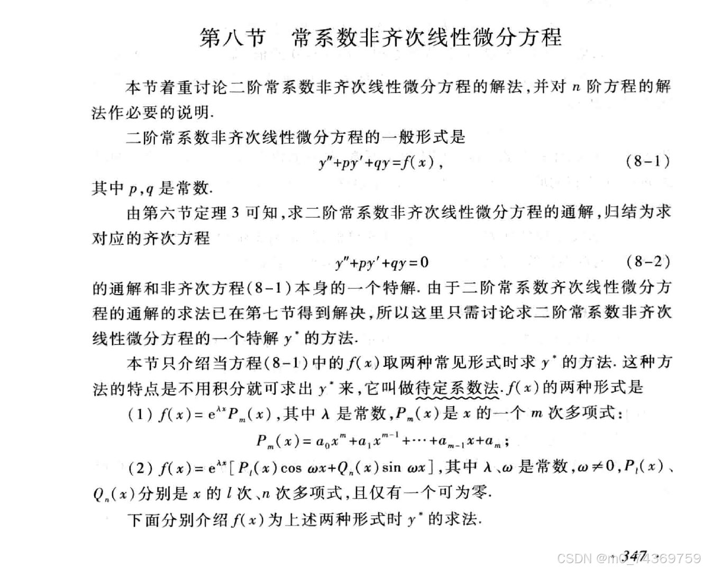
 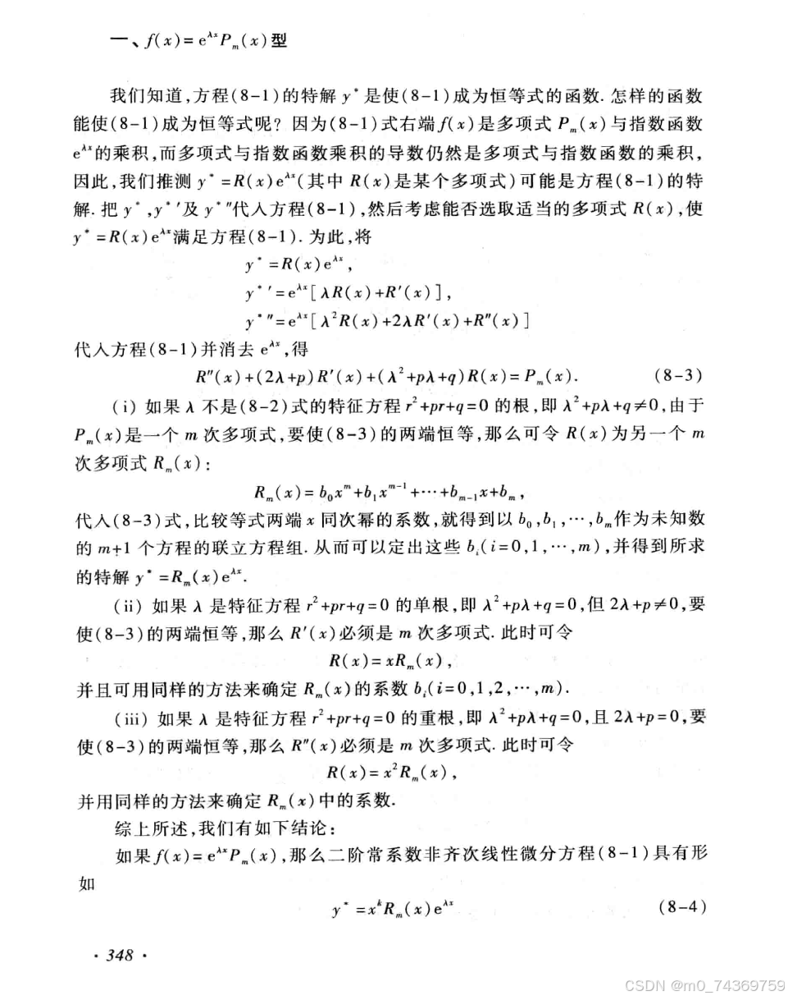
 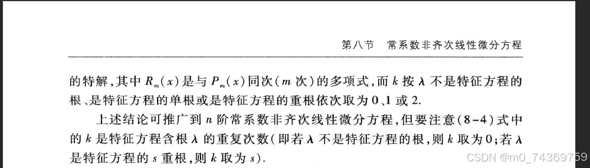

### 1.那道题目

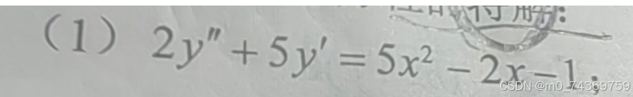

### 2.我算的结果和答案给的区别

#### 1.我算的结果

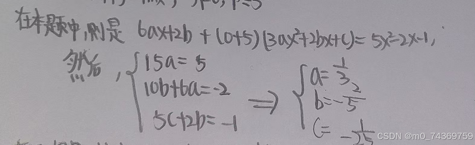

#### 2.答案给的是这样子的

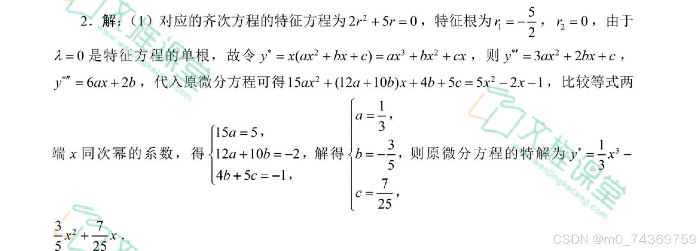

## 二.解决的方案

当时我在淘宝问了一下，然后，我就知道我的问题在哪里了，

### 1.我的错误分析

通过和淘宝上的那位老师探究，我明白了，我的问题正是没有将二阶导的系数化为1，所导致的问题，老师，说，你可以方程俩边都除以2，将2阶导的系数化为1，就可以就解决问题了，我一想这个形式不正是和书上给的形式一样吗？那结果一个是对的，然后我就用symbol这个网站测试了一下，下面是测试结果。

### 2.测试的结果分析

#### 1.首先是在网站symbol这个网站测试的结果，如下，大家有兴趣可以试一下。

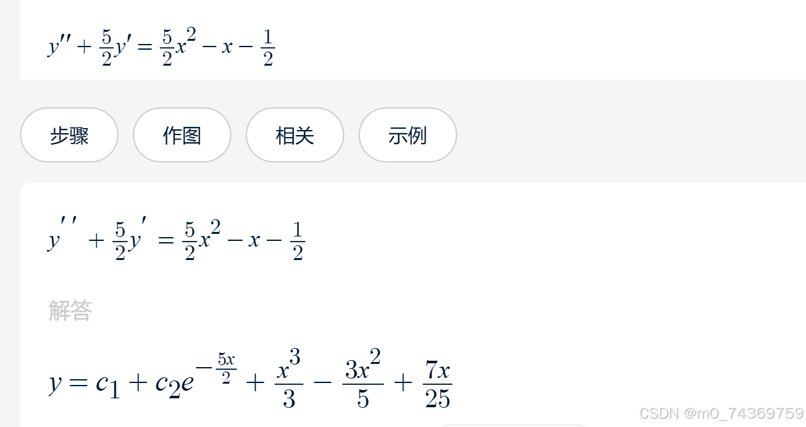

#### 2.然后答案给的看一下

### 3.分析结果

通过这些结果我们很清楚的看到，通过把二阶导的系数化为1，算出来是对的

## 三.我的建议

通过以上的分析相信大家都认识到了，这个公式的适用范围，那就是二阶导的系数必须为1，其他的倒是没有要求。
