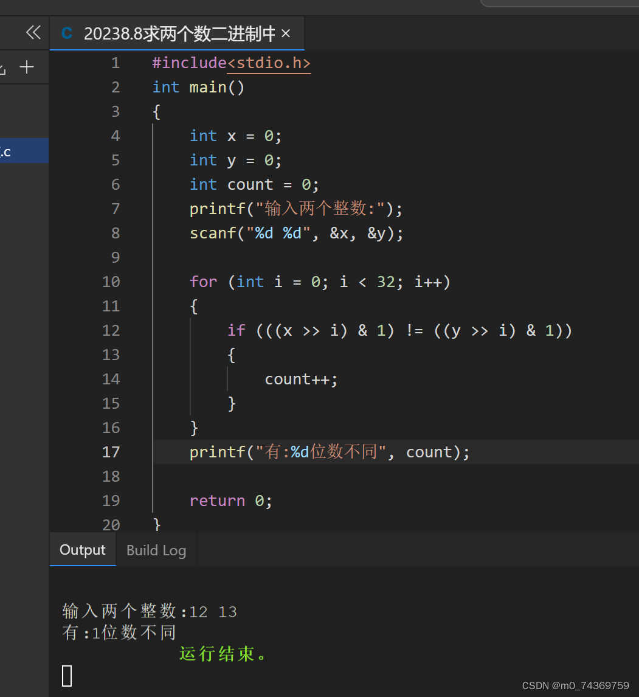



例题：求两个数二进制中不同位的个数，写出C代码。

在我的讲解篇2中可以看到：由于每次右移1位并对1按位与那么就可以将二进制位分离出来，得出与原来一样二进制位。

思路一样，那么我们可以用上一篇中提到的方法，那么接下来我们就需要对每个二进制位进行比较就可以了，以此类推，若是不同的话统计其个数并将其统计的个数，返回，所求的便是其值，我所写的代码，如下：


```
#include<stdio.h>

int main()

{

    int x = 0;

    int y = 0;

    int count = 0;

    printf("输入两个整数:");

    scanf("%d %d", &x, &y);


    for (int i = 0; i < 32; i++)

    {

        if (((x >> i) & 1) != ((y >> i) & 1))

        {

            count++;

        }

    }

    printf("有:%d位数不同", count);


    return 0;

}


```


下面是我的代码的运行结果：


