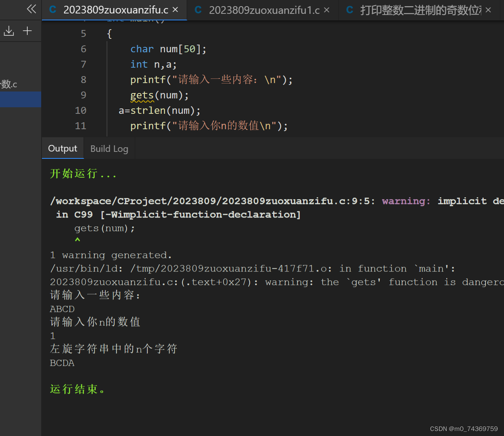
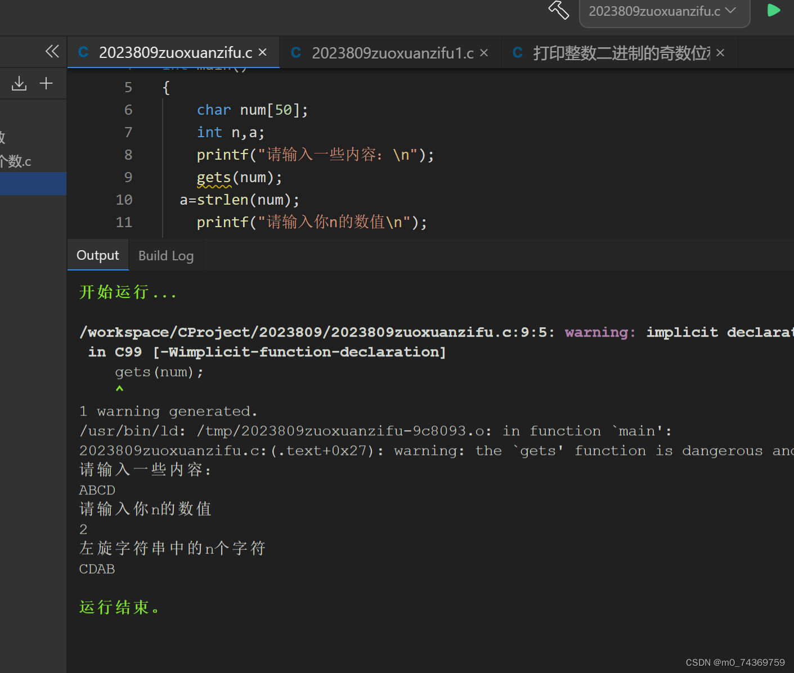



例题：实现一个函数，可以左旋字符串中的k个字符，用C语言写出。

每次可以把第一个字符存下来，接下来可以以此把每个字符向前移动一个位置，最后把最后一个字符赋值为刚开始存下的值，这样每次做到的就是翻转就是一个字符，那么将总共的大循环，设定为翻转得个数，那么就可以轻轻松松解决问题了，下面是我的代码示例：


```
#include<stdio.h>

#include<string.h>

void programming(char * a,int n,int num);

int main()

{

    char num[50];

    int n,a;

    printf("请输入一些内容：\n");

    gets(num);

  a=strlen(num);

    printf("请输入你n的数值\n");

    scanf("%d",&n);

    printf("左旋字符串中的n个字符\n");

    programming(num,n,a);

    printf("%s\n",num);

    return 0;

}

void programming(char * a,int n,int num)

{

    int i=0;

    char temp;

  for(i=0;i<n;i++)

  {

      temp=*a;

      for(int j=0;j<num-1;j++)

      *(a+j)=*(a+1+j);

      *(a+num-1)=temp;

  }


  }

```


该代码的运行结果，是如下：




