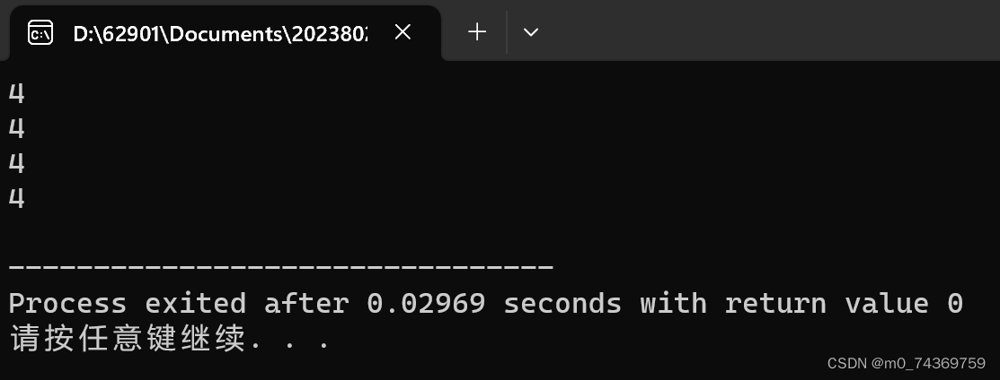



从这一节开始，我们就要开启学习指针之旅，我将此次指针的学习分为5次，今天是第一次学习，在学习指针的时候我们必定会遇到许多困难与挑战，我们会遇到一些比较抽象的概念，也会遇到一些复杂的代码，不管如何，我们能做的只有坚持，坚持只有这样，我们才可以真正搞懂所谓的指针，明白指针的确实含义，来开启我们今天的指针学习吧，亲爱的同学们！


#### C语言指针篇第一


 首先呢，我将为大家介绍有关地址的知识点，接下来我们会学习到指针的运算，以及使用。


## 1. 内存和地址


### 1.内存与地址的介绍


>


1.在宾馆当中，我们若果需要寻找需要的人时，在不知道对方的房间号时，我们能够做的是，一个房间一个房间挨着寻找，虽然这样可以找到我们需要的人，但是需要注意的是。这样寻找，注定了它的效率是不高的，是低效率的，因此呢，若果我们知道对方的房间号时，那么找到对方是一瞬间的事情。
 2.在计算机中，信息也是按照宾馆，按照宿舍存储的，在计算机中信息是以字节为单位，这个字节就有点像宿舍，一个宿舍存储8个人，而一个字节有八个比特位，这样只要我们知道信息的房间号，在计算机中我们常说的是地址----指针—内存单元的编号，我们就可以迅速的找到这个信息。
 3.若果在32为环境下，地址是按照32位地址线发出电信号，进行编码的，此时地址拥有32个比特位，也就是说地址有4个字节
 4.但是，若果在64位的环境下，那么就是地址按照64个地址线编码的，此时地址拥有64个比特位，也就是说地址现在拥有，8个字节。


### 2.地址的一些性质


`1.首先，在相同环境之下，地址的大小都是一样，要么是4个字节，要么是8个字节，这个同地址（指针）的类型是无关的。`
 2. 指针是有类型的，有字符型，整型，数组类型。
 **3. 在计算机存储当中时，是按照字节进行存储的，整型的话是4个字节，字符型是一个字节。**


## 2. 指针变量和地址


以下我们即将学到，操作符&，以及解引用操作符*，以及我们会学习到，指针的大小如何比较，下面就开启我们的学习之旅吧！


### 1.取地址操作符（&）


首先呢，我们举一个例子：


```
int a=12;
int * pr=&a;

```


在上例中，我们可以看到，按位与操作符加在变量之前就变成了，取地址操作符，通过以上代码，我们可以发现，我们使用了指针变量加以接收，a的地址，现在把a的地址就存储到pr当中了，通过上例的举出，大家对于取地址操作符，有新的了解与认识吗？似乎，没有非常的困难的样子，下面我就为大家开启以下的重头戏，上面只是本个知识点的开胃菜，下面才是真正的硬菜。


### 2.指针变量和解引⽤操作符（*）


在下面我即将会学习到，解引用操作符以及指针变量，这个我希望大家可以认真，听我的讲解，来开启这个知识点的学习吧！


#### 1.指针变量


##### 1.指针变量的含义


1.当大家首次听到这个名字的时候，会发生疑惑，指针变量不是接收地址，而地址在内存当中不是一样的吗？其实对于这样的想法，我想说，你说的并没有问题，只是由于，不同类型的地址，他们的指针宽度是不同的，因此不能胡子眉毛一把抓，我们在此处定义了指针变量有字符型，整型，数组类型，函数类型，等等。


##### 2.指针变量的意义


1.由于我们拥有了指针变量，那么的话，它就可以存储我们的地址，这样地址就存储在指针变量当中，这大概就是指针变量的含义。


#### 2.解引⽤操作符（*）


##### 1.解引用操作符的含义


解引用操作符是当地址存储在指针变量当中之时，我们需要操纵这个地址上面的东西，这个时候我们就用到了解引用操作符，给大家举例子如下：


```
int a=12;
int * pr=&a;
*pr=3;

```


##### 2.理解指针变量


给大家举出例子如下：


```
int w=18;
int * a=&w;

```


在这里呢，*a代表的是，该变量是指针变量而其前面的int 则表示的是，指针的类型是整型，如此我相信大家，可以对指针变量有着深厚的理解。


##### 3.解引用操作符的意义


通过以上例子，我们可以发现通过解引用，我们就非常的容易对a的地址进行修改，这样解引用就不仅可以得到与原来的变脸一样的变量，同时由于其是对地址的解引用那么的话，同时可以对原变量进行远程修改，这一点是极其重要的。


### 3.指针变量的⼤⼩


指针变量的大小，在我的上面陈述当中时，我们发现在相同环境下，那么指针变量的大小就是一样的，假设在32位的环境之下，那么指针变量的大小都是4个字节；若是在64位的环境之下的话，那么的话，指针变量的大小就是8个字节，给大家举出例子如下：


```
#include <stdio.h>
//指针变量的⼤⼩取决于地址的⼤⼩
//32位平台下地址是32个bit位（即4个字节）
//64位平台下地址是64个bit位（即8个字节）
int main()
{
 printf("%zd\n", sizeof(char *));
 printf("%zd\n", sizeof(short *));
 printf("%zd\n", sizeof(int *));
 printf("%zd\n", sizeof(double *));
 return 0; }

```


如下是在32位环境下运行的结果：
 
 由此呢，我相信大家一定会明白指针的大小是相同的，只要是在相同的环境之下，下面我们就开启关于变量的类型的意义的学习。


## 3. 指针变量类型的意义


### 1.指针变量类型的含义


我们需要知道一个东西，是指针的步长，也就是指针的宽度，是指针向后移动一个则实际在内存上移动多少个字节。


### 2.指针变量类型的举例


指针变量的类型有字符型，整型，他们的步长分别是1,4。


### 3. 指针变量类型的意义


首先我们举出例子如下：


```
#include <stdio.h>
int main()
{
 int n = 0x11223344;
 int *pi = &n;
 *pi = 0;
 return 0;
 }

```


1.在这里，由于指针变量的类型与变量的类型都是整型那么的话，所得出的答案，就是整型a的4个字节全部都是0.


```
#include <stdio.h>
int main()
{
int n = 0x11223344;
char *pc = (char *)&n;
*pc = 0;
return 0;
 }

```


2.在这里，由于指针变量的类型是字符型与变量的类型是整型那么的话，所得出的答案，就是整型a的4个字节中的一个字节是0.
 3.通过上述例子我们看出，指针的类型对于解引用的权限是相关的，需要注意的是void * 可以接收任何的地址类型，但是不能对void 类型的指针进行解引用，因为它的步长我们无法得知。


## 4. const修饰指针


### 1.const修饰变量（1）


若果我们不想要变量被修改的话，那么我们需要在变量的前面加上const，这样变量就不能通过直接的方式修改了，我给大家举出的例子如下：


```
const int a=90;
a=98;

```


那么由于我们在变量的前面加上了const那么变量是无法修改的，在程序运行的时候必然会报错。


### 2.const修饰变量（2）


1.我们在上述的例子中发现加上一句const这句话，这样便无法被修改了，但是我们可以采用间接的方法进行修改，举出的例子如下：


```
const int a=90;
int * b=&a;
*b=98;

```


2.由于const修饰的是，变量a那么它的地址就没有被修饰，如此我们就可以采用地址的方式修改原来的地址，我们加上const这句话的目的是不要修改原来的变量，但是它被修改了，这不是我们需要的代码，是不正确的，因此我们通过以下的方式，对地址加上const那么就可以，规避这些问题了。


### 3.const修饰指针


const修饰指针，可以通过加在指针的前面或者后面加以取得不同的结果，取得不同的修饰的后果。


#### 1.const加在*的前面


1.这样修饰的是指针指向的内容，保证指针指向的内容不能通过指针来改变。 但是指针变量本⾝的内容可变。
 给大家举出的例子如下：


```
void test2()
{
 //代码2
 int n = 10;
 int m = 20;
 const int* p = &n;
 *p = 20;//ok?
 p = &m; //ok?
}

```


2.在这里由于指针指向的内容不能通过指针来改变，那么*p=20是错误的，在系统运行的时候会报错，但是由于指针变量本⾝的内容可变，那么的话，p = &m是没有问题的。


#### 2.const加在*的后面


1.这样修饰的是是指针变量本⾝，保证了指针变量的内容不能修改，但是指针指 向的内容，可以通过指针改变。
 给大家举出的例子如下：


```
void test3()
{
 int n = 10;
 int m = 20;
 int *const p = &n;
 *p = 20; //ok?
 p = &m; //ok?
}

```


2.在这里由于指针变量的内容不能修改，那么 p = &m; 是错误的，在系统运行的时候会报错，但是指针指 向的内容，可以通过指针改变，那么的话，*p = 20是没有问题的。


## 5. 指针运算


### 1.指针-指针


指针-指针是指针之间的元素的个数，给大家举出例子如下：


```
#include <stdio.h>
int my_strlen(char *s)
{
 char *p = s;
 while(*p != '\0' )
 p++;
 return p-s;
}
int main()
{
 printf("%d\n", my_strlen("abc"));
 return 0;
 }

```


上述例子当中，由于把首地址存到另一个指针当中，那么两者相减那么就是，字符串的个数


### 2.指针+（-）整数


是指针移动多少个步长，举出一些例子如下：


```
#include <stdio.h>
//指针+- 整数
int main()
{
 int arr[10] = {1,2,3,4,5,6,7,8,9,10};
 int *p = &arr[0];
 int i = 0;
 int sz = sizeof(arr)/sizeof(arr[0]);
 for(i=0; i<sz; i++)
 {
 printf("%d ", *(p+i));//p+i 这⾥就是指针+整数
 }
 return 0;
 }

```


在上面的例子当中，*(p+i)就是每次移动i * 步长个单位，而int类型的指针的步长则是4，那么每次的移动次数就是步长乘以i，以此类推。


## 6. 野指针


### 1.野指针是如何造成的


以下是野指针形成的三个成因。


#### 1. 指针未初始化


例子如下：


```
#include <stdio.h>
int main()
{
 int *p;//局部变量指针未初始化，默认为随机值
 *p = 20;
 return 0;
 }

```


#### 2. 指针越界访问


例子如下：


```
#include <stdio.h>
int main()
{
 int arr[10] = {0};
 int *p = &arr[0];
 int i = 0;
 for(i=0; i<=11; i++)
 {
 //当指针指向的范围超出数组arr的范围时，p就是野指针
 *(p++) = i;
 }
 return 0;
 }

```


#### 3. 指针指向的空间释放


例子如下：


```
#include <stdio.h>
int* test()
{
 int n = 100;
 return &n;
}
int main()
{
 int*p = test();
 printf("%d\n", *p);
 return 0;
 }

```


### 2.如何规避野指针


1.指针初始化
 2.⼩⼼指针越界
 3.指针变量不再使⽤时，及时置NULL，指针使⽤之前检查有效性
 完（结束）
