

## 一.DNS服务器软件介绍


### 1… DNS的基本概念


```
DNS（Domain Name System，域名系统）是互联⽹的“电话簿”，它⽤于将⼈类易于记忆的域
名（如 www.baidu.com）转换为计算机能够理解的 IP 地址（如 192.0.2.1）。由于直接记住数字地址
不如记住域名⽅便，DNS 使得⼈们能够通过域名访问⽹站，⽽不必关⼼背后的数字地址。
作⽤：
• 域名映射到IP地址：DNS使得⽤⼾在浏览器中输⼊域名时，能够查询到相应的IP地址，从⽽连接到
⽬标服务器。
• 反向解析：除了域名到IP的正向解析，DNS 还⽀持 IP 地址到域名的反向解析，这对⽹络安全和故
障排查等⾮常重要。
• 提供负载均衡：通过 DNS，可以实现不同 IP 地址的轮换，帮助分散流量，提升访问速度和可靠
性。
• 简化⽹络配置：通过 DNS，管理员只需使⽤域名管理服务，简化了⽹络配置和维护。

```


### 2.DNS结构


#### 1.根域 .（root）


```
在整个 DNS 系统的最上⽅⼀定是 . (⼩数点) 这个 DNS 服务器 (称为 root)，也叫”根域“。它们不
直接存储域名和IP地址的映射，⽽是存储指向顶级域（TLD）服务器的信息。
根域 （13台 全世界只有13台。1台为主根服务器，放置在美国。其余12台均为辅根服务器，其中9
台放置在美国，欧洲2台，位于英国和瑞典，亚洲1台，位于⽇本。）

```


#### 2.顶级域DNS服务器(TLD DNS Servers)


```
顶级域（如 .com , .org , .net , .cn 等）的DNS服务器存储了关于某个域名下的权威DNS服务
器的信息。
例如， .com 域的TLD服务器会告诉你要去查找与某个 .com 域名相关的权威DNS服务器。```
• 常⻅的顶级域及国家
.com 商业机构
.net ⽹络
.org ⾮商业机构 www.centos.org www.kernel.org
.edu 教育机构
.gov 政府机关
.cn 中国域名
.us 美国域名
.ai ⼈⼯智能
.io 云计算
.mil 军事机构

```


`除了顶级域名外， 还有⼆级域名（baidu.com）、三级域名（smartgo.net.cn）、四级域名 （it.smartgo.net.cn）等`


#### 3.权威DNS服务器（Authoritative DNS Servers）


`权威DNS服务器存储了某个域名的确切信息（如 IP 地址）。当DNS查询请求到达这些服务器时，服务器会直接返回查询结果。它们对⾃⼰所管理的域名负责。除了这些类型的DNS服务器外，其实还有递归DNS服务器、缓存DNS服务器、前向DNS服务器等`


### 3.DNS服务器软件介绍


```
⽬前市场上⽀持搭建DNS服务器的软件有很多，以下是⼏个常⽤的DNS服务器介绍：
• 1- BIND（Berkeley Internet Name Domain）
BIND 是最常⻅的 DNS 服务器软件之⼀，⼴泛应⽤于 Linux 和 Unix 系统。它功能强⼤，⽀
持正向和反向解析，并且具有灵活的配置选项。
优点：
功能强⼤，⽀持主从 DNS 配置。
配置灵活，⽀持多种⾼级功能，如 DNSSEC、访问控制等。
社区活跃，⽀持⼴泛。
缺点：
配置较为复杂，初学者需要时间学习。
• 2- Unbound
Unbound 是⼀个轻量级的、开源的 DNS 解析器，主要⽤于递归查询，它的设计⽬标是提供快
速、安全、灵活的 DNS 服务。相⽐ BIND，Unbound 更加简洁易⽤，适合⽤于简单的 DNS 解析服
务。
优点：
配置简便，容易上⼿。
安全性⾼，⽀持 DNSSEC 和 DoH（DNS over HTTPS）。
性能优越，适合⾼负载环境。
缺点：
功能不如 BIND 强⼤，主要⽤于递归解析，⽽⾮权威 DNS 服务。
3- dnsmasq
dnsmasq 是⼀个轻量级的 DNS 和 DHCP 服务器，适⽤于⼩型⽹络或家庭环境。它可以提供
DNS 缓存功能，并且⽀持 DHCP 服务。
优点：
配置简单，适合⼩型⽹络和家庭⽹络。
⽀持 DHCP 服务，可以同时作为 DNS 和 DHCP 服务器。
⽀持 DNS 缓存，加速访问速度。
缺点：
功能相对有限，适合⼩规模⽹络，不能处理⾼负载。
4- PowerDNS
PowerDNS 是⼀个⾼性能的 DNS 服务器，⽀持多种后端数据库，如 MySQL 和 PostgreSQL。
它适⽤于需要⾼性能、⾼可⽤性的企业级应⽤。
优点：
⽀持多种后端数据库，便于管理⼤量 DNS 记录。
⾼性能，适合⼤规模部署。
缺点：
配置较为复杂，适合有经验的⽤⼾。
5- CoreDNS
CoreDNS 是⼀个灵活、可扩展的 DNS 服务器，⼴泛⽤于 Kubernetes 环境中，也可以作为传
统 DNS 服务器使⽤。它由 Go 语⾔编写，⽀持插件扩展。
优点：
可扩展，⽀持插件机制。
轻量级，易于配置。
⽀持现代云环境，特别适⽤于 Kubernetes 集群。
缺点：
主要⽤于云环境，配置⽅式与传统 DNS 服务有所不同。

```


本次我们主要采⽤BIND来完成建设DNS服务器的任务
 服务器规划：
 • node1为访问的客⼾端
 • node2为DNS服务器


## 二.在DNS服务器上安装BIND


`node1和node2上面是均可以安装这个软件bind的说明： bind：提供 DNS 服务器功能，⽤于 解析域名（包括内部和外部域名），管理 DNS 区域和记录。 bind-utils：提供⼀些 DNS 查询⼯具，如 dig、nslookup、host，⽤于测试和调试 DNS 配置`


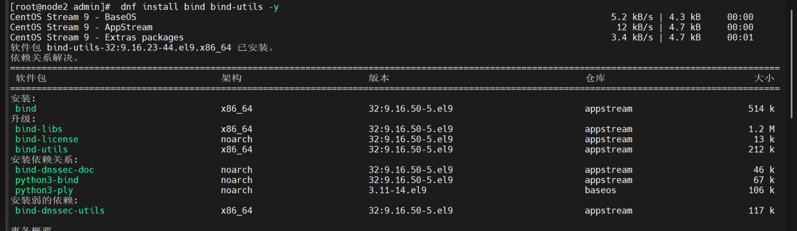


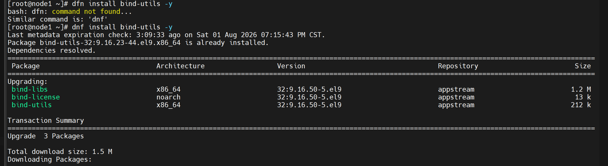


## 三.配置BIND主配置⽂件


`我们使用vi /etc/named.conf这个命令来配置文件`


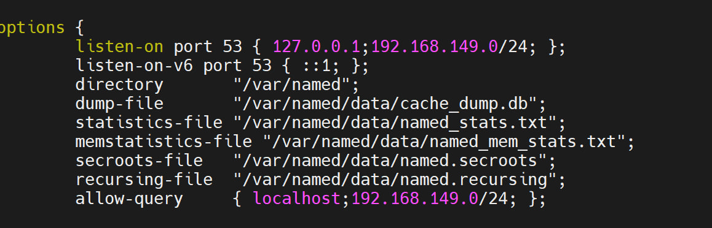


## 四.配置内部区域注册⽂件


```
假设⽬前有以下内部⽹站需要配置内部转发：
1 internal.local 192.168.88.101

```


### 1.正向解析


#### 1.添加正向解析声明


- .`我们修改配置文件，vi /etc/named.rfc1912.zones,在文件里面添加正向解析的声明`


```
vi /etc/named.rfc1912.zones

添加以下内容：

zone "internal.local" IN {
    type master;
    file "/var/named/internal.local.db";
    allow-update { none; };
};


说明:
zone "internal.local" IN {
    表示一个 DNS 区域的声明
    internal.local 是此 DNS 区域的名称
    IN 指 Internet 类别，常用默认值

type master;
    指定此区域的类型为 主（master）区域
    主区域是该域名的权威数据源，DNS 数据直接从此服务器的配置文件加载

file "/var/named/internal.local.db";
    定义该区域的区域数据文件位置
    文件 internal.local.db 包含该区域的记录（如 A、MX、NS 等）

allow-update { none; };
    指定此区域是否允许动态更新
    none 意味着不允许任何动态更新，域名记录只能通过手动修改文件更新

```


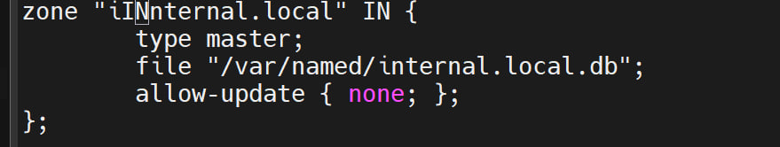


#### 2.添加正向解析内容


- .`我们需要打开之前在rfc1912.zones这里面声明的文件，然后在这个文件里面进行添加内容`


```
vi /var/named/internal.local.db

# 添加以下内容：

$TTL 86400
@    IN    SOA   ns1.internal.local. admin.internal.local. (
                  2024011701 ; Serial
                  3600       ; Refresh
                  1800       ; Retry
                  1209600    ; Expire
                  86400 )    ; Minimum TTL

     IN    NS    ns1.internal.local.
ns1    IN    A     192.168.149.130
web1   IN    A     192.168.149.128
web2   IN    A     192.168.149.128
@      IN    A     192.168.149.128


说明:
$TTL 默认 TTL (Time To Live)。
所有资源记录的默认缓存时间，单位为秒。
这里设置为 86400（一天）。客户端在缓存数据时会遵循此值。

SOA 记录（Start of Authority）
        @: 当前区域的根域（即 internal.local）。
        IN: 表示 Internet 类别。
        SOA: 开始授权记录，定义该区域的关键元信息。
        ns1.internal.local.        主域名服务器的 FQDN（全限定域名）。
    admin.internal.local.        管理员的邮箱地址，@ 替换为 .（即 admin@internal.local）。
    2024011701        序列号，每次修改区域文件时需递增，用于从服务器检测更新。
    3600        刷新时间，从服务器多久检查主服务器是否有更新（秒）。
    1800        重试时间，从服务器在刷新失败后再次尝试的等待时间（秒）。
    1209600        过期时间，从服务器在无法联系主服务器时数据失效的时间（秒）。
    86400        最小 TTL，未覆盖的记录的默认缓存时间（秒）。

NS 记录（Name Server）
        指定该区域的域名服务器地址。
        ns1.internal.local.: 表示 internal.local 的主域名服务器。

A 记录（Address）: 定义域名到 IPv4 地址的映射。
        ns1.internal.local. 解析为 192.168.88.102
        web1.internal.local. 和 web2.internal.local. 都解析为 192.168.88.101


扩展常见的DNS记录类型:
A 记录（Address Record）: 将域名映射到 IPv4 地址。
AAAA 记录: 将域名映射到 IPv6 地址。
CNAME 记录（Canonical Name Record）: 为域名提供别名。
MX 记录（Mail Exchange Record）: 指定邮件服务器的地址。
NS 记录（Name Server Record）: 指定域名的权威 DNS 服务器。
SOA 记录（Start of Authority Record）: 定义 DNS 区域的起始权威信息。
PTR 记录（Pointer Record）: 用于反向 DNS 查找，将 IP 地址映射回域名。
TXT 记录（Text Record）: 存储任意文本数据，常用于 SPF、DKIM 等验证机制。

```


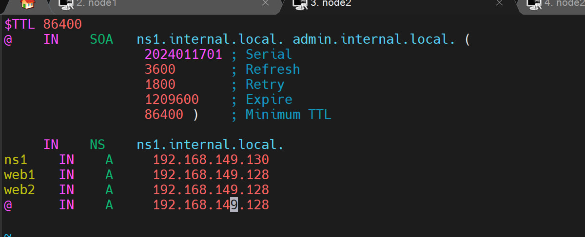


`要是我们需要其他域名比如说是it_test.cn，那么的话，我们需要先把internal.local都改成it_test.cn，其次我们这个时候需要的子域名是heima以及boxuegu，那么我们需要将web1修改为heima，web2修改为boxuegu，其实就可以了，这个域名其实就添加成功了。`


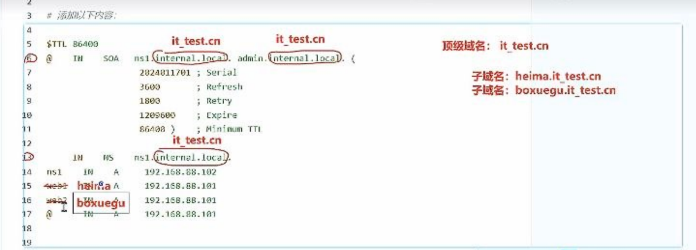


### 2.反向解析


#### 1.添加反向解析的声明


- 1.`我们需要打开rfc1912.zones这个文件，并且在文件添加反向解析的声明`


```
vi /etc/named.rfc1912.zones

# 添加以下配置
zone "149.168.192.in-addr.arpa" IN {
    type master;
    file "/var/named/192.168.149.rev";
    allow-update { none; };
};

说明:
zone "149.168.192.in-addr.arpa" IN {
这是一个 反向区域（reverse zone）的声明。
反向区域用于将 IP 地址（IPv4）转换为域名，这和正向 DNS 查询（将域名转换为 IP 地址）是相反的。
149.168.192.in-addr.arpa：这是 192.168.149.x IP 地址段的反向区域名称。反向查找区域的命名规则是：将 IP 地址的每个八位字节倒序并加上 .in-addr.arpa 后缀。例如，192.168.149.x 的反向区域名称就是 149.168.192.in-addr.arpa。

type master;
指定该区域是 主（master）区域，也就是说，这是该区域的权威 DNS 服务器，并且数据会从本地文件加载

file "192.168.149.rev";
这是该区域的区域数据文件路径。
192.168.149.rev 文件包含了反向解析记录，用于将 IP 地址（如 192.168.149.101）映射到对应的域名

allow-update { none; };
allow-update 指定是否允许动态更新。在这里设置为 none，意味着不允许任何动态更新
这是一种安全配置，防止未经授权的客户端修改 DNS 记录

```


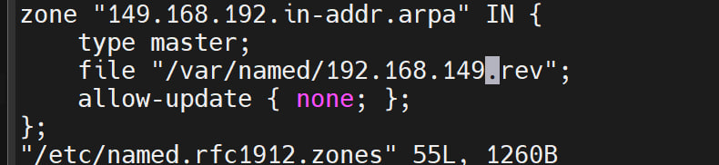


#### 2.添加反向解析的内容


```
vi /var/named/192.168.149.rev

# 添加以下配置
$TTL 86400
@    IN    SOA   ns1.internal.local. admin.internal.local. (
                  2024011701 ; Serial
                  3600       ; Refresh
                  1800       ; Retry
                  1209600    ; Expire
                  86400 )    ; Minimum TTL

     IN    NS    ns1.internal.local.
130    IN    PTR   ns1
128    IN    PTR   web1
128    IN    PTR   web2
128    IN    PTR   @

```


`这个文件其实与正向的文件很相似，只不过的是这个文件刚好在后几行反过来了,it_test.cn，其实添加逻辑也是一样的,和正向文件差不多，把Internal.local修改,以及把web1,web2修改一下就可以了`


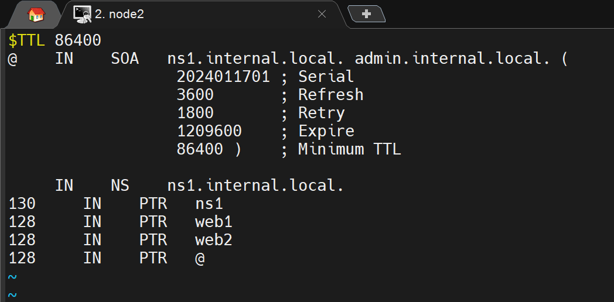


`然后我们保存文件就可以了`


### 3.语法检测


`我们需要采用named-checkconf /etc/named.conf这个命令来进行检测文件是否有错误`


```
# 配置文件语法检查
named-checkconf /etc/named.conf


如果报了错误， 一般都是由于配置文件丢失内容导致语法结构不对， 请检查配置文件
/etc/named.conf  【大概率是该文件的问题】
/etc/named.rfc1912.zones

```


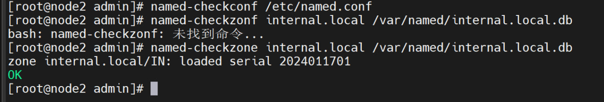


`我们再次进行区域文件的检查,查看正向与反向文件哪一个出错了呢`


```
# 区域文件语法检查
named-checkzone internal.local /var/named/internal.local.db
named-checkzone 149.168.192.in-addr.arpa /var/named/192.168.149.rev

```


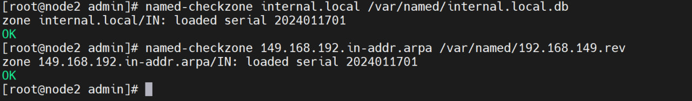


## 五.启动BIND服务


```
systemctl start named  -- 立即启动
systemctl enable named  -- 开启自动启动
systemctl status named  -- 查看状态

```


`接下来，我们需要把这个dns的bind服务打开就可以了`


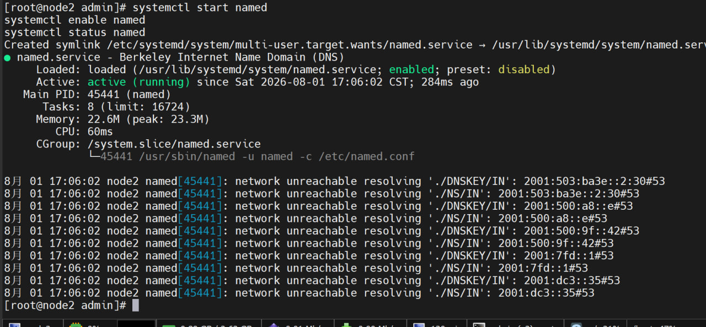


`可以看到，这个服务我是成功的启动了的，没有报任何的错误，接下来，我们需要在服务器上面把这个服务的端口放行，那么其实node2上面的配置就解决了`


## 六.配置防⽕墙


```
firewall-cmd --zone=public --add-port=53/udp --permanent
firewall-cmd --zone=public --add-port=53/tcp --permanent
firewall-cmd --reload


或者：
firewall-cmd --zone=public --add-service=dns --permanent
firewall-cmd --reload

# 查看规则信息：
firewall-cmd --list-all

```


`这上面的是配置防火墙的命令，我们通过截图查看一下是否成功了的`
 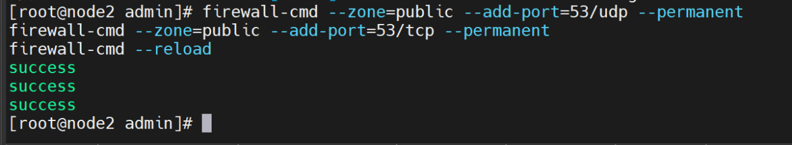


`我们把防火墙放行，可以看到其实也是完美的运行，没有报出错误，接下来我们需要对node1进行配置，把node1的dns修改为node2的IP地址`


`然后我们，再次查看已经放行的服务列表`


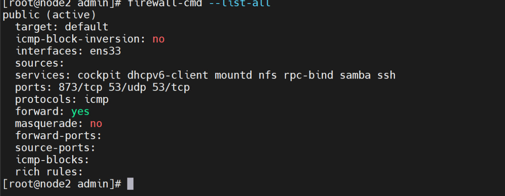


## 七.客⼾端配置操作【node1】


`我们需要把node1的dns追加一条，内容是node2的IP地址`


```
vim /etc/NetworkManager/system-connections/ens33.nmconnection #打开配置文件，来进行相应的网络配置操作

```


```
[connection]
id=ens33
uuid=f63e95b4-2d94-316d-9f6e-bddab78c0f43
type=ethernet
autoconnect-priority=-999
interface-name=ens33
timestamp=1785329942

[ethernet]

[ipv4]
address1=192.168.149.128/24
dns=192.168.149.130;1.1.1.1;8.8.8.8;
gateway=192.168.149.2
method=manual

[ipv6]
addr-gen-mode=eui64
method=auto

[proxy]


```


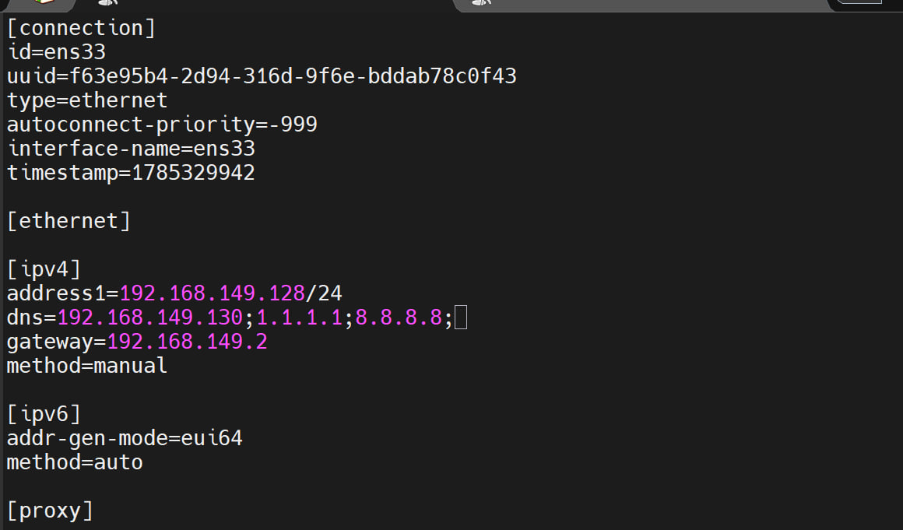


`我们显示一下网卡的信息，查看是否dns配置成功了`


```
 nmcli device show ens160

```


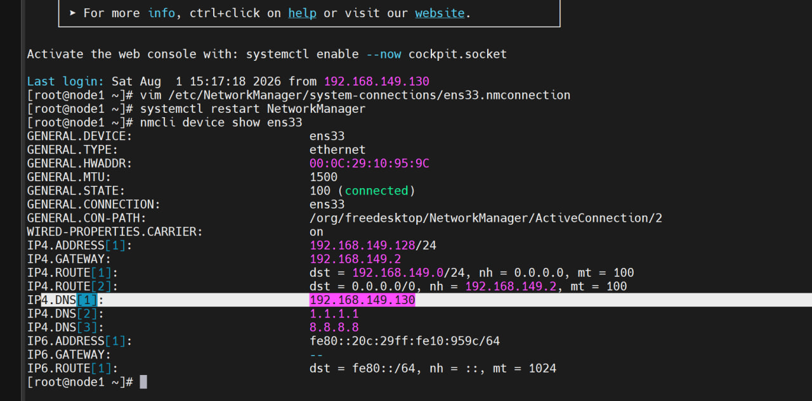


## 八.测试服务器是否正常


- `使用 `dig` 或 `nslookup` 命令测试 DNS 查询，确保内部域名解析正常工作。例如：`


```
dig web1.internal.local

```


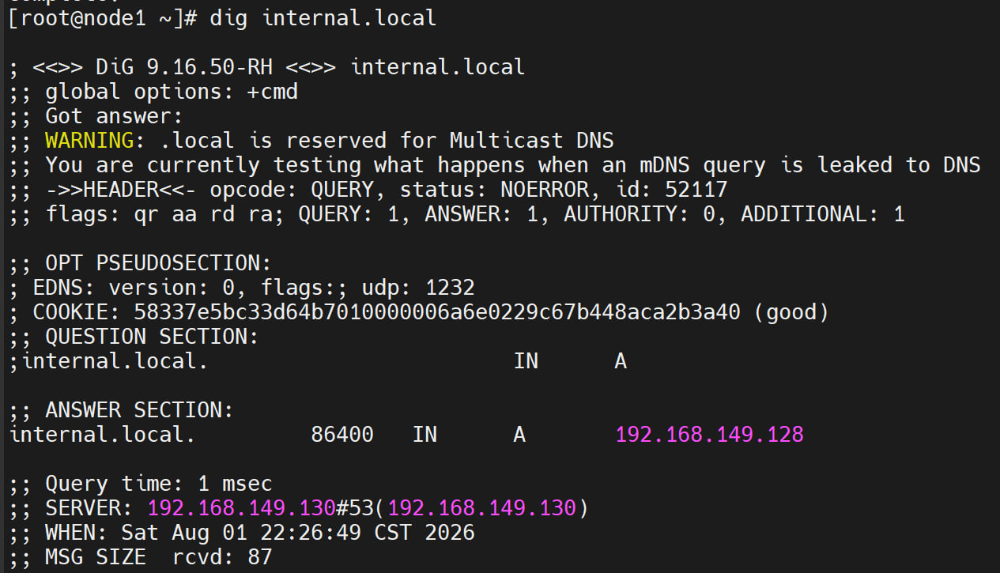


- **我们再使用命令ping一下看一下是否与设定的域名可以连通**


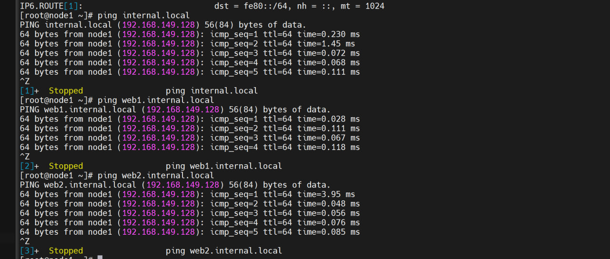


- **使用 `dig` 或 `nslookup` 命令测试 DNS 查询，确保外部域名解析正常工作。 **


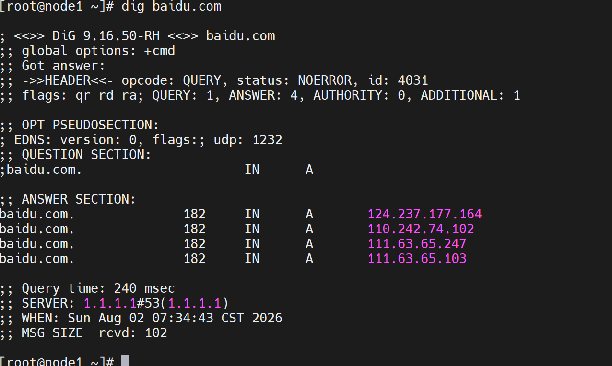


`可以看到，域名解析服务是可以正常解析外部链接的`


## 九.如何清空


```
node2:
    dnf -y remove bind bind-utils
    dnf clean all

    rm -rf /etc/named*

node1:
    修改网卡的DNS服务器， 将其调整为 8.8.8.8;114.114.114;

```


`我们通过这个命令把今天做的再删掉，多做几遍，同时删掉的话，可以更好的完成dns的作业`


## 十.总结


**本次学习任务，佳乐老师讲解了dns服务器的相关设定，从软件包的安装，文件的修改，端口放行。以及node1的相关设定。修改的文件本次在node2里面主要是有1个主配置文件，1个区域文件，区域文件要追加正向解析和反向解析，正向解析和反向解析都还要在你声明的时候指定的文件，来进行修改就可以了，我们在检测一下刚刚的配置文件是否出错，最后进行服务的启动以及端口的放行.


然后我们在node1中我们需要修改他的网络，将他的dns新增一条记录，内容是node2的IP地址，我们再用dig检测是否node2的dns服务器可以正常运行,这个其实也是可以的，windows也是同理将dns修改为node2的IP地址。需要注意我这里修改的是vmnet1网卡，最后Windows也是成功ping通了。


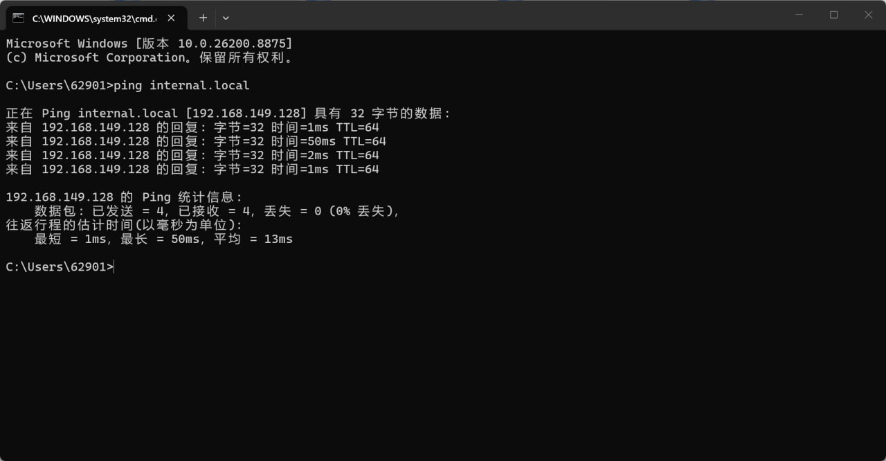
