

SSh的相关操作


## 一.基于SSH实现发送命令到远程服务器


`SSH远程执⾏命令是通过SSH协议连接到远程服务器，并在远程服务器上执⾏指定的命令或脚本， ⽽⽆需直接登录到服务器的终端`


相关的命令是


```
ssh [选项] username@remote_host "command [&&] conmmad"
说明：
username：远程服务器的⽤⼾名。
remote_host：远程服务器的IP地址或域名。
command：要在远程服务器上执⾏的命令
& ： 异步执⾏， 在远程服务器后台运⾏， SSH不会等待命令完成，会⽴即返回并关闭连接
选项：
-t： 如果远程命令需要交互式终端（例如 sudo 命令），可以使⽤ -t 选项
-p： 如果远程服务器的SSH服务运⾏在⾮默认端⼝（默认是22），可以使⽤ -p 选项指定端⼝
-o： 使⽤ -o 选项来指定SSH配置选项，例如禁⽤主机密钥检查（StrictHostKeyChecking=no）
-A： 需要转发认证代理连接（例如使⽤SSH密钥进⾏跳板机连接），可以使⽤ -A 选项
需求⼀： 在node1中远程查看node2的主机名
ssh root@192.168.88.102 "hostname"
需求⼆： 在node1中，远程执⾏进⼊root⽤⼾家⽬录，并在此⽬录下创建 a.txt⽂件
说明：如果是执⾏多个命令，可以使⽤分号 或 && 来分隔命令
分号： 仅分隔命令， 不管前⾯得命令是否执⾏成功， 后⾯的命令依然会执⾏
&& ： 将多个命令合并为⼀个命令， 前⾯得命令如果执⾏失败， 后⾯的命令就⽆法执⾏
ssh root@192.168.88.102 "cd ~ && touch a.txt"


```


``这里面我为大家看一下我所在操作过程之中遇到的问题`


- 首先呢，就是要注意的是目标主机的IP地址之后是务必要要加上引号的，我当时就没有加上的，然后命令没有跑通，我查了一些资料，之后明白了，其实就是没有加上引号，意思就是连接到目标主机之后，然后执行&&前面的命令然后断开了，在本地的主机执行&&之后的指令


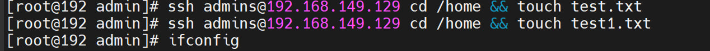


- 在这里其实，目标主机并没有执行
 


`这个所带来的效果其实是，连接远程主机然后在远程主机里面执行cd /home 命令，之后就断开了，在本地主机执行touch test.txt这个是第一句的指令，然后呢，我在本地主机执行了第二句指令，其实是前面的意思与第一句带来的效果一样，但是呢后面的是在本地主机创建了一个test1.txt，然后呢，我在ubuntu查看是俩个都没有的，其实就是因为我没有加上引号导致的，之后`


- 之后，我加上了引号，就发现了是可以进行操作的。


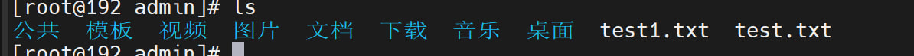
 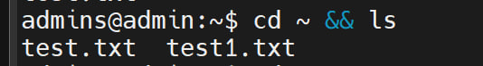


**之后呢，我就没有遇到了什么问题了，这个方面就解决了，然后，就开始了下一个进展了。**


## 二.基于SSH进⾏免密数据传输


`SCP（Secure Copy Protocol）是基于 SSH 协议的安全⽂件传输⼯具，可⽤于在本地和远程服务 器之间传输⽂件或⽬录。通过 SCP，数据在传输过程中会被加密，确保安全性`


其基本的语法结构是:


```
源⽂件路径：本地⽂件或远程服务器上的⽂件。
⽬标路径：本地路径或远程服务器上的路径。
常⽤选项：
-r 递归复制整个⽬录（传输⽬录时必⽤）
-P 指定 SSH 连接的端⼝号（默认是 22）
-i 指定 SSH 使⽤的私钥⽂件（⽤于免密登录）
-q 静默模式，不显⽰进度条和调试信息
-C 开启压缩传输，提⾼传输速度（适合⼤⽂件或低速⽹络）
-l 限制传输速度（单位为 Kbit/s，例如 -l 1000 表⽰限制为 1Mbps）

```


SCP的基本语法是


```
1. `从本地传输到远程`
   `scp /local/path/file.txt user@remote:/remote/path/`
2. `从远程传输到本地`
   `scp user@remote:/remote/path/file.txt /local/path/`
3. `递归传输整个⽬录`
   scp -r /local/path/dir user@remote:/remote/path/

```


`下面是我操作出来的，大家可以看一下`
 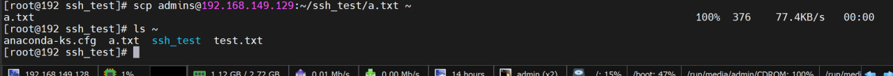


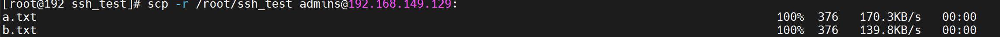


`在这里面呢，其实还有一个问题:这个是远程给ubuntu发送消息的时候是不能发送到根目录下的，由于ubuntu的权限就是远程登录只可以由普通用户的，也就是说普通用户只可以访问~，对于根目录是没有访问权限的，所以我只能用scp信息给家目录传递`


## 三.综合案例基于JDK的安装和操作


### 一.台机器的jdk的安装和配置


- 在这里面呢，首先呢，我们应当先从网上下载jdk的rpm包，然后再把其传输到本主机就可以了，当然了，在这里我遇到一些问题，我其实在把这个rpm上传到linux的时候发现了一个问题，就是无论如何上传其实都是会报错的。


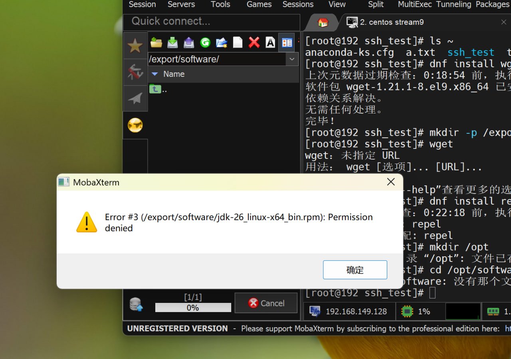


- 然后呢，我研究了一下这个问题，发现了其实就是由于，我当时以为我当时Linux所在的系统权限是root所以在上传文件时也是root这个权限可以对于文件夹拥有读写权限，但是呢，其实就是在上传的时候，是默认了普通用户的权限，所以我们要做的其实就是赋权,用命令chmod 777 software就可以了


**真正原因：MobaXterm 不是用 root 身份传文件的**
 **你 SSH 终端里确实是 root（`#` 提示符），但 MobaXterm 左侧那个 SFTP 文件浏览器，走的是另一个会话，它不一定继承你终端的 root 身份：**
 **MobaXterm 建立 SFTP 连接时，可能用的是你最开始填的那个普通用户（比如 `admins`），而不是 root。**
 **哪怕你终端 `su -` 切到 root 了，SFTP 面板那边还是原来那个连接，不会自动升级。**
 **所以 SFTP 侧对 `software` 目录的身份是 “other”（其他人），而 other 只有 r-x，没写权限 → 报 `Permission denied`。**
 **你 `chmod 777` 后，other 也拿到了 rwx，所以"其他人"（也就是 SFTP 那个连接）就能写了——问题消失**


- 然后我们用rpm -ivh对于rpm进行安装操作就可以了

- 然后还有一个注意的是我们需要修改配置文件vim /etc/profile


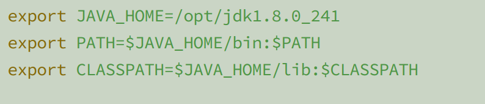


**这个是要在文末加上的**。


- 最后呢，我们重载一下服务：source /etc/profile

- 然后，我们在屏幕上输入java javac测试一下就可以了：
 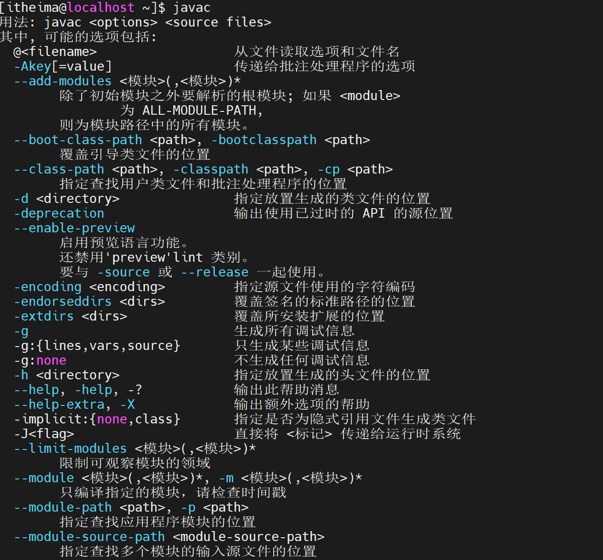


### 二.把这个软件和相应的配置文件通过scp发送出去


- 1.我们先发送软件包，cd /opt && scp -r jdk1.8.0_241/ root@192.168.88.102:$PWD


**说明： $PWD 常量值 表⽰当前所在的路径**


- 2.SCP /etc/profile root@192.168.88.102:/etc/


这里面其实就是opt路径下的，不可以使用$PWD了，


- 3.最后我们重启一下服务就可以：source /etc/profile


在这里，我们测试一下：
 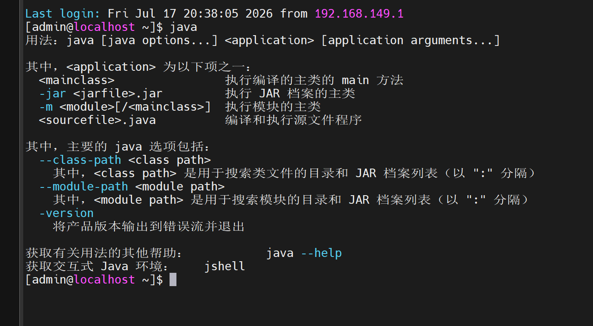


`发现成功了。就可以下一步了`


## 四.基于Ubuntu完成SSH服务配置


### 一.第⼀步： 需要让三个服务器全部都使⽤itheima⽤⼾登录服务器


- 首先呢我们需要都同时打开三台服务器，务必要要保证要小于我们电脑的内存，否则会打不开的

- 接着我们打开了之后，使用以下命令增加账户itheima


```
useradd itheima
passwd itheima
123456

```


`然后呢，三台主机都同时输入这几行命令就可以了`


- 最后呢，我们使用三台主机所对应的IP地址在mx上面只要把主机名修改为itheima，登录就可以了


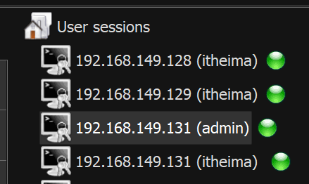


**就像如此的**


### 二.第二步: 需要让三台服务器都要配置免密操作


`这个和我的上一个博客是一样的，内容也一样的，只不过操作起来比较麻烦的，`


**我们首先是在每台主机里面下载对应的公钥和私钥，然后呢，再以此把对应的公钥发送三分，操作三次就可以了**


- 下载对应的公钥和私钥


```
ssh-keygen -f ~/.ssh/id_rsa -P '' -q && ll ~/.ssh

```


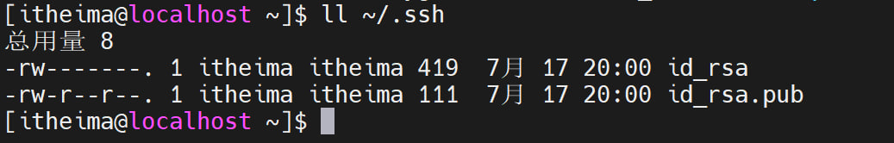


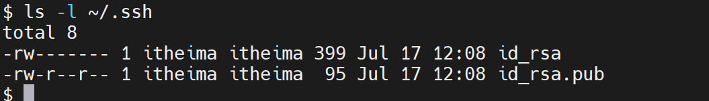


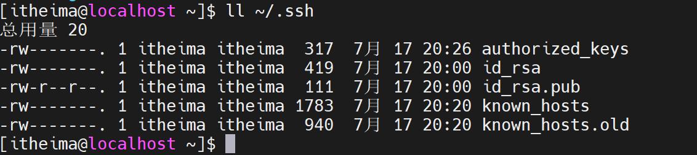


- 二.我们开始把对应的公钥发送三分


```
ssh 192.168.149.128
ssh 192.168.149.129
ssh 192.168.149.131

```


`三台主机其实都是如此写的，只不过我们要注意的是需要一行一行操作的`


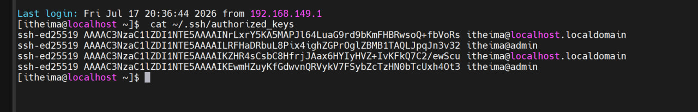


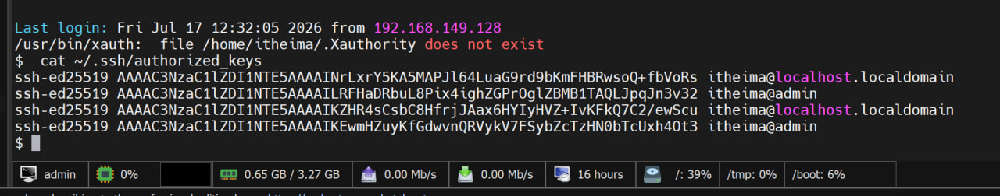


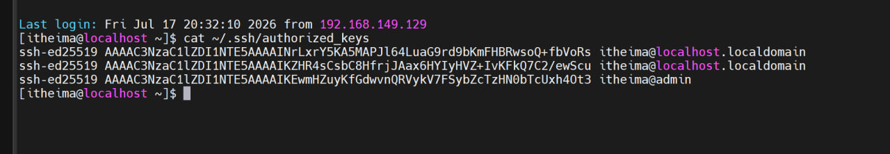


### 三.第三步：依次通过： ssh 主机地址 连接各个服务器， 观察是否需要输⼊密码


```
依次通过： ssh 主机地址 连接各个服务器， 观察是否需要输⼊密码
建议⽅案， ⼀个节点 ⼀个节点依次测试， 确保不漏测
以node1为例：
ssh 192.168.88.101
通过exit退回 --> node1
ssh 192.168.88.102
通过exit退回 --> node1
ssh 192.168.88.130
 通过exit退回 --> node1

```


`这个地方是没有上面难度的，和之前的博客一样的，我把我其中一台主机样图给展示出来`


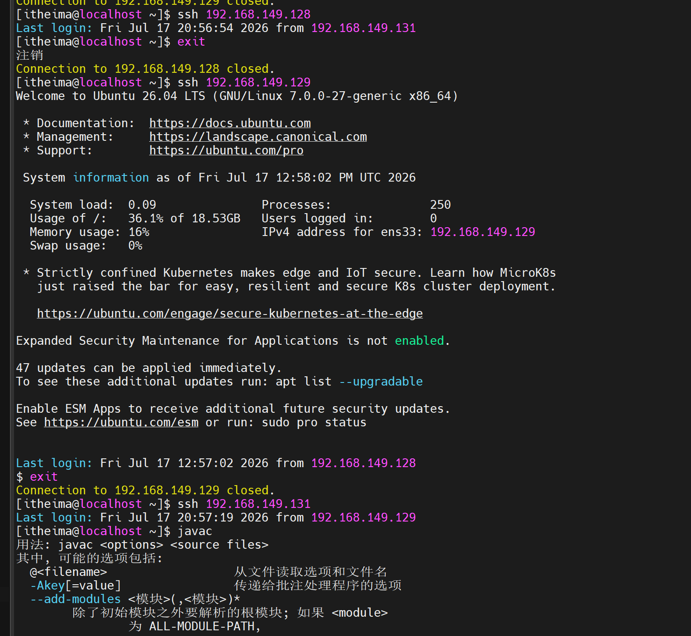


## 综述


`今天在操作的时候，其实是和之前的ssh命令一样的，只不过扩充了一些其他的内容，比如scp，ssh远程传输命令等等,最后我们在综合的案例当中发现了，这个其实我在最后进行网络测试的时候是瞎弄的，就比如是我们不是在测完一个ip的时候不是应该回退测试下一个ip对吧，但是呢，我当时没有注意，就想当然的操作了，这是一点,其实也挺好的，这个命令这些天学习了，博客其实也写了，公钥，私钥其实也明白了，关键是这个命令对于以后的脚本操作有积极意义的。`
