

> **前言**
> 
> 今天上午做 VMware 内网流量转外网实验，照着教程一行一行敲命令，结果 node 能 ping 通网关，却死活 ping 不通百度。
> 
> 我查了路由表、翻了 iptables 规则、确认了内核转发、关了 firewalld……几乎把 Linux 网络栈翻了个底朝天，几度想直接跳过这个实验。直到最后敲下 `ip route get 8.8.8.8`，盯着输出沉默了三秒——**教程里写的是 `ens160`，而我的外网网卡，叫 `ens33`**。更讽刺的是，之前加过的重复规则把真正的问题掩盖了整整一上午。
> 
> 一个单词的错位，一次规则的冗余，让我怀疑人生了大半天。如果你也在做 NAT 转发实验，node 能 ping 通网关却上不了外网，希望这篇排坑记录能帮你省下这几个小时——**因为"低级错误"从来不低级，它只是隐蔽得恰到好处**

## 1.实验环境

跟着黑马 Linux 云计算课程做网络拓扑实验，目标是让多台仅主机模式的虚拟机通过一台拥有 NAT 网卡的"网关机"访问外网。

| 机器         | 网卡模式                                                         | IP                                                               | 角色                 |
| ---------- | ------------------------------------------------------------ | ---------------------------------------------------------------- | ------------------ |
| **jumper** | ens33：NAT 模式（VMnet8） ens36：仅主机模式（VMnet2） ens37：仅主机模式（VMnet3） | ens33: 192.168.149.10（外网口） ens36: 10.1.1.128 ens37: 172.16.0.128 | 路由器/网关，负责帮内网机器转发流量 |
| **node1**  | 仅主机模式（VMnet2）                                                | 10.1.1.x（网关指向 10.1.1.128）                                        | 内网机器，借 jumper 上外网  |
| **node2**  | 仅主机模式（VMnet3）                                                | 172.16.0.x（网关指向 172.16.0.128）                                    | 内网机器，同上            |

**拓扑目标**：node1 和 node2 本身没有外网 IP，通过 jumper 做 NAT 转发访问互联网。


## 2.故障现象

其实就是，node1 ping 不通百度，node2也ping不通百度，**但是**，他们可以ping通jummper的ens33的网段---------192.168.149.10，而且，我也把内网流量转外网流量打开了，jumper是可以Ping通外网的

在 jumper 上执行了经典的 MASQUERADE 命令（照着视频抄的）：

```powershell
iptables -t nat -A POSTROUTING -o ens160 -j MASQUERADE
```

然后在 node1 上测试,结果出问题了，不能和老师讲的效果一样了


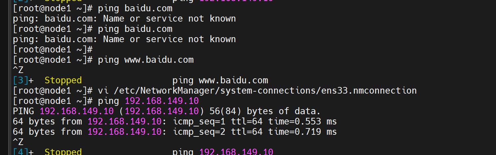

这个外网是无法ping通的

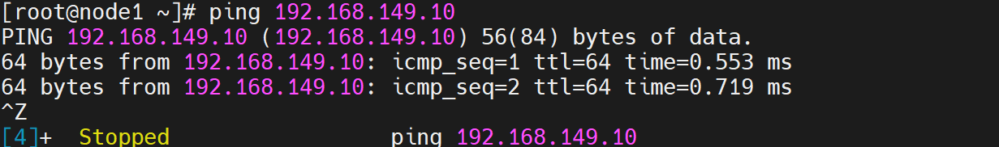

观察发现，是可以ping通jummper的ens33的网段---------192.168.149.10

在node2上面的结果和node1是一样的，无法ping通外网，可以ping通jumper的主网段。

## 3.排查过程

### 3.1检查默认网关

我当时先在node1上面进行核验  

```Linux
ip route show
```

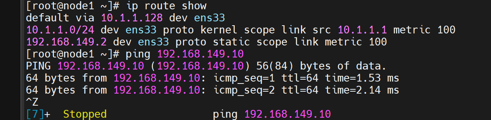


发现默认的配置完全正确，就是要的那个网段，node2上面的核查结果是一样的，他的默认网关显示的是172.16.0.128，这一个检查是没有问题的，然后，我进行了下一步的检查

### 3.2确认 node1 到 jumper 的内网连通性


这个，我就不赘述了，因为在故障现象这个部分的时候，我为大家，描述了这个结果，node1和node2都是可以访问jumper的主网段段的，这一步也是没有问题的

### 3.3 确认 jumper 自己能上外网


这个，我进行了核验，结果发现也是没有太大问题的

```powershell
ping baidu.com
```


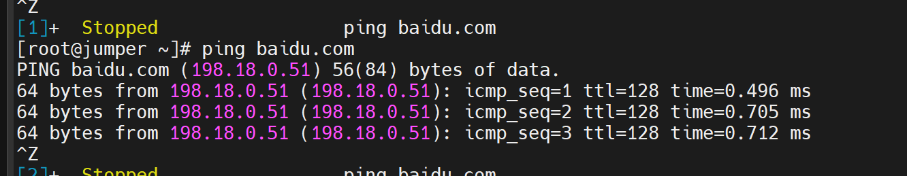


### 3.4确认内核转发已开启

使用命令

```bash
cat /proc/sys/net/ipv4/ip_forward
```


通过，结果，发现内网流量已经转为外网流量了


### 3.5确认 FORWARD 链放行


```bash
iptables -L FORWARD -n
```

发现 FORWARD 链的默认策略是 `DROP`，且没有放行规则！

**补上：**

```bash
iptables -A FORWARD -j ACCEPT
```


补完后测试——**还是不通**


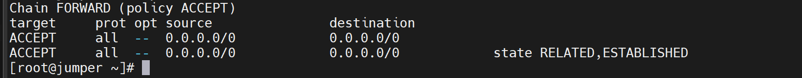


### 3.6抓包定位（关键转折点）

在 jumper 上开两个终端抓包：

**终端 1：抓内网入口**

tcpdump -i ens36 icmp  

终端 2：抓外网出口

tcpdump -i ens160 icmp

然后在 node1 上 `ping 8.8.8.8`。

**结果**：ens36 上能看到 ICMP 包进来，但 ens160 上**一个包都没有。**

这说明：**包确实到了 jumper，但 NAT 转换没生效，包没被扔到外网网卡上。**

问题锁定在 `iptables -t nat` 的 POSTROUTING 规则。


### 3.7第 7 步：查看 NAT 规则（真相浮出水面）

```bash
iptables -t nat -L POSTROUTING -n --line-numbers
```


输出：

```bash
Chain POSTROUTING (policy ACCEPT)num target     prot opt source         destination1   MASQUERADE all   -- 192.168.149.0/24 0.0.0.0/02   MASQUERADE all   -- 0.0.0.0/0         0.0.0.0/0
```

两条 MASQUERADE 规则——**一条是我之前加的（带 `-s 192.168.149.0/24`），一条是后来加的（不带 `-s`）**。而且两条都写着 `-o ens160`。


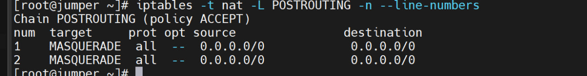

### 3.8核对真实的外网网卡名

```bash
ip route get 8.8.8.8
```

输出：

```bash
8.8.8.8 via 192.168.149.2 dev ens33

`dev ens33`！外网出口是 **ens33**，不是 ens160！
```


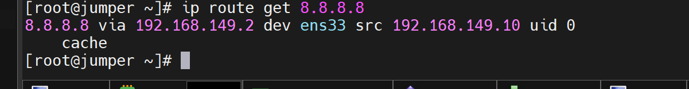

**再确认一下 `ifconfig`：**

ens33: 192.168.149.10   ← NAT 模式，外网口  
ens36: 10.1.1.128       ← 仅主机，内网口  
ens37: 172.16.0.128     ← 仅主机，内网口

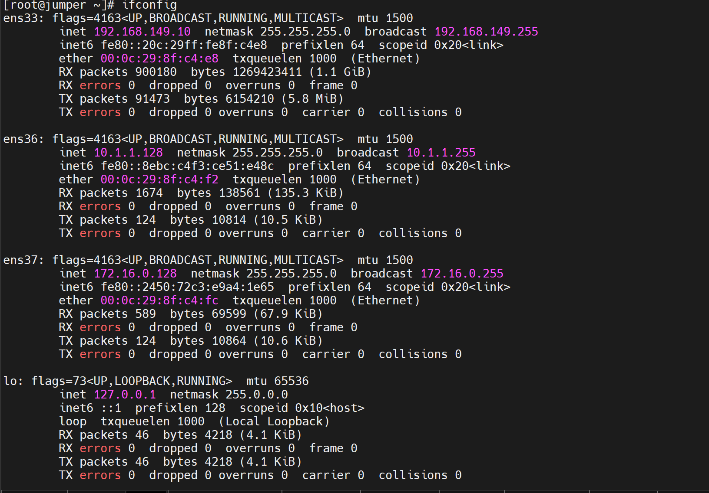

**根因找到了：**

1.视频里老师的机器外网网卡叫 `ens160`，我照抄写成 `-o ens160`；

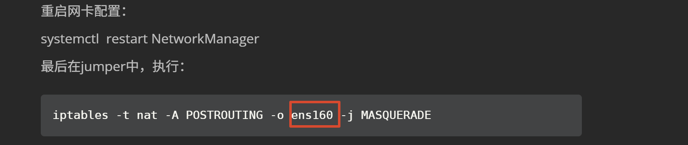

2.我的真实外网网卡是 `ens33`；

3.MASQUERADE 规则挂在了**不存在/错误的网卡**上，包出去时根本没被伪装，外网回不来。


## 4.根因分析

这次故障是**三个因素叠加**导致的"隐形陷阱"：

| 因素        | 怎么坑的                                       |
| --------- | ------------------------------------------ |
| **网卡名抄错** | 教程里是 `ens160`，我的是 `ens33`。一行字写错，后面全白费      |
| **规则重复**  | 加了带 `-s` 和不带 `-s` 的两条，链里看起来"有规则"，实则挂错网卡    |
| **环境不一致** | 老师的拓扑 ens33=内网/ens36=外网；我的 ens33 身兼外网+网关双职 |

Linux 网络排错最操蛋的地方在于：**所有错误的表现完全一样——就是不通。** 你根本分不清是哪个环节的问题，完全不能依照教案给的步骤来，不能和教案做的一样，这样就出问题了，我就是这样，应该一边做着，一边思考着，我当时愚蠢了，想着把老师给的命令写入jumper就可以直接ok，但是我真愚蠢，如此简单的问题，我排查来排查去，可能当时我觉得这个命令是通用的，当时我只看到了好长的英文字母，就大意了，配置信息也没有仔细查看，直接出问题了

---

## 5.正确配置（最终生效）

在 jumper 上执行：

```bash
# 1. 清空 nat 表（干掉所有错误/重复规则）
iptables -t nat -F

# 2. 用正确的网卡名重新加
iptables -t nat -A POSTROUTING -o ens33 -j MASQUERADE

#内网流量转外网流量
iptables -t nat -A POSTROUTING -o ens33 -j MASQUERADE
# 4. 确保内核转发开启（若未开）
sysctl -w net.ipv4.ip_forward=1
echo 'net.ipv4.ip_forward = 1' >> /etc/sysctl.conf
# 6. 保存规则（防止重启丢失）
service iptables save
```

**在 node1/node2 上确认：**

```bash
# 网关指向 jumper 对应内网口的 IP
ip route add default via 10.1.1.128   # node1
ip route add default via 172.16.0.128  # node2


```

这一步，测出来，结果是没有问题的。


测试：

```bash
ping 8.8.8.8      # ✅ 通！
ping baidu.com     # ✅ 通！DNS 也 OK！
```

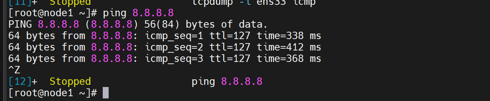


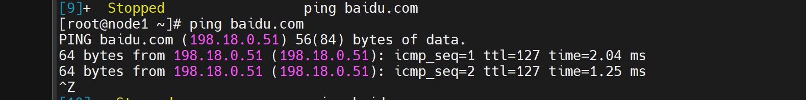


发现，测试出来的机器，是可以连接到外网的，node2在这次测试中也是可以连到外网的，我在这里就不赘述了，这次实验失败的总结写到这里就结束了，有兴趣的，可以接着往下阅读。

---

## 6.避坑清单（收藏备用）

下次再遇到"内网通、外网不通"的 NAT 转发问题，按这个顺序查，**10 分钟定位**：

| #   | 检查项                 | 命令                                  | 期望结果                       |
| --- | ------------------- | ----------------------------------- | -------------------------- |
| 1   | 内核转发是否开启            | `cat /proc/sys/net/ipv4/ip_forward` | 输出 `1`                     |
| 2   | 外网出口网卡是谁            | `ip route get 8.8.8.8`              | 记住 `dev` 后面的网卡名            |
| 3   | MASQUERADE 是否挂在正确网卡 | `iptables -t nat -L POSTROUTING -n` | `-o` 后面必须是第 2 步的网卡名        |
| 4   | 是否有重复/冲突规则          | `iptables -t nat -L --line-numbers` | 只保留一条干净的 MASQUERADE        |
| 5   | FORWARD 链是否放行       | `iptables -L FORWARD -n`            | 有 ACCEPT 规则或 policy ACCEPT |
| 6   | firewalld 是否干扰      | `systemctl status firewalld`        | 应为 `inactive (dead)`       |
| 7   | 内网机器的网关             | `ip route \| grep default`          | 指向 jumper 对应内网口 IP         |
| 8   | DNS 是否配置            | `cat /etc/resolv.conf`              | 有 `nameserver 8.8.8.8`     |

## 7. 写在最后

这个可以说是一个小的心得了，这次实验，理论上是非常容易的，但是我却折腾了好久，这里查查，那里看看，查过之后，我截了一张图片，问问元宝，他所这里，那里都没有问题，当时都给我搞的好烦躁呀，无论如何都难以搞定此次实验的任务了，元宝给我列了排查顺序，但是这个一点用也没有，还是非常糟糕，我急坏了。说我这里配置重复了，那里写的不安全了，防火墙，了，反正在他看来都是问题，我觉得他在胡说八道，怎么可能呢，老师讲的时候，也没有用到如此之多的服务，也不是配置服务项，就是ping呀，他有些傻，我当时就在无奈之下把ifconfig打在窗口了，仔细盯着老师的那行内网流量转外网流量，发现，咦，这个地方老师怎么用的是ens160呢，我的网段明明是33怎么回事呢，我想着想着，明白了，原来，老师在机房用的是88网段，ens160，我的和他的环境不一样，显然配置也不一样，再加上当时，老师并没有强调要在这个配置自我修改，我就出问题了，后来发现问题之后，解决就非常快了，上午我还问元宝，说我明明和老师的命令写的一样，怎么他的可以呀的，我的不行呢，他没有给我建设性的建议，只是淡淡说，老师已经演示无数遍了，你自己肯定环境不对，哪里不对，支支吾吾说不出，现在看来，这个和老师写的一样简直是一个笑话，尤其在linux里面，每一条语句都要明白他的十分含义，要不然，不理解就会闹问题，耽搁时间


==这里，我希望大家，在看完我的这篇错误经验之后，能够及时发现问题，纠正错误，节省宝贵的时间，希望大家不要焦头烂额，希望这篇文章对于大家有十分帮助，最后，希望大家不要尽信ai，这样还不如没有ai，有了ai，人们不再思考，问题也不会实质性解决，解决问题，关键还是靠我们自己，ai我觉得只是在和稀泥，对于找到错误之后，ai其实非常智慧的，但前提是找到错误，没有找到错误，智慧就只能照着他自己，无法照在我身上，这个是一点==
