

#### 磁盘的综合案例


## 1.修改网络配置


`我们这里修改网络配置其实需要，进行对于ip的更改以及对于ssh的相关配置，ip要以此修改为192.168.88.170 171 172`


### 1.改成88网段


注意。这里可能我使用88网段的话，还需要对于网卡进行修改，因为我虚拟机的之前的网段其实是149网段，如果不修改的话，会导致ping的时候没有反应，这是我第一次操作时遇到的一个问题，这里写出来给大家说明一下
 这个问题是因为 **VMware 的虚拟交换机（VMnet8）底层网段** 与 **虚拟机操作系统内部配置的 IP 网段** 不一致导致的。只改虚拟机内部 IP 而不改 VMware 配置，数据包是发不出去的。


#### 情况一：全局迁移至 88 网段（推荐彻底解决）


如果你想把所有机器都规范到 88 网段，请按以下步骤操作：


##### 第一步：修改 VMware 底层配置


1. 在 Windows 宿主机上打开 VMware，点击顶部菜单栏的 **编辑 → 虚拟网络编辑器**。

2. 选中左侧的 **VMnet8 (NAT 模式)**。

3. 点击右下角的 **更改设置**（需管理员权限）。

4. 将 **子网 IP** 从 `192.168.149.0` 修改为 `192.168.88.0`，子网掩码保持 `255.255.255.0`。

5. 点击旁边的 **NAT 设置**，确认网关 IP 已自动变为 `192.168.88.2`（如果不是请手动修正）。

6. 点击 **DHCP 设置**，将地址池起始范围调整到 88 网段（例如 `192.168.88.128` ~ `192.168.88.254`）。

7. 点击 **应用**，等待服务重启。


##### 第二步：修改虚拟机内部配置


1. 启动虚拟机，进入系统。

2. 编辑网卡配置文件（以 CentOS/RedHat 为例）：


```
vi /etc/sysconfig/network-scripts/ifcfg-ens33

```


1. 修改以下关键字段：


```
BOOTPROTO=static
IPADDR=192.168.88.170
NETMASK=255.255.255.0
GATEWAY=192.168.88.2
DNS1=8.8.8.8
ONBOOT=yes

```


>


将上述 `IPADDR` 替换为每台机器对应的规划 IP（170 / 171 / 172）。


1. 重启网络服务：


```
systemctl restart network

```


或重启虚拟机：


```
reboot

```


##### 第三步：验证连通性


在 Windows 宿主机上执行：


```
ping 192.168.88.170
ping 192.168.88.171
ping 192.168.88.172

```


全部能通即说明配置成功。


#### 情况二：临时恢复连接（最省事）


如果你只是想快速让环境通起来，不想折腾 VMware 的设置，最简单的方法是**“妥协”**：


直接将那台连不上的虚拟机 IP 改回 149 网段（例如 `192.168.149.170`），只要它回到 VMware 当前设定的网段，宿主机立刻就能连通。


```
ip addr add 192.168.149.170/24 dev ens33

```


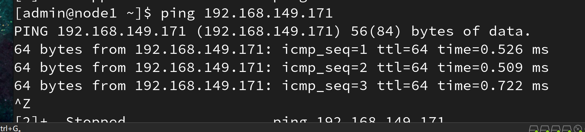
 **因此，我采用的也是最省事的方案，修改主机号就可以了**


### 2.ssh免密登录


#### 0.对于hosts文件进行修改


- `我们在这一步操作的时候，需要注意的是，应当对于/etc/hosts文件进行修改，把三个主机的ip记录添加进去，用映射关系表述`


```
127.0.0.1   localhost localhost.localdomain localhost4 localhost4.localdomain4
::1         localhost localhost.localdomain localhost6 localhost6.localdomain6
192.168.149.170 node1 node1.itcast.cn
192.168.149.171 node2 node2.itcast.cn
192.168.149.172 node3 node3.itcast.cn

```


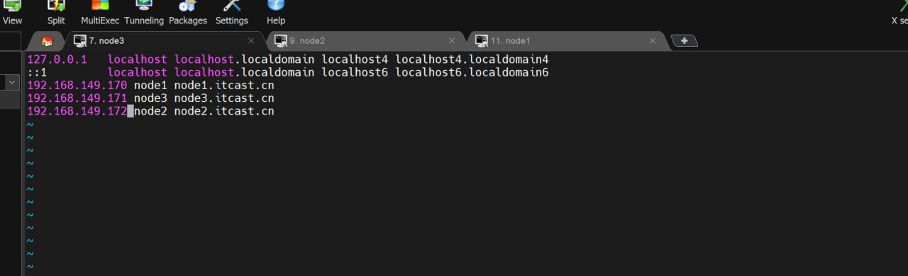


- 随后我们测试一下连通性如何


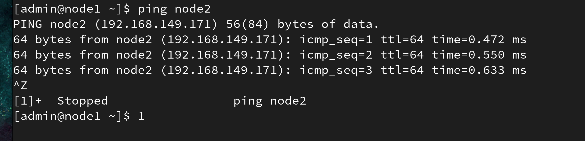


**这里我们发现是可以的，配制太大的问题,但是需要注意的是我们需要服务和网卡都重启一下，这样配置才会生效**


#### 1.生成私钥和公钥


`我们先再宿主机上面生成对应的公钥与私钥，然后将公钥发送给远端`


```
ssh-keygen -f ~/.ssh/id_rsa -P '' -q

```


 `其他两台主机同理，也是如此操作的`


#### 2.发送公钥


```
ssh-copy-id node1 #发送公钥给node1
ssh-copy-id node2 #发送公钥给node2
ssh-copy-id node3 #发送公钥给node3

```


#### 3.测试一下


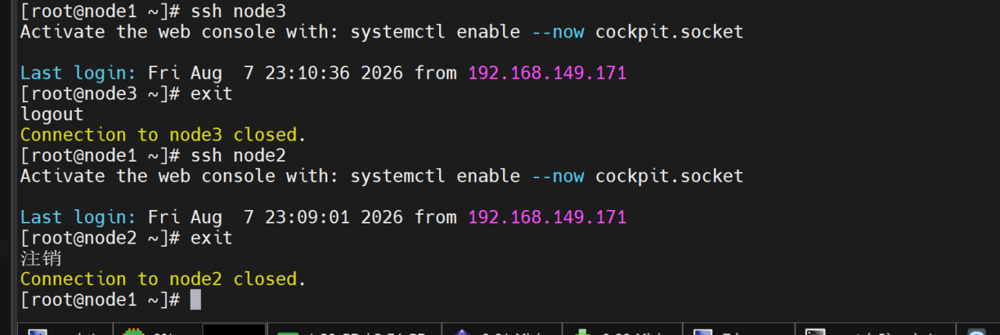
 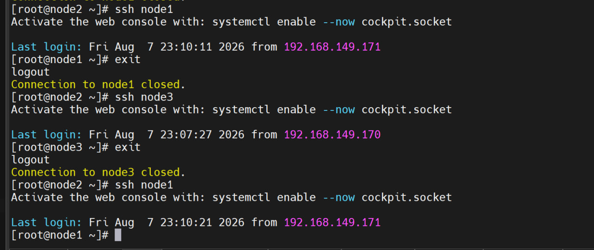
 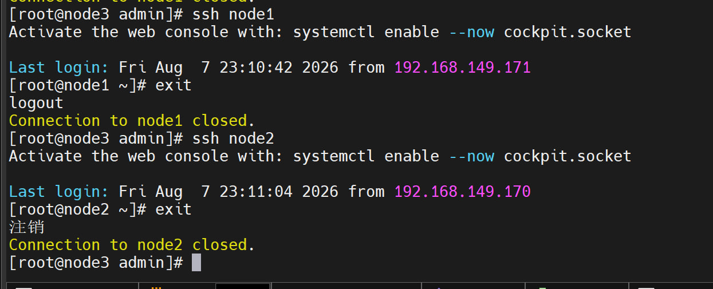
 **我发现ssh免密登录也是配置好了，这台虚拟机网络部分解决了**


## 2.DNS配置


### 1.要求


`是用node2作为dns服务器，node1和node3作为客户端，域名要求是web.internal.local 是node1的ip，而log.internal.local则是node3的ip ns1.internal.local和inter.local则是node2的`


### 2.配置


注意，之前我们安装过这个dns软件包bind-utils,下面我就把需要注意的部分写出来，其他或是和之前配置的重复或是没有写的必要,主配置文件和区域声明文件因为之前用的就是这个网段,所以我就不需要重新配置这几个文件了


#### 1.正解析文件的配置


```
$TTL 86400
@    IN    SOA   ns1.internal.local. admin.internal.local. (
                  2024011701 ; Serial
                  3600       ; Refresh
                  1800       ; Retry
                  1209600    ; Expire
                  86400 )    ; Minimum TTL

      IN    NS    ns1.internal.local.
ns1   IN    A     192.168.149.171
web   IN    A     192.168.149.170
log   IN    A     192.168.149.172
@     IN    A     192.168.149.171

```


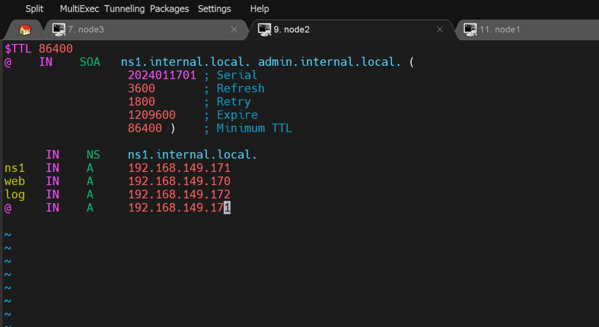


#### 3.反解析文件配置


```
$TTL 86400
@    IN    SOA   ns1.internal.local. admin.internal.local. (
                  2024011701 ; Serial
                  3600       ; Refresh
                  1800       ; Retry
                  1209600    ; Expire
                  86400 )    ; Minimum TTL

     IN    NS    ns1.internal.local.
171     IN    PTR   ns1
170     IN    PTR   web
172     IN    PTR   log
171     IN    PTR   @

```


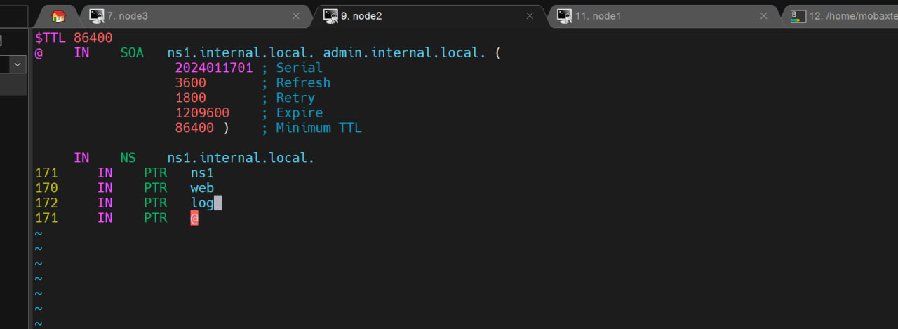


### 3.测试


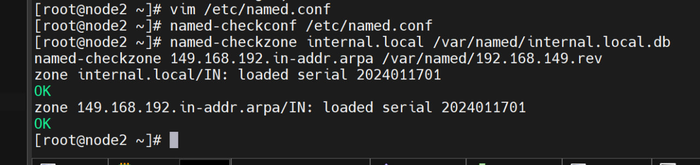


### 4.开放端口


```
firewall-cmd --permanent --add-service=dns
firewall-cmd --reload

```


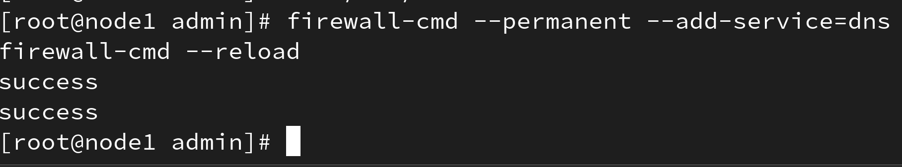


### 5.开启服务


```
systemctl start named
systemctl status named

```


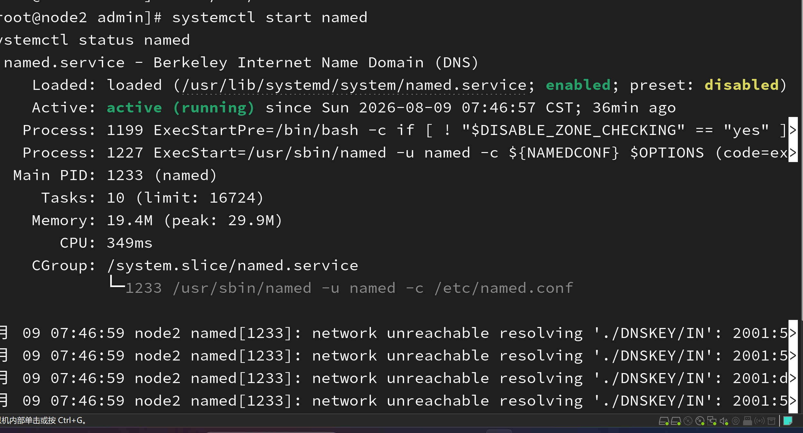


### 6.修改客户端dns


```
vim /etc/NetworkManager/system-connections/ens33.nmconnection
#打开配置文件
[ipv4]
address1=192.168.149.171/24
dns=192.168.149.171;
gateway=192.168.149.2
method=manual
#这里只需要修改这个部分的dns最好将dns只保留一个，否则容易解析失败，
#我可能dns后面呢跟的太多了，之前解析失败了

```


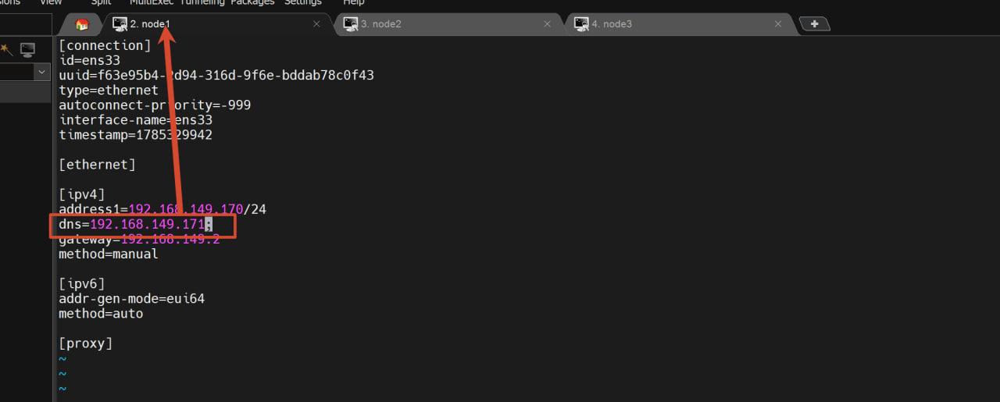
 其余两台也需要这样改，注意，node2也需要进行修改自己指向自己
 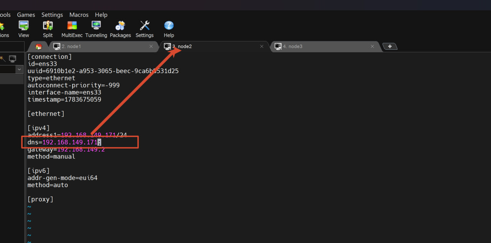
 修改完之后，将服务和网卡都重新启动一下，然后随后进行测试


### 7.测试


```
#在三台主机分别输入
ping web.internal.local;
ping log.internal.local;i
ping nternal.local.

```


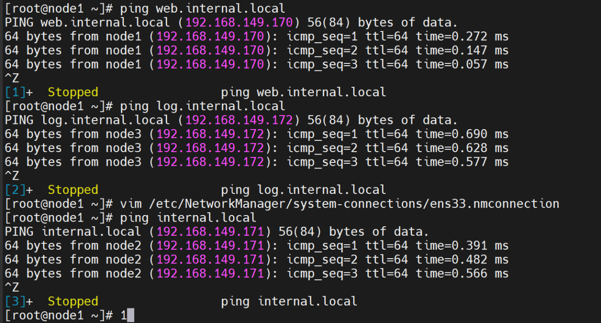
 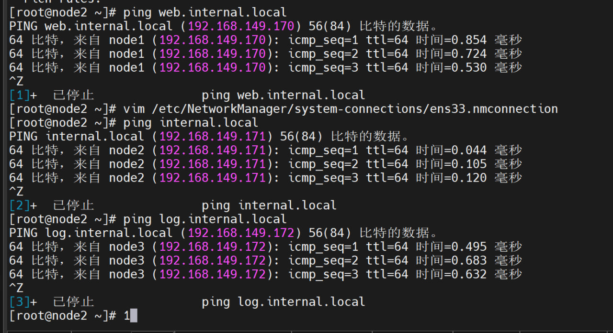
 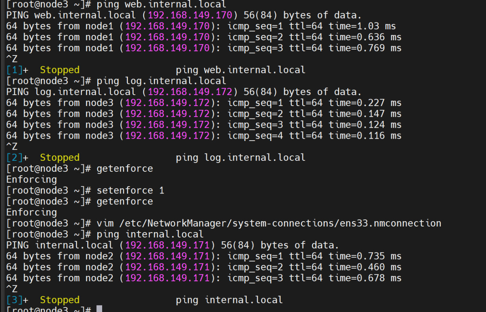


## 3. 日志的配置


### 1. 要求


`要求：node1和node2作为客户端，将info级别的日志发送到node3`


### 2. 修改rsyslog.conf


```
#注意这里是单个转发不是所有日志转发不用转发模块
vim /etc/rsyslog.conf
*.info;mail.none;authpriv.none;cron.none action(type="omfwd" protocol="tcp" target="log.internal.local" port="514")
#注意，node2也是如此修改的
#node3也是修改这个文件不过需要将tcp放开
module(load="imtcp")
# needs to be done just once
input(type="imtcp" port="514")

```


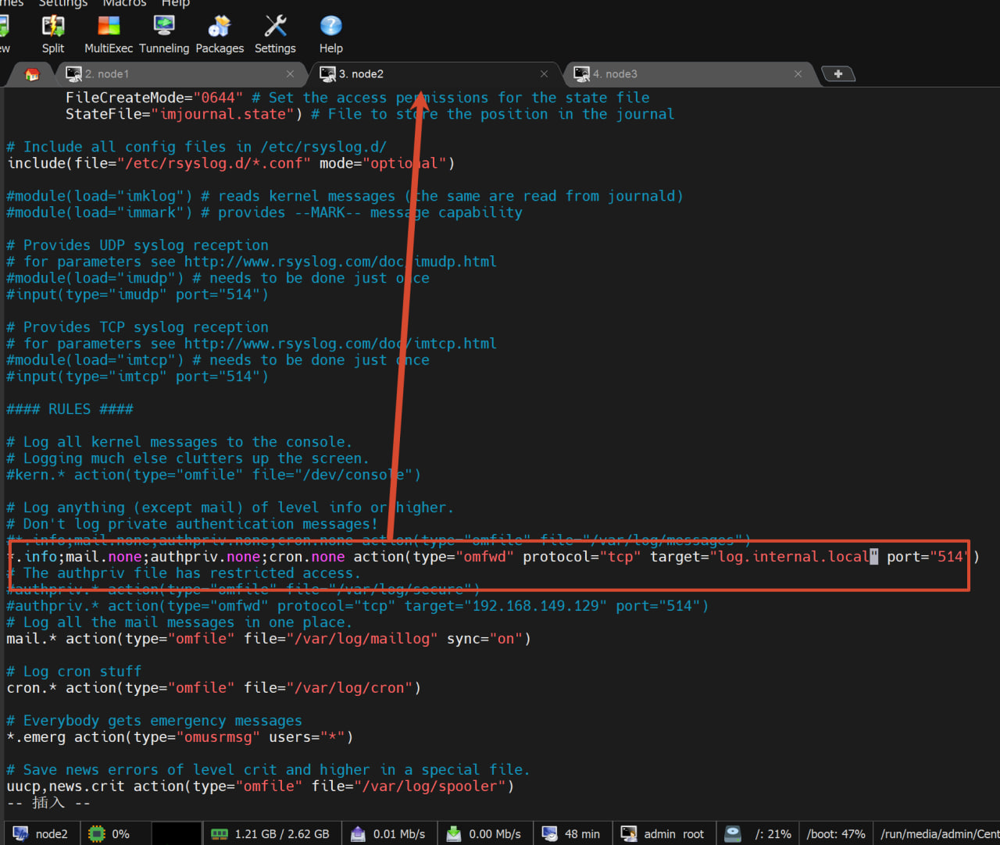


这个是node3的图片
 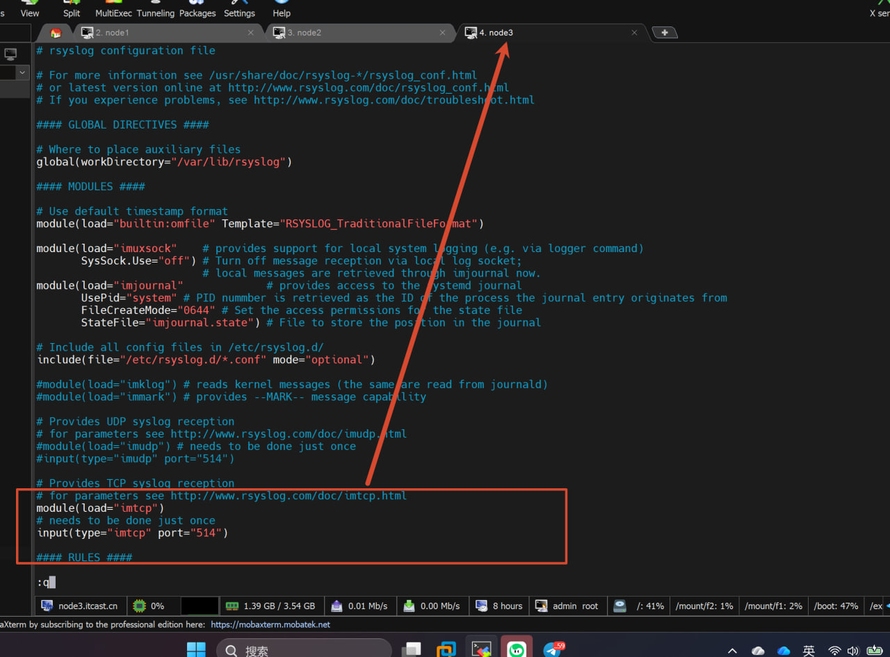


### 3. 重启服务与放行端口


```
systemctl restart rsyslog
systemctl status rsyslog
#重启服务
firewall-cmd --add-port 514/tcp --permanent
firewall-cmd --reload
firewall-cmd --list-all
#放行端口

```


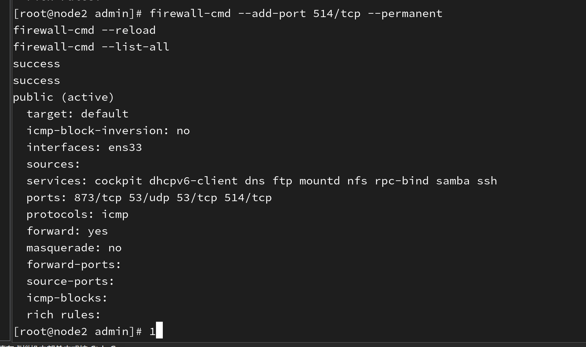


### 4.测试


```
#在node1和node2分别输入logger -p info '111'

```


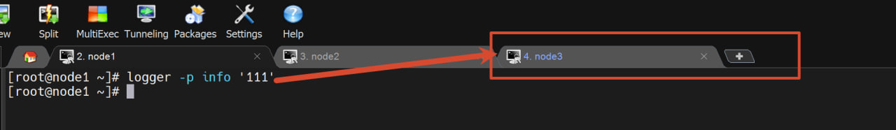
 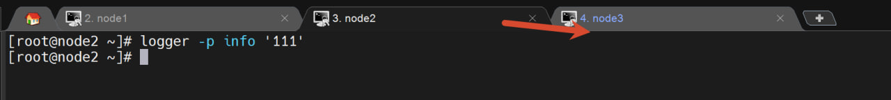
 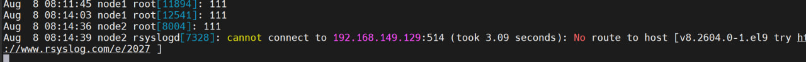


## 4.磁盘配置


### 0.需求


`我们需要搞一个lvm，大小为30G`


### 1.添加一个100G大容量磁盘


`我需要在虚拟机针对node1新增一块磁盘，大小就为100G`


### 2.添加到物理卷


`我们使用lsblk查看新增的磁盘，然后使用pvcreate进而增加到物理卷`


```
pvcreate /dev/sdb

```


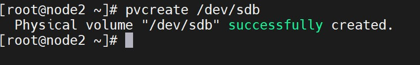


### 2.添加到卷组


`之后我们把这个物理卷添加到卷组，就可以了`


```
vgcreate vg_logs /dev/sdb       # 可选 -s
vgdisplay #查看卷组信息

```


 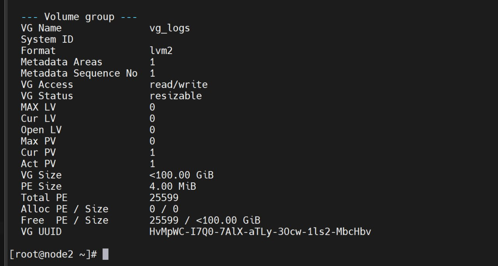


### 3.添加到逻辑卷


```
#我们先加15G的逻辑卷之后再扩容15G
lvcreate -L +15GB -n lv_logdata vg_logs
lvdisplay

```


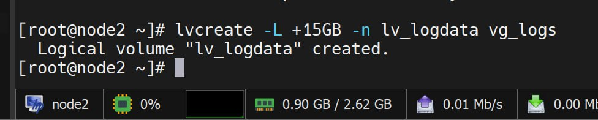
 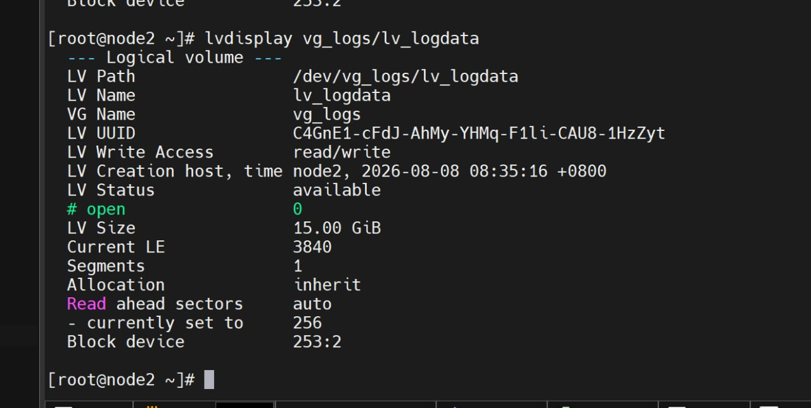


### 4.格式化分区的格式


```
mkfs.xfs /dev/vg_logs/lv_logdata

```


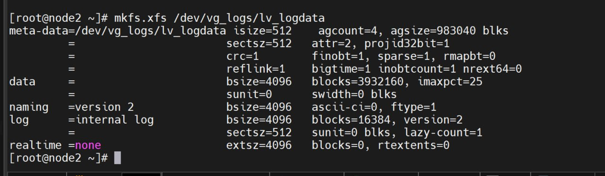


### 5.挂载到指定路径


- 1.创建挂载路径


```
mkdir -p /var/log

```


- 2.开始挂载


```
mount /dev/vg_logs/lv_logdata /var/log/

```


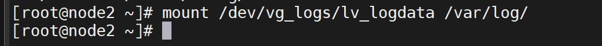


- 3设置永久挂载


`先打开fstab文件把挂载信息添加到文件`


```
vim /etc/fstab
/dev/mapper/cs_192-root /                       xfs     defaults        0 0
UUID=2fac3fef-f7ab-4148-ab3a-56b65bd8dc8c /boot                   xfs     defaults        0 0/dev/mapper/cs_192-swap none                    swap    defaults        0 0/dev/mapper/vg_logs-lv_logdata /var/log                   xfs     defaults        0 0

```


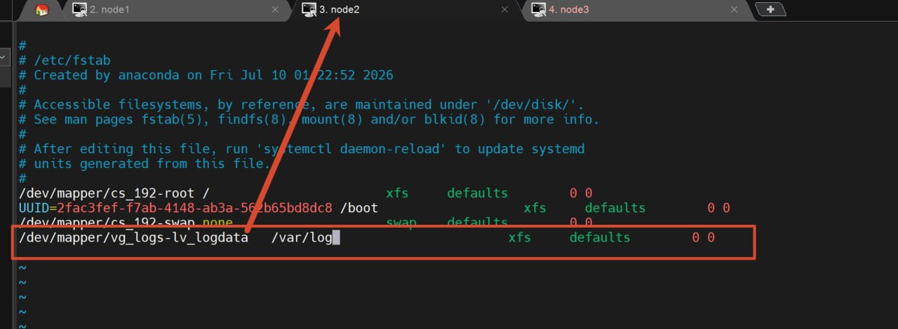


- 3.开机测试一下是否文件设置成功


```
df -h

```


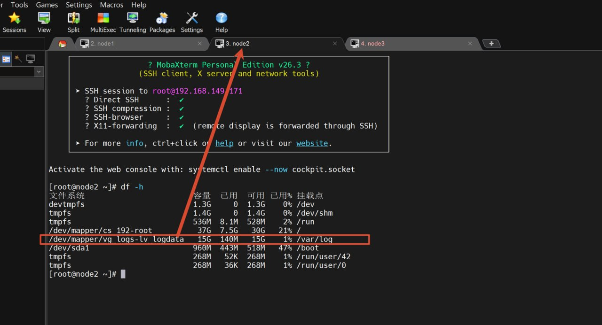


### 6.添加剩下的15G


```
lvextend -L +15GB /dev/vg_logs/lv_logdata

```


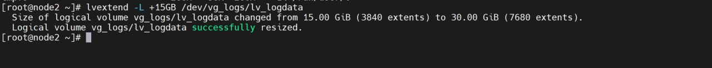


#### 1.设置让扩容生效


```
xfs_growfs /dev/vg_logs/lv_logdata

```


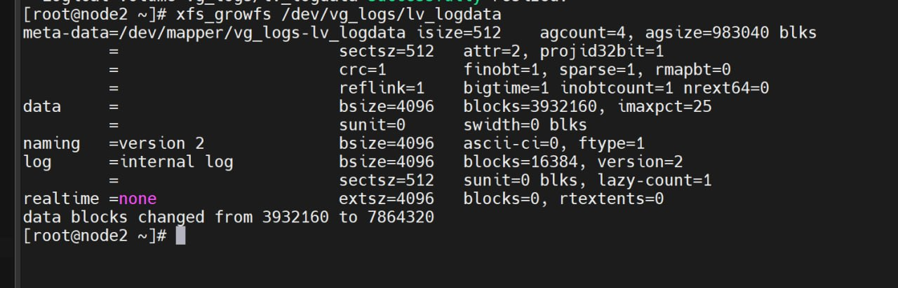
 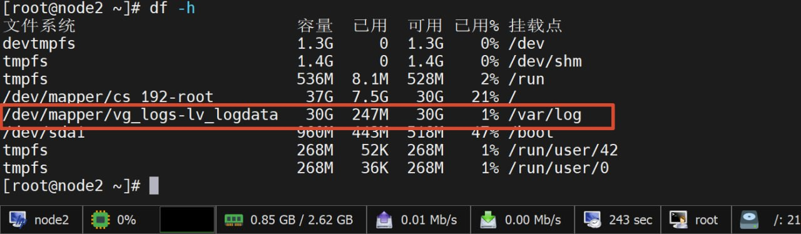


#### 2.查看是否配置生效


```
df -h

```


