

#### 磁盘管理


## 1.文件系统


`文件系统的主要作用是将存储设备（如硬盘、SSD）上的物理空间组织为逻辑单元，提供数据存储、检索和管理的标准方法。一般文件系统主要由超级块（Superblock）、inode、数据块、目录结构构成的`


## 常见文件系统对比


### 一、主流文件系统横向对比
| 文件系统 | 所属系统 | 最大单文件 | 最大分区 | 核心特点 | 优点 | 缺点 | 典型场景 |
|---|---|---|---|---|---|---|---|
| ext4 | Linux | 16TB | 1EB | Linux 默认文件系统 | 稳定、成熟、兼容性好、支持日志 | 不支持快照、COW、校验 | 大多数 Linux 发行版默认 |
| xfs | Linux | 8EB | 8EB | SGI 开发的高性能文件系统 | 并行 I/O 强、大文件读写快、在线扩容 | 不能缩容、修复工具较弱 | 服务器、大数据（RHEL/CentOS 默认） |
| btrfs | Linux | 16EB | 16EB | 写时复制（COW）现代化文件系统 | 支持快照、子卷、压缩、校验、RAID | 性能略低、成熟度不如 ext4 | 需要快照/高级特性的场景 |
| ext3 | Linux | 2TB | 16TB | ext4 的前身 | 稳定 | 性能低、功能少 | 老系统兼容 |
| FAT32 | 跨平台 | 4GB | 2TB | 最广泛兼容的格式 | 几乎所有设备都能读 | 单文件 ≤4GB、无权限、无日志 | U 盘、移动设备 |
| exFAT | 跨平台 | 16EB | 128PB | FAT32 的现代继任者 | 单文件超大、跨平台 | 无日志、无权限 | 大容量 U 盘、SD 卡 |
| NTFS | Windows | 16EB | 256TB | Windows 现代文件系统 | 支持权限、加密、压缩、日志 | Linux 下写操作稳定性略差 | Windows 系统盘、与 Win 共享数据 |
| APFS | macOS | — | — | Apple 的现代文件系统 | 快照、加密、空间共享 | 仅 macOS | Mac 电脑 |
| ZFS | 跨平台 | 16EB | 256ZB | 企业级文件系统（COW+卷管理） | 数据完整性校验、快照、RAID-Z、压缩 | 内存占用高、Linux 下许可协议有争议 | 企业存储、NAS（TrueNAS） |
| HFS+ | macOS | — | — | APFS 前身 | — | 老旧 | 老 Mac |


>


**单位换算**：EB = Exabyte (10¹⁸)，PB = Petabyte (10¹⁵)，TB = Terabyte (10¹²)


## 2.常用的磁盘管理命令


### 2.1 查看磁盘与分区信息


#### 1. lsblk —— 查看块设备（推荐首选）


```
lsblk                         # 树状显示所有磁盘和分区
lsblk -f                      # 显示文件系统类型和 UUID
lsblk -d -o NAME,SIZE,ROTA    # 查看磁盘是否为 SSD（ROTA=0 为 SSD）
lsblk -o NAME,SIZE,TYPE,MOUNTPOINT  # 自定义输出列

```


#### 2. fdisk —— 查看分区表


```
sudo fdisk -l                  # 查看所有磁盘分区表
sudo fdisk -l /dev/sda         # 查看指定磁盘分区表

```


#### 3. parted —— 高级分区查看


```
sudo parted -l                 # 查看所有磁盘分区（同时支持 MBR/GPT）
sudo parted /dev/sda print     # 查看指定磁盘详细信息

```


#### 4. blkid —— 查看 UUID 和文件系统类型


```
sudo blkid                     # 查看所有分区 UUID 和文件系统类型
sudo blkid /dev/sda1           # 查看指定分区

```


#### 5. 其他硬件信息


```
sudo hdparm -I /dev/sda       # 查看硬盘硬件信息
sudo dmidecode -t disk        # 查看磁盘 DMI 信息
ls -la /dev/disk/by-uuid/    # 查看 UUID 软链接

```


### 2.2 分区管理命令


#### 1. fdisk —— MBR 分区（交互式）


```
sudo fdisk /dev/sdb            # 进入 fdisk 交互界面

# 常用交互命令：
# p  → 打印分区表
# n  → 新建分区
# d  → 删除分区
# t  → 修改分区类型（82=swap, 83=linux, 8e=lvm, ef=EFI）
# w  → 保存并退出
# q  → 不保存退出
# g  → 创建 GPT 分区表
# o  → 创建 MBR 分区表

```


#### 2. gdisk —— GPT 分区（交互式）


```
sudo gdisk /dev/sdb            # 进入 gdisk 交互界面

# 常用交互命令与 fdisk 类似
# 新建分区后需刷新内核分区表：
sudo partprobe /dev/sdb

```


#### 3. parted —— 高级分区工具


```
sudo parted /dev/sdb

(parted) mklabel gpt                     # 创建 GPT 分区表
(parted) mklabel msdos                   # 创建 MBR 分区表
(parted) mkpart primary xfs 0% 50%      # 创建占前半磁盘的主分区
(parted) mkpart primary xfs 50% 100%    # 创建占后半磁盘的主分区
(parted) print                           # 打印分区表
(parted) rm 2                            # 删除第 2 个分区
(parted) quit

```


#### 4. 刷新内核分区表


```
sudo partprobe /dev/sdb        # 通知内核重新读取分区表
sudo partx -a /dev/sdb         # 添加分区到内核
sudo partx -d /dev/sdb         # 从内核删除分区信息

```


### 2.3 文件系统格式化


#### 1. 创建文件系统


```
sudo mkfs.ext4 /dev/sdb1       # 格式化为 ext4
sudo mkfs.xfs /dev/sdb1        # 格式化为 xfs
sudo mkfs.btrfs /dev/sdb1      # 格式化为 btrfs
sudo mkfs.vfat -F 32 /dev/sdb1 # 格式化为 FAT32
sudo mkfs.exfat /dev/sdb1      # 格式化为 exFAT
sudo mkfs.ntfs /dev/sdb1       # 格式化为 NTFS

```


#### 2. 格式化时指定参数


```
# ext4：指定卷标和 inode 大小
sudo mkfs.ext4 -L data_disk -I 256 /dev/sdb1

# xfs：指定块大小和标签
sudo mkfs.xfs -L data_disk -b size=4096 /dev/sdb1

# 强制格式化（无需确认）
sudo mkfs.ext4 -F /dev/sdb1

```


#### 3. 查看文件系统信息


```
sudo dumpe2fs /dev/sdb1 | head -30   # 查看 ext 系列超级块信息
sudo xfs_info /dev/sdb1               # 查看 xfs 文件系统信息
sudo btrfs filesystem show /dev/sdb1  # 查看 btrfs 信息

```


### 2.4 挂载与卸载


#### 1. 临时挂载


```
sudo mount /dev/sdb1 /mnt/data             # 挂载到目录
sudo mount -t xfs /dev/sdb1 /mnt/data      # 指定文件系统类型
sudo mount -o ro /dev/sdb1 /mnt/data       # 只读挂载
sudo mount -o rw,noexec,nosuid /dev/sdb1 /mnt/data  # 指定安全选项
sudo mount -a                               # 挂载 fstab 中所有未挂载的设备

```


#### 2. 卸载


```
sudo umount /mnt/data          # 按挂载点卸载
sudo umount /dev/sdb1          # 按设备卸载
sudo umount -l /mnt/data       # 懒卸载（lazy，等设备空闲后卸载）
sudo umount -f /mnt/data       # 强制卸载

```


#### 3. 查看挂载信息


```
mount                          # 查看所有挂载
findmnt                        # 树状显示挂载信息
findmnt /mnt/data              # 查看指定挂载点
cat /proc/mounts               # 查看内核挂载表

```


### 2.5 磁盘空间监控


#### 1. 查看磁盘使用情况


```
df -h                          # 人类可读格式显示磁盘使用
df -hT                         # 显示文件系统类型
df -i                          # 查看 inode 使用情况
df -h --total                  # 显示总计行

```


#### 2. 查看目录大小


```
du -sh /path/to/dir            # 查看目录总大小
du -sh /*                      # 查看根目录下各目录大小
du -h --max-depth=1 /var       # 查看 /var 下一级目录大小
du -ah /path | sort -rh | head -20   # 找出最大的 20 个文件/目录

```


#### 3. 找出占用空间最大的目录（实战排障）


```
# 找出根分区下占用最高的目录
du -sh /* 2>/dev/null | sort -rh | head -10

# 逐层深入定位"磁盘满"的元凶
du -sh /var/* 2>/dev/null | sort -rh | head -10
du -sh /var/log/* 2>/dev/null | sort -rh | head -10

```


### 2.6 LVM 逻辑卷管理


#### 1. 物理卷（PV）


```
sudo pvcreate /dev/sdb1         # 创建物理卷
sudo pvcreate /dev/sdb1 /dev/sdc1  # 同时创建多个 PV
pvs                            # 查看物理卷（简洁）
pvdisplay                      # 查看物理卷（详细）
pvremove /dev/sdb1             # 删除物理卷

```


#### 2. 卷组（VG）


```
sudo vgcreate vg_data /dev/sdb1        # 创建卷组
sudo vgcreate vg_data /dev/sdb1 /dev/sdc1  # 多个 PV 加入卷组
vgs                            # 查看卷组（简洁）
vgdisplay                      # 查看卷组（详细）
sudo vgextend vg_data /dev/sdc1 # 向卷组添加新 PV
sudo vgreduce vg_data /dev/sdb1 # 从卷组移除 PV

```


#### 3. 逻辑卷（LV）


```
sudo lvcreate -L 10G -n lv_data vg_data   # 从卷组创建 10G 逻辑卷
sudo lvcreate -l 100%FREE -n lv_data vg_data  # 使用卷组全部剩余空间
lvs                            # 查看逻辑卷（简洁）
lvdisplay                      # 查看逻辑卷（详细）
sudo lvextend -L +5G /dev/vg_data/lv_data   # 扩容 5G
sudo lvextend -l +100%FREE /dev/vg_data/lv_data  # 扩容到最大
sudo lvremove /dev/vg_data/lv_data           # 删除逻辑卷

```


#### 4. 扩容后刷新文件系统


```
# ext4 扩容后刷新
sudo resize2fs /dev/vg_data/lv_data

# xfs 扩容后刷新
sudo xfs_growfs /mnt/data

```


### 2.7 磁盘 I/O 性能排查


#### 1. iostat —— 磁盘 I/O 统计


```
iostat -x 1                    # 每 1 秒刷新，显示扩展统计
iostat -x 1 5                  # 每 1 秒刷新，共 5 次
iostat -d -k 1                 # 以 KB 为单位显示磁盘吞吐

```


**关键指标解读**：
| 指标 | 含义 | 告警阈值 |
|---|---|---|
| %util | 磁盘利用率 | 持续 >80% 说明瓶颈 |
| await | I/O 平均等待时间(ms) | >20ms 说明慢 |
| r/s, w/s | 每秒读/写请求数 | 视磁盘类型而定 |
| rkB/s, wkB/s | 每秒读/写吞吐量 | 接近磁盘极限则瓶颈 |


#### 2. iotop —— 按进程查看 I/O


```
sudo iotop                     # 实时显示每个进程的 I/O 占用
sudo iotop -o                  # 只显示有 I/O 活动的进程
sudo iotop -a                  # 累积模式

```


#### 3. 其他 I/O 排查工具


```
sudo pidstat -d 1              # 每 1 秒显示进程 I/O 统计
cat /proc/diskstats            # 内核磁盘统计原始数据

```


### 2.8 磁盘故障排查


#### 1. SMART 健康检测


```
sudo smartctl -a /dev/sda      # 查看完整 SMART 信息
sudo smartctl -H /dev/sda      # 快速查看健康状态（PASS/FAIL）
sudo smartctl -t short /dev/sda  # 执行短时自检
sudo smartctl -t long /dev/sda   # 执行长时自检
sudo smartctl -l selftest /dev/sda # 查看自检结果

```


#### 2. 文件系统修复


```
# ⚠️ 修复前必须先卸载！
sudo umount /dev/sdb1

# ext 系列修复
sudo fsck.ext4 -y /dev/sdb1
sudo e2fsck -f -y /dev/sdb1    # 强制检查并自动修复

# xfs 修复
sudo xfs_repair /dev/sdb1
sudo xfs_repair -L /dev/sdb1   # 强制清零日志后修复（危险）

# 查看文件系统错误计数
sudo dumpe2fs -h /dev/sdb1 | grep "FS Error"

```


#### 3. 坏道检测


```
sudo badblocks -v /dev/sdb     # 扫描坏道（只读模式）
sudo badblocks -wsv /dev/sdb   # 读写模式扫描（⚠️ 会破坏数据！）

```


### 2.9 SWAP 交换分区管理


#### 1. 查看 SWAP


```
swapon -s                      # 查看当前 SWAP 设备
free -h                        # 查看内存和 SWAP 使用情况

```


#### 2. 创建 SWAP 分区


```
# 方法一：使用独立分区
sudo mkswap /dev/sdb2          # 格式化为 SWAP
sudo swapon /dev/sdb2          # 启用 SWAP

# 方法二：使用文件（更灵活）
sudo dd if=/dev/zero of=/swapfile bs=1M count=2048  # 创建 2G 文件
sudo chmod 600 /swapfile
sudo mkswap /swapfile
sudo swapon /swapfile

```


#### 3. 永久生效（写入 fstab）


```
# /etc/fstab 添加：
UUID=xxxx  swap  swap  defaults  0  0
# 或文件方式：
/swapfile  swap  swap  defaults  0  0

```


#### 4. 调整 SWAP 使用策略


```
cat /proc/sys/vm/swappiness    # 查看当前值（默认 60）
sudo sysctl vm.swappiness=10   # 临时降低（值越小越倾向于用物理内存）
# 永久生效：写入 /etc/sysctl.conf
echo "vm.swappiness=10" | sudo tee -a /etc/sysctl.conf

```


### 2.10 fstab 配置文件详解


#### 1. 文件格式


```
# /etc/fstab 每行 6 个字段：
# <设备>  <挂载点>  <文件系统>  <挂载选项>  <dump>  <fsck顺序>

```


#### 2. 示例


```
# 用 UUID 挂载（推荐）
UUID=1234-5678-90ab  /mnt/data  xfs  defaults  0  2

# 用设备名挂载（不推荐，设备名可能变化）
/dev/sdb1  /mnt/backup  ext4  defaults  0  2

# 网络文件系统
server:/share  /mnt/nfs  nfs  defaults  0  0

# 绑定挂载（将同一目录挂到两个位置）
/mnt/data  /srv/data  none  bind  0  0

```


#### 3. 常用挂载选项
| 选项 | 含义 |
|---|---|
| defaults | rw,suid,dev,exec,auto,nouser,async 的组合 |
| noatime | 不更新访问时间，提升性能 |
| nodiratime | 不更新目录访问时间 |
| noexec | 不允许执行二进制文件（安全加固） |
| nosuid | 忽略 setuid/setgid 位（安全加固） |
| nodev | 不解释字符/块设备（安全加固） |
| ro | 只读挂载 |
| usrquota,grpquota | 启用用户/组磁盘配额 |


#### 4. 安全验证 fstab


```
sudo mount -a                   # 挂载 fstab 中所有未挂载的设备（不重启）
sudo mount -fav                 # 模拟执行（dry-run），不真正挂载

```


#### 📌 速查口诀


>


**查磁盘用 `lsblk`，看分区用 `fdisk -l`**
 **分完区要 `partprobe`，格式化用 `mkfs.xfs`**
 **临时挂用 `mount`，永久写在 `fstab`**
 **看空间用 `df -h`，找大文件用 `du -sh`**
 **LVM 三步曲：`pvcreate` → `vgcreate` → `lvcreate`**
 **扩容完别忘 `resize2fs` 或 `xfs_growfs`**
 **磁盘慢用 `iostat -x 1`，找进程用 `iotop`**


## 3.磁盘分区操作


### 1.准备工作


`首先，我应该先关闭虚拟机，在设置里面追加20GB的磁盘空间，之后打开虚拟机`


### 2.GPT分区


`我打开虚拟机之后，使用lsblk命令查看磁盘的情况`


```
lsblk

```


#### 1.查看磁盘情况


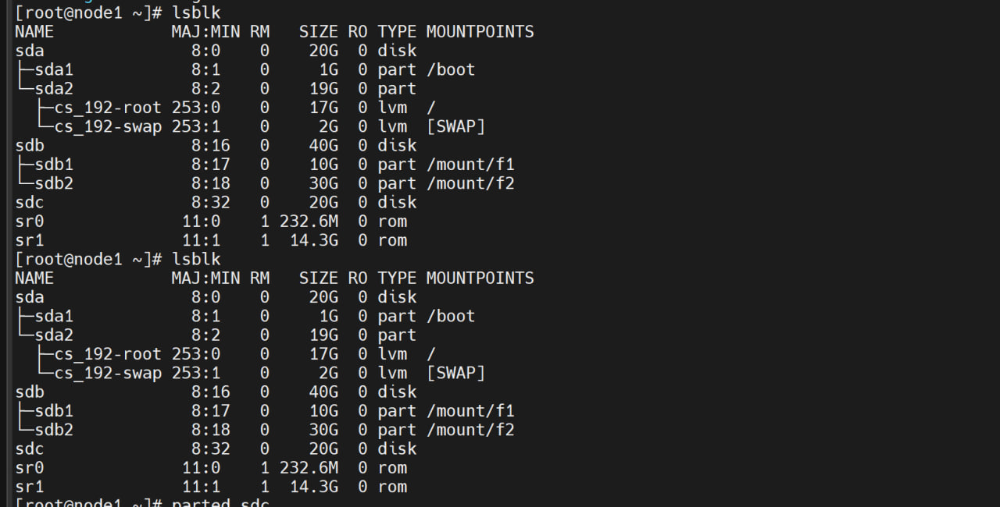
 ``通过观察，我知道，刚刚新增的磁盘应该就是sdc了


#### 2.使用parted命令开始分区操作


```
parted /dev/sdc

```


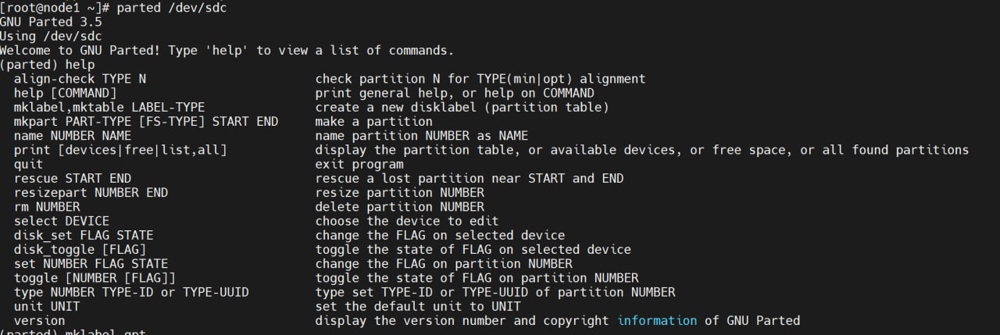


##### 1.创建GPT分区表


`使用mklabel创建分区表`


```
mklabel gpt
mktable gpt

```


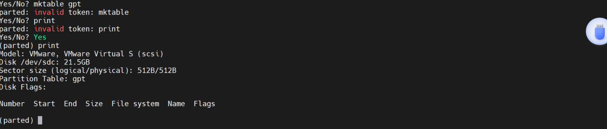


##### 2.创建一个新分区


```
mkpart primary xfs 1MiB 100%
#注意这个开头至少填的是1MB，中间我们可以随便写的，只要保证
最后是100%即可

```


##### 3.查看分区情况


```
print
lsblk

```


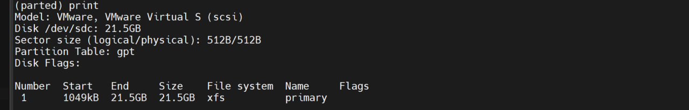
 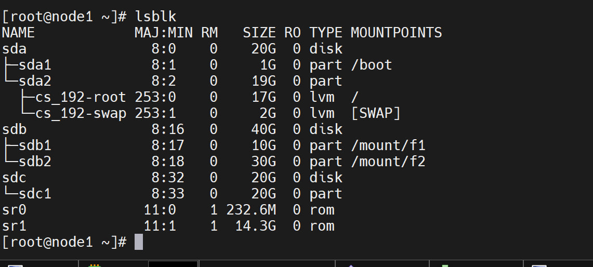
 **最后我们使用rm 1删除磁盘，接下来呢，我们直接分区5个看看**


```
mkpart primary xfs 1MiB 20%
mkpart primary xfs 20% 40%
mkpart primary xfs 40% 60%
mkpart primary xfs 60% 80%
mkpart primary xfs 80% 100%

```


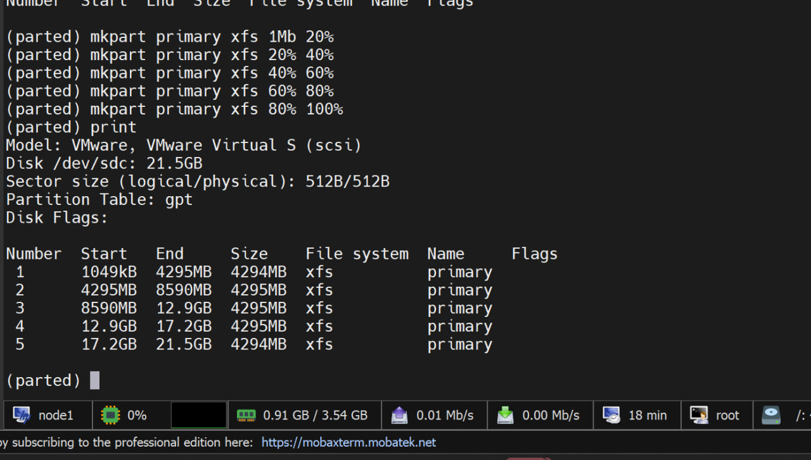


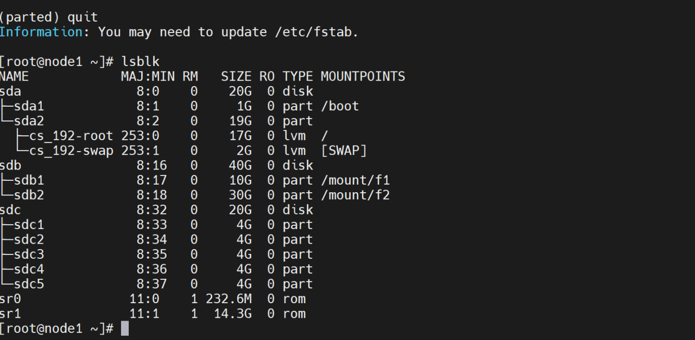
 注意，就是不能使用rm 1 2 3 4 5 直接删掉，这样做，只会把1号盘干掉
 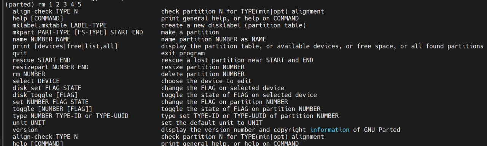
 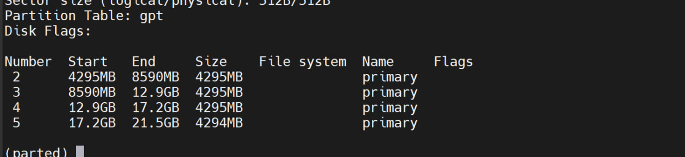


### 3.设置交换内存


#### 1.分配4G的分区大小


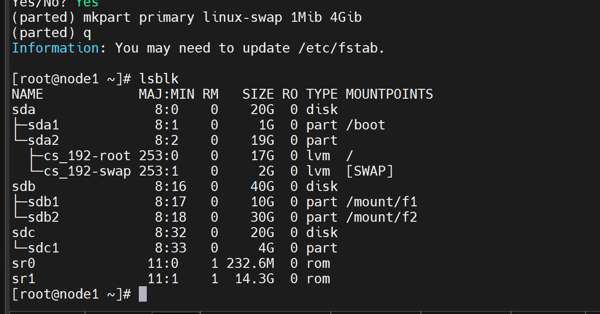


#### 2.使用mkswap格式化分区


```
mkswap

```


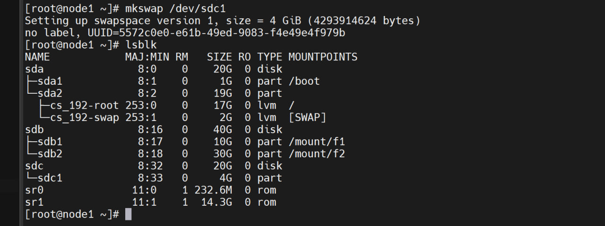


#### 3.设置swapon启动交换分区


```
swapon /dev/sdc1

```


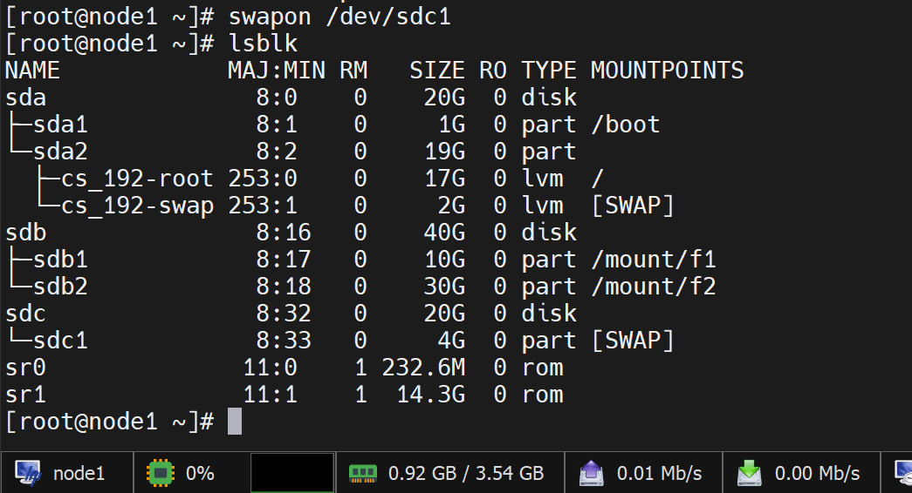


#### 4.查看交换分区大小


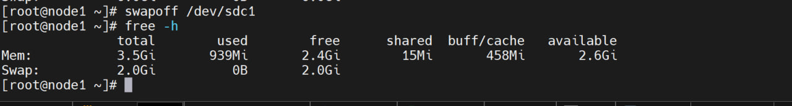


`这个是之前的没有增加交换分区的时候`


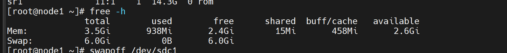


`这个是增加交换分区的情况，发现增加了4G，也就是说这个操作成功了.`
